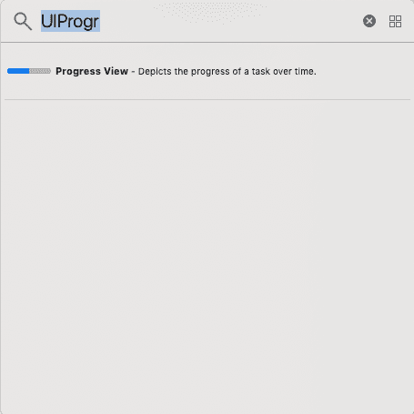
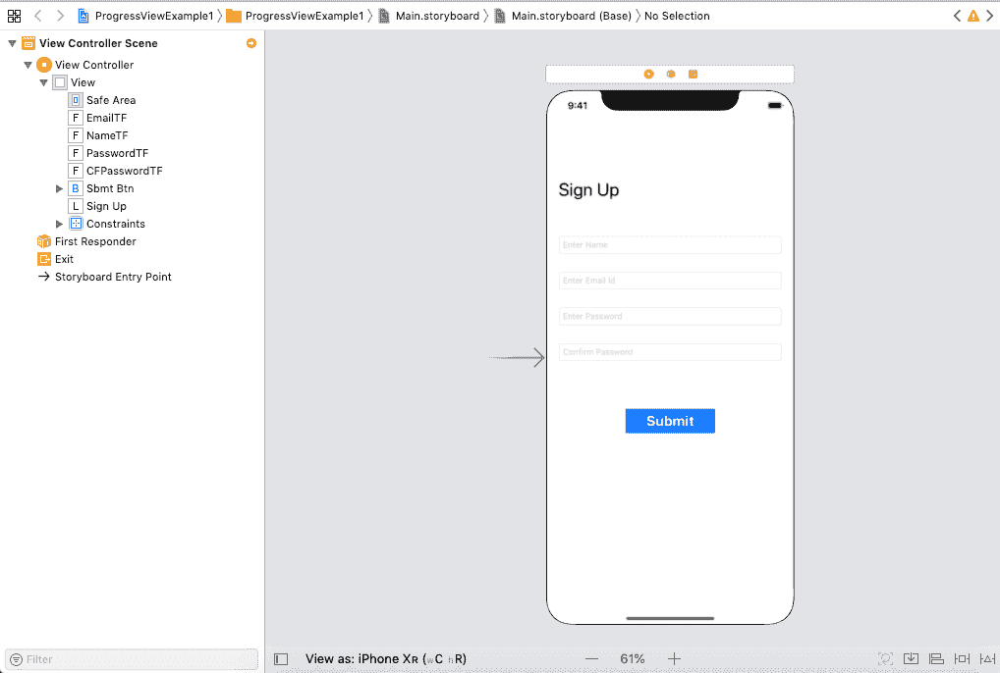
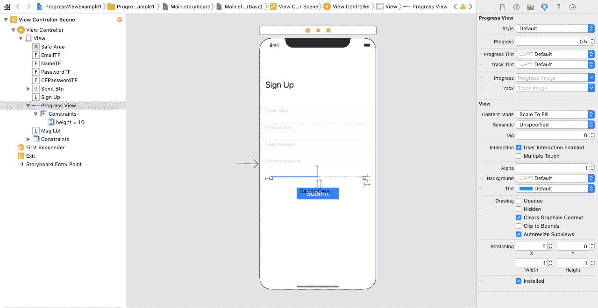
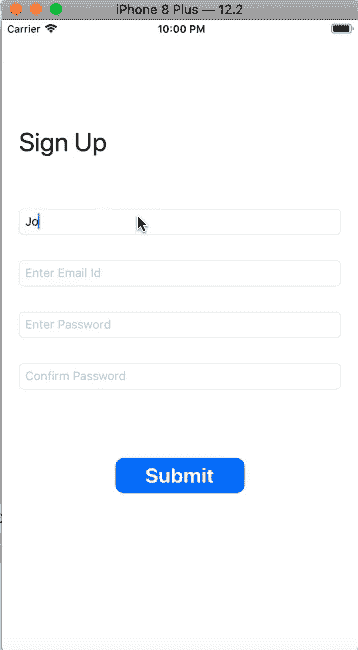

# 视图

> 哎哎哎:# t0]https://www . javatppoint . com/IOs-programessvview

在 iOS 应用程序中，ProgressView 用于显示任务随时间的进度。ProgressView 是 UIProgressView 的实例，它继承了 UIView 类。

```

class UIProgressView : UIView

```

ProgressView 显示进度条，我们可以在其中使用 UIProgressView 类的方法和属性来管理它的样式。我们可以获取和设置固定在任务进度上的值。

### 属性和方法

| 塞内加尔 | 属性或方法 | 描述 |
| one | var 进度:浮动 | 它表示进度条显示的当前进度。 |
| Two | 功能设置程序(浮动，动画:布尔) | 此方法用于设置进度条的进度。我们可以选择传递一个布尔值来决定动画是打开还是关闭。 |
| three | var observedProgress:进展如何？ | 它是用于更新进度视图的进度对象。 |
| four | var progress viewer style:uiprogressview。样式(Style) | 它表示进度视图的当前图形样式。 |
| five | var progressTintColor： UIColor？ | 它是为进度条中已填充或已完成的部分显示的颜色。 |
| six | var progressive:uiimage？ | 通过使用这个属性，我们可以为进度条被填充的部分设置图像。 |
| seven | 在哪里 tracktincolor:ui color？ | 它是为进度条部分显示的颜色；未填写或未完成。 |
| eight | var trackImage: UIImage？ | 它是可以为进度条中未填充的部分显示的图像。 |

### 将进度视图添加到界面生成器。

*   要将 ProgressView 添加到故事板，请在对象库中搜索 UIProgressView，并将结果拖到故事板，如下图所示。



*   为进度视图定义自动布局规则，以控制其在不同屏幕尺寸下的位置和大小。
*   设置 UIProgressView 的适当属性，以控制进度视图随时间的进度。

### 例子

在本例中，我们将模拟注册示例，在该示例中，我们将通过填写姓名、电子邮件 id 和密码来提示用户在应用程序中注册。当用户点击提交按钮时，我们将向用户显示一个进度条，表明用户数据正在保存在数据库中。

**界面构建器**

为了创建项目的界面，我们将向故事板添加四个带有注册标签的文本字段和一个提交按钮，并为它们定义自动布局规则来控制它们的位置和大小，如下图所示。



现在，让我们添加进度视图和一个标签来指示界面的进度，如下图所示。



当用户点击提交按钮时，我们将执行一个计时器来表示进度视图的进度。

**ViewController.swift**

```

import UIKit

class ViewController: UIViewController {

    @IBOutlet weak var nameTF: UITextField!

    @IBOutlet weak var emailTF: UITextField!

    @IBOutlet weak var passwordTF: UITextField!

    @IBOutlet weak var CFPasswordTF: UITextField!

    @IBOutlet weak var progressView: UIProgressView!

    @IBOutlet weak var msgLbl: UILabel!

    @IBOutlet weak var sbmtBtn: UIButton!

    let progress = Progress(totalUnitCount: 4)

    var ratio: Float?

    override func viewDidLoad() {
        super.viewDidLoad()
        // Do any additional setup after loading the view.
        progressView.isHidden = true
        ratio = 0
        progressView.progress = ratio!
        msgLbl.isHidden = true
        progressView.layer.cornerRadius = 10
        sbmtBtn.layer.cornerRadius = 10
    }

    @IBAction func clickedSubmitBtn(_ sender: Any) {
        if(nameTF.text != "" && emailTF.text != "" && passwordTF.text != ""){
        sbmtBtn.isHidden = true
        msgLbl.isHidden = false
        progressView.isHidden = false
            Timer.scheduledTimer(withTimeInterval: 1.0, repeats: true) { (timer) in
                guard self.progress.isFinished == false else{
                    timer.invalidate()
                    self.msgLbl.text = "Data Saved"
                    return
                }
                self.progress.completedUnitCount += 1
                let progrsssFloat = Float(self.progress.fractionCompleted)
                self.progressView.setProgress(progrsssFloat, animated: true)

            }
        }
    }
}

```

**输出:**



* * *