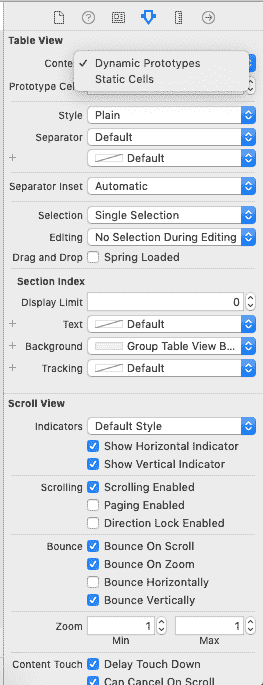

# TableViewController

> 吴奇珍:t0]https://www . javatppoint . com/IOs-tableview controller

在本教程的前几节中，我们已经讨论了用于在 iOS 应用程序中以表格形式显示垂直排序列表的表格视图。

我们还创建了一些应用程序，在这些应用程序中，我们用定制的原型单元格将 tableview 添加到了 UIViewController 类中。然而，在本教程中，到目前为止，我们还没有使用 TableViewControllers 来管理 tableview。

在本教程的这一部分中，我们将为 tableviews 使用 tableviewcontroller。我们还将使用原型和静态单元创建示例项目。

表视图控制器可以定义为专门管理表视图的视图控制器。TableViewController 负责维护该表及其数据和事件。为此，它使用 tableview 属性的委托和数据源。TableViewController 是继承 UIViewController 的 UITableViewController 类的一个实例。

```
class UITableViewController : UIViewController

```

当我们需要使用我们的视图控制器只显示 tableview 而不显示其他内容时，我们继承了 UITableViewController 类，因为我们只能在接口生成器中将 tableview 添加到 TableViewController 中。tableViewController 自动提供 TableView 属性，并且它已经采用了 UITableViewDelegate 和 UITableViewDataSource 协议。

除了 tableview 之外，UITableViewController 还提供了以下好处。

*   它加载在故事板或 nib 文件中存档的 tableview。TableViewController 提供 tableview 属性来访问故事板中的 tableview。
*   默认情况下，它符合 UITableViewDelegate 和 UITableViewDatasource 协议。子类重写委托和数据源方法，以提供 tableview 实现。
*   它会在 viewWillAppear(:)方法中第一次出现时自动为其 tableview 重新加载数据。每次显示 tableview 时，它都会清除所选内容。
*   当用户点击导航栏中的编辑|完成按钮时，它会自动切换表格的编辑模式。
*   它会根据屏幕键盘的出现或消失自动调整 tableview 的大小。

## 向接口添加 TableViewController

要将 TableViewController 添加到接口生成器，请考虑以下说明。

*   在 XCode 中创建新项目。在这个新创建的 XCode 项目中，我们将获得以下文件集。


在上面显示的图像中，我们获得了由 XCode 生成的项目文件，用于运行单视图 iOS 应用程序。它还生成一个 ViewController.swift 文件，该文件被分配给故事板中的单个 ViewController。删除这个文件，创建一个新的 UITableViewController 子类，如下图所示。


*   在 Main.storyboard 文件中，删除 ViewController，在对象库中搜索 TableViewController，并将结果拖到界面上。


它将在故事板中添加 tableviewcontroller。


如果我们运行上面的项目，它会给出如下的空 tableview 输出。


## TableViewController 的组件

下图显示了 tableviewcontroller 中的各种可见组件。


*   **表视图**:UITableViewController 包含一个内置的表视图。故事板中的 tableview 可以通过使用 TableViewController 子类中的 tableView 属性来访问。tableview 是 UITableView 类的一个实例。
*   **tableview cell**:tableview 单元格显示 tableview 控制器的实际内容。TableViewCell 是 UITableViewCell 类的一个实例。该单元格包含 UIView 类型的内容视图。我们可以向 tableview 单元格中的内容视图添加自定义子视图。但是，有两种类型的单元格可以在 TableViewController 中显示:即显示静态数据的静态单元格和自定义单元格中显示的数据原型的原型单元格。
*   **导航控制器**:导航控制器是控制故事板中视图控制器之间关系的控制器。导航控制器中嵌入的所有视图控制器都包含导航栏，我们可以在其中放置标题栏和按钮项。导航栏是 UINavigationBar 类的实例。我们可以相应地显示或隐藏 tableview 控制器的导航栏。

**示例 1:创建简单的 TableViewController**

在本例中，我们将创建一个简单的 TableViewController，其中我们将以表格形式显示数据网格。

## 项目结构

定制的 tableviewcontroller 子类继承了 UITableViewController 类，并符合 uitableviewpdelegate 和 uitableviewpdata source 协议，这使得定制的子类覆盖了 uitableviewpdelegate 和 uitableviewpdata source 协议的所有方法。包含 TableViewController 的项目结构如下图所示。


## 界面构建器

在 Main .故事板中，删除现有的 UIViewController，搜索 UITableViewController，并将结果拖到故事板中。这将创建具有原型单元格的 tableview 控制器，如下图所示。


由于 tableviewcontroller 包含一个原型单元格，我们需要用内容视图开发这个原型单元格。在这个例子中，我们正在开发一个具有标题、副标题和细节的原型单元。为此，我们将把 UILabel 拖到 TableViewCell，如下图所示。


这里，我们还需要一个 UITableViewCell 子类来包含这些 UILabels 的出口连接。

**MyTableViewCell.swift** 的缩写形式

```
import UIKit

class MyTableViewCell: UITableViewCell {
    @IBOutlet weak var titleLbl: UILabel!
    @IBOutlet weak var subTitleLbl: UILabel!
    @IBOutlet weak var detailLbl: UILabel!
    override func awakeFromNib() {
        super.awakeFromNib()
        // Initialization code
    }

    override func setSelected(_ selected: Bool, animated: Bool) {
        super.setSelected(selected, animated: animated)

        // Configure the view for the selected state
    }

}

```

**mytable view controller . swift**的缩写形式

```
import UIKit

class MyTableViewController: UITableViewController {

    var titleArr = Array<String>()
    var subTitleArr = Array<String>()
    var detailArr = Array<String>()

    override func viewDidLoad() {
        super.viewDidLoad()
        subTitleArr = ["Goa","Himachal Pradesh","Uttarakhand","Andman and Nicobar", "Mumbai"]
        titleArr = ["Punjim","Shimla","Dehradun","PortBlair","maharashtra"]
        detailArr = ["7 m", "2276 m", "447 m","16 m","14 m"]

    }

    // MARK: - Table view data source

    override func numberOfSections(in tableView: UITableView) -> Int {
        return 1
    }

    override func tableView(_ tableView: UITableView, numberOfRowsInSection section: Int) -> Int {
        // #warning Incomplete implementation, return the number of rows
        return titleArr.count
    }

    override func tableView(_ tableView: UITableView, cellForRowAt indexPath: IndexPath) -> UITableViewCell {
        let cell = tableView.dequeueReusableCell(withIdentifier: "cell", for: indexPath) as! MyTableViewCell

        cell.titleLbl.text = titleArr[indexPath.row]
        cell.subTitleLbl.text = subTitleArr[indexPath.row]
        cell.detailLbl.text = detailArr[indexPath.row]

        return cell
    }

    override func tableView(_ tableView: UITableView, heightForRowAt indexPath: IndexPath) -> CGFloat {
        return 130
    }
}

```

**输出**


## 表格视图控制器静态单元格

与 TableView 不同，我们还可以在 TableViewControllers 中嵌入静态单元格。要添加静态单元格，我们需要在界面生成器的属性检查器中更改单元格类型，如下图所示。



默认情况下，它被选择为动态原型。但是，我们可以将其设为静态单元格，如上图所示。

如果我们将其更改为静态单元格，tableviewcontroller 会将其内容更改为包含三个静态单元格的静态部分，如下图所示。


我们可以增加 tableview 中的节数以及每个节包含的行数。如果我们增加 tableview 中的节数，我们的 TableViewController 将看起来像下图。


* * *