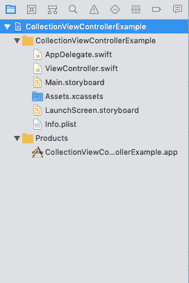
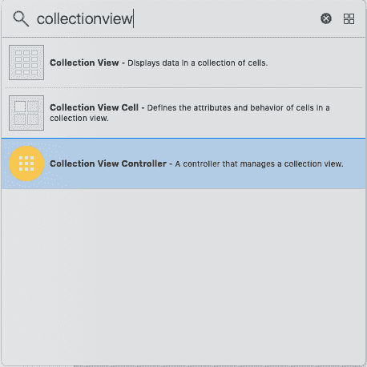
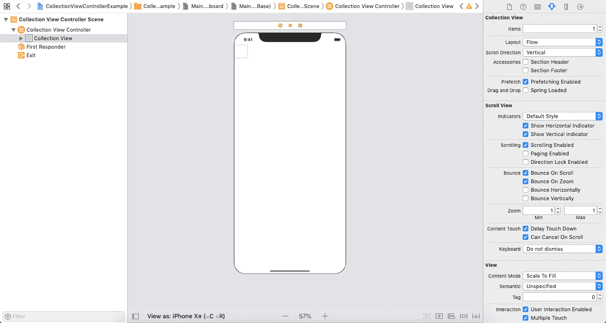
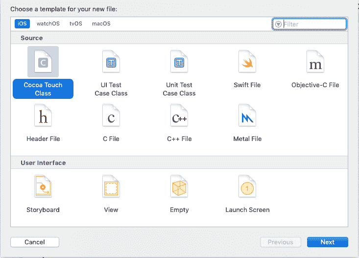
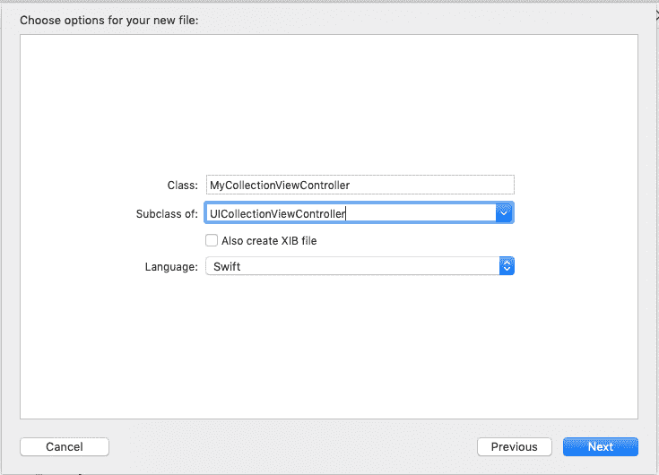
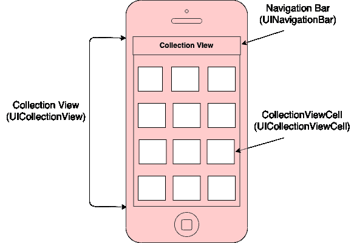
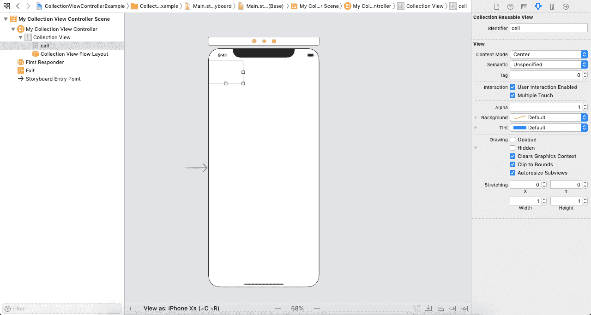
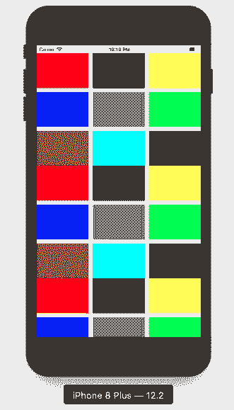

# CollectionViewController

> 哎哎哎:# t0]https://www . javatppoint . com/IOs-collection view controller

到目前为止，我们已经讨论了 CollectionView，这是一种用于表示项目集合的内容视图，其中 UICollectionViewCell 表示一个项目。我们已经使用 CollectionViews 创建了 iOS 应用程序。在教程的这一部分，我们将使用 CollectionViewController 来管理 collectionview。

CollectionViewController 可以定义为视图控制器，专门管理 CollectionView。它是 UICollectionViewController 的一个实例，继承了 UIViewController 类。

```

class UICollectionViewController : UIViewController

```

像 TableViewController 一样，我们不能向 CollectionView 控制器添加任何自定义 UIView，因为它只能管理 CollectionView。CollectionViewController 在故事板中包含一个内置的 collectionview，其中至少有一个 collectionview 单元格(项)。然而，我们可以在 CollectionViewController 中拥有任意多的项目。我们可以通过使用类的 collectionview 属性来访问 UICollectionViewController 子类中的 collectionView。

CollectionViewController 实现了 UICollectionViewDelegate 和 UICollectionViewDataSource 协议，以控制 CollectionView 的数据和用户交互。当 CollectionView 即将首次出现时，CollectionViewController 会重新加载集合视图数据。它还会在每次显示视图时清除当前选择。但是，我们可以通过将**clearsselectionviewWillar**属性的值设置为 false 来更改此行为。

## 向接口添加 CollectionViewController

在 XCode 中创建新的单视图 iOS 应用程序。我们将在 XCode 中获得以下自动生成的文件。



在这里，我们需要删除故事板中现有的视图控制器，并通过在对象库中搜索来添加集合视图控制器，并将结果拖到故事板中。



这将在故事板中创建一个带有集合视图单元的集合视图控制器。



在我们的项目中，我们还需要创建 UICollectionViewController 的子类，它可以被分配给故事板中的集合视图 Controller。

要创建新的类文件，按**命令+ n** 并选择选项“**可可触摸类**”。



这将打开如下图所示的窗口。输入类的名称，并从下拉列表中选择父类作为 UICollectioViewController。



这里，我们创建了一个类 MyCollectionViewController，它是 UICollectionViewController 的子类。将此类分配给故事板中的集合视图控制器。

## 集合视图控制器组件

集合视图控制器包含屏幕上可见的各种特定组件。




**集合视图**:集合视图控制器提供一个内置的集合视图，带有一个集合视图单元。可以通过使用 UICollectionViewController 子类中的 collectionview 属性来访问此 collectionView。它是继承 UICollectionView 类的一个实例。

**集合视图单元**:集合视图单元显示集合视图控制器的实际内容。它包含一个 UIView 类型的内容视图，我们可以向其中添加自定义子视图。它是 UICollectionViewCell 类的一个实例。

**导航栏**:导航栏显示在嵌入在导航控制器中的视图控制器的顶部。它包含标题栏和按钮项。它是 UINavigationBar 类的一个实例。

## UICollectionViewController Properties

UICollectionViewController 包含以下属性。

| 塞内加尔 | 财产 | 描述 |
| **1** | var collectionView:UICollectionView！ | 它表示由视图控制器管理的集合视图对象。 |
| **2** | var collectionviewlayout:uicollectionviewlayout | 它表示用于初始化集合视图控制器的布局对象。 |
| **3** | var clearsselectiononewwilluapar:bool | 它是一个布尔值，指示当视图即将出现在屏幕上时是否应该清除选择。 |
| **4** | var 交互移动:Bool | 一个布尔值，指示集合视图控制器是否安装了标准手势识别器来驱动重新排序过程。 |
| **5** | var useayouuttolyoutnavigation transitions:Bool-可变布局导航转换:bool | 一个布尔值，指示集合视图控制器是否与导航控制器协调转换。 |

**例**

在本例中，我们将创建一个简单的集合视图控制器，并为每个集合视图单元格分配不同的颜色。

## 界面构建器

在这里，我们将在对象库中搜索集合视图控制器，并将结果拖到故事板。这将在故事板中创建一个带有 collectionview 原型单元格的 CollectionViewController。



现在，我们将创建一个 UICollectionViewController 的子类，并将这个类命名为 MyCollectionViewController。

**支原体检查控制器. swift**

```

import UIKit

private let reuseIdentifier = "cell"

class MyCollectionViewController: UICollectionViewController {
    var colorArr = Array<UIColor>()

    override func viewDidLoad() {
        super.viewDidLoad()

        // Uncomment the following line to preserve selection between presentations
        // self.clearsSelectionOnViewWillAppear = false

        // Register cell classes
        self.collectionView!.register(UICollectionViewCell.self, forCellWithReuseIdentifier: reuseIdentifier)

        colorArr = [UIColor.red,UIColor.black,UIColor.yellow,UIColor.blue,UIColor.gray,UIColor.green,UIColor.brown,UIColor.cyan,UIColor.darkGray]

        // Do any additional setup after loading the view.
    }

    override func numberOfSections(in collectionView: UICollectionView) -> Int {
        // #warning Incomplete implementation, return the number of sections
        return 3
    }

    override func collectionView(_ collectionView: UICollectionView, numberOfItemsInSection section: Int) -> Int {
        // #warning Incomplete implementation, return the number of items
        return colorArr.count
    }

    override func collectionView(_ collectionView: UICollectionView, cellForItemAt indexPath: IndexPath) -> UICollectionViewCell {
        let cell = collectionView.dequeueReusableCell(withReuseIdentifier: reuseIdentifier, for: indexPath)

        // Configure the cell
        cell.contentView.backgroundColor = colorArr[indexPath.row]

        return cell
    }
}

```

**输出**



* * *