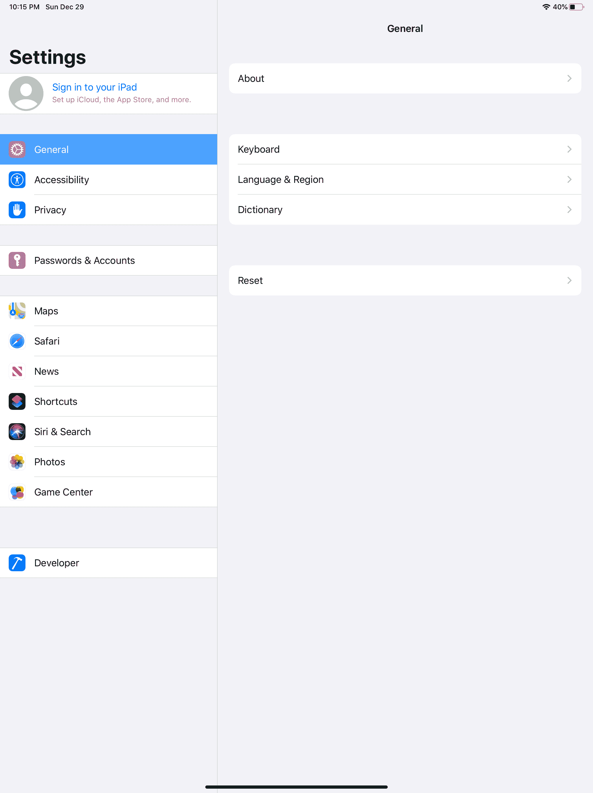
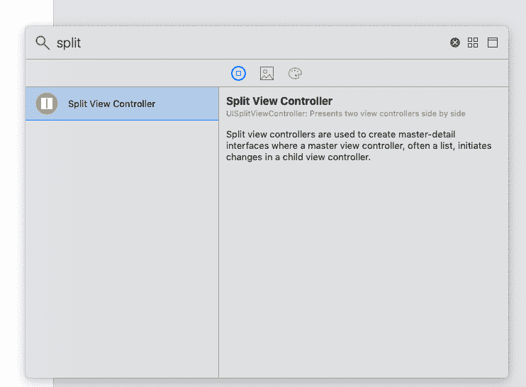
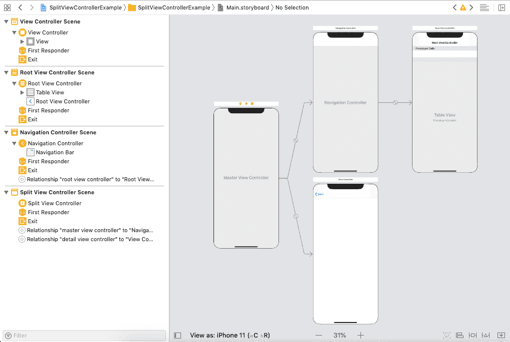
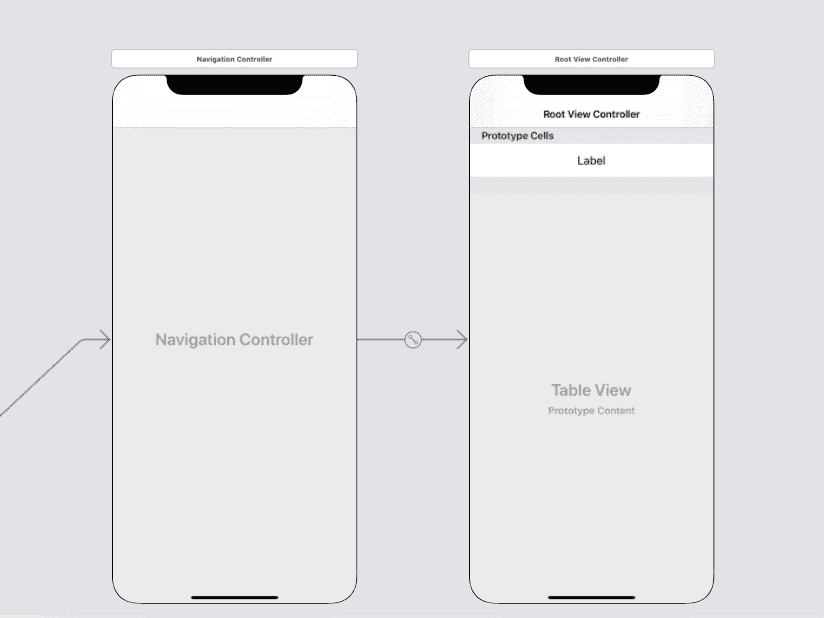
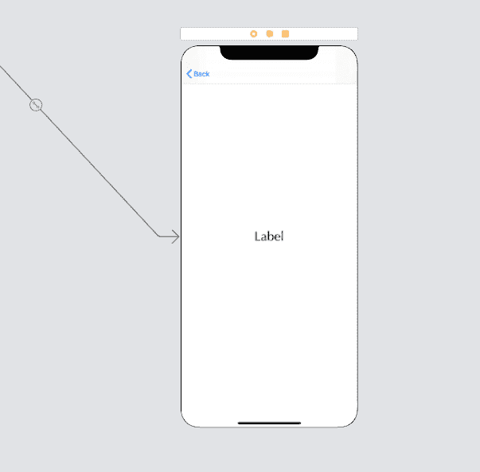
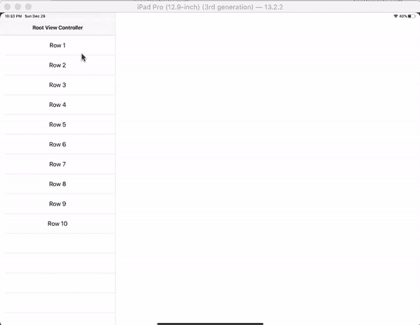

# 拆分视图控制器

> 原文：<https://www.javatpoint.com/ios-split-view-controller>

在 iOS 应用程序中，要求将屏幕分成两部分，并在每一侧显示一个视图控制器来显示应用程序内容。在教程的这一部分，我们将讨论分割视图控制器，它是 iOS 应用程序的重要组成部分。

拆分视图控制器是一个容器视图控制器，它通过将屏幕拆分为两个部分来管理主-细节界面，以便用户可以与主界面交互，从而在细节视图控制器中获得细节。例如，IPad 中的设置应用显示在主-细节界面，如下图所示。



拆分视图控制器是 UISplitViewController 的一个实例，它继承了 UIViewController。

```

class UISplitViewController : UIViewController

```

分割视图控制器管理主-细节界面中的两个子视图控制器。主视图控制器中的更改会驱动详细视图控制器的更改。从 iOS 8 开始，该类适用于所有 iOS 设备。在以前的版本中，它仅适用于 iPad。

## 将拆分视图控制器添加到界面

要将分割视图控制器添加到界面中，我们需要在对象库中搜索它，并将结果拖到故事板中。



我们需要将拆分视图控制器作为我们正在构建的 iOS 应用程序中的根视图控制器。它在应用程序中没有显著的视觉外观，因为它只管理向用户显示的子视图控制器。

## 配置拆分视图控制器的外观

我们可以设置分割视图控制器的显示模式，以配置其视觉外观。可以设置 UISplitViewController 的 **preferredDisplayMode** 属性来配置显示模式。下表给出了显示模式的可能值。

| 方式 | 描述 |
| 并排 | 在这种模式下，两个子视图控制器同时显示在屏幕上，其中主视图控制器显示在屏幕的左窗格上，细节视图控制器显示在右窗格上。主视图控制器通常比详细视图控制器窄。我们可以使用**preferred primarycolumntwidthfraction**属性来调整主视图控制器的宽度。该模式由 UISplitViewController 表示。DisplayMode.allVisible 常量。 |
| 隐藏的 | 在这种模式下，主(主)视图控制器被隐藏并变为屏幕外，而细节视图控制器变为屏幕上。要显示主视图控制器，我们必须以模式显示它或改变显示模式。该模式由 UISplitViewController 表示。DisplayMode.primarryHidden 常量。 |
| 覆盖物 | 在这种模式下，主视图控制器层叠在详图控制器的顶部。在这种模式下，主视图控制器会遮挡次视图控制器。该模式由 UISplitViewController 表示。DisplayMode.primaryOverlay 常量。 |

由于空间限制，拆分视图控制器可能不遵循显示模式。拆分视图控制器不能在紧凑的水平环境中并排显示子视图控制器。

## ui splitbasecontroller properties

UISplitViewController 类包含以下属性，用于自定义拆分视图行为和管理子视图控制器。

| 塞内加尔 | 财产 | 描述 |
| one | var 委托:UISplitViewControllerDelegate？ | 它表示用于接收拆分视图控制器消息的委托。 |
| Two | 协议 UISplitViewControllerDelegate | 协议 UISplitViewControllerDelegate 包含对拆分视图界面进行更改时通知的方法。 |
| three | 做为检视控制项:[检视控制项] | 接收器管理的是视图控制器阵列。 |
| four | var presents 与 Gesture： Bool | 它是一个布尔类型的值，用于确定是否可以用滑动手势来显示隐藏的视图控制器。 |
| five | var preferreddisplaymode:uisplitpontroller。DisplayMode(显示模式) | 这是界面的首选显示模式。 |
| six | var display mode:uisplitpviewcontroller。DisplayMode(显示模式) | 它表示拆分视图控制器内容的当前排列。 |
| seven | var displayModeButtonItem： UIBarButtonItem | 它表示更改界面显示模式的按钮。 |
| eight | var primaryedge:uisplitting view controller。PrimaryEdge 先生 | 它表示主视图控制器保留的一侧。 |
| nine | var is called:Bool | 它是一个布尔值，指示是否显示其中一个子视图控制器。 |
| Ten | var preferred primaryolumn dthfraction:cgfloat | 它表示主视图控制器的相对宽度。 |
| Eleven | var primaryColumnWidth： CGFloat | 它表示主视图控制器的宽度(以点为单位)。 |
| Twelve | var minimumprimarycolumn width:cgfloat | 它表示主视图控制器所需的最小宽度(以磅为单位)。 |
| Thirteen | var maximumparycolumn width:cgfloat | 它表示主视图控制器所需的最大宽度。 |

## uisplitviewcontroller 方法

UISplitViewController 类包含以下操作方法来显示子视图控制器。

| 塞内加尔 | 方法 | 描述 |
| one | func showDetailViewController（UIViewController， sender： Any？） | 它显示了拆分视图界面的详细视图控制器。 |
| Two | func show(UIViewController，发送方:有吗？) | 它显示了拆分视图界面的主视图控制器。 |

### 例子

在本例中，我们将创建一个实现主-细节界面的 iOS 应用程序。

**界面构建器**

要为项目创建界面构建器，首先，我们需要将拆分视图控制器添加到故事板中。为此，搜索拆分视图控制器并将结果拖到故事板。这将向界面构建器添加一个拆分视图控制器，如下图所示。



上图包含一个主视图控制器，它是一个表视图控制器，以及一个 UIViewController 来实现一个详细视图控制器。表视图控制器将显示记录列表，其中每个记录的详细信息都显示在详细视图控制器上。

首先，将拆分视图控制器作为初始视图控制器。让我们开始设计故事板。首先，我们将通过添加标签来设计一个原型表视图单元。我们还将为单元格的内容视图中的标签定义自动布局规则，如下图所示。



现在，我们将设计细节视图控制器。我们将向详细视图控制器添加标签以显示内容。我们还将为详图控制器中的标签定义自动布局规则，如下图所示。



现在，我们将创建 UITableViewController 的子类，并将其分配给主视图控制器。我们还将创建一个 UITableViewCell 的子类，并将其分配给表视图单元。在 TableViewCell 中为单元格内容标签创建连接出口。此外，创建 UIViewController 的子类来表示详细视图控制器，并在其中连接标签的出口。

**表视图单元格. swift**

```

import UIKit

class TableViewCell: UITableViewCell {

    @IBOutlet weak var cellTitleLbl: UILabel!
    override func awakeFromNib() {
        super.awakeFromNib()
        // Initialization code
    }

    override func setSelected(_ selected: Bool, animated: Bool) {
        super.setSelected(selected, animated: animated)

        // Configure the view for the selected state
    }

}

```

**ViewController.swift**

```

import UIKit

class ViewController: UIViewController {

    @IBOutlet weak var titleLbl: UILabel!
    var text = ""
    override func viewDidLoad() {
        super.viewDidLoad()

        // Do any additional setup after loading the view.
        titleLbl.text = text

    }

}

```

**table view controller . swift**的缩写形式

```

import UIKit

class TableViewController: UITableViewController {

    var dataArr = Array()

    override func viewDidLoad() {
        super.viewDidLoad()
        for i in 1..<11{
            dataArr.append("Row "+i.description)
        }
    }

    // MARK: - Table view data source

    override func numberOfSections(in tableView: UITableView) -> Int {
        // #warning Incomplete implementation, return the number of sections
        return 1
    }

    override func tableView(_ tableView: UITableView, numberOfRowsInSection section: Int) -> Int {
        return dataArr.count
    }

    override func tableView(_ tableView: UITableView, cellForRowAt indexPath: IndexPath) -> UITableViewCell {
        let cell = tableView.dequeueReusableCell(withIdentifier: "TableViewCell") as! TableViewCell
        cell.cellTitleLbl.text = dataArr[indexPath.row]
        return cell
    }

    override func tableView(_ tableView: UITableView, didSelectRowAt indexPath: IndexPath) {
        let storyboard = UIStoryboard(name: "Main", bundle: nil)
        let vc = storyboard.instantiateViewController(identifier: "ViewController") as! ViewController
        vc.text = dataArr[indexPath.row] + " Data"
        splitViewController?.showDetailViewController(vc, sender: nil)
    }
} 
```

**输出:**



* * *