# 标签栏控制器

> 原文：<https://www.javatpoint.com/ios-tab-bar-controller>

在 iOS 应用程序中，我们必须提供用户功能，以便在应用程序的完全不同的部分之间切换。我们可能需要底部带有不同按钮的标签栏，以便用户与按钮交互来切换到应用程序的不同部分。为此，使用了标签栏控制器。在教程的这一部分，我们将讨论标签栏控制器。

选项卡栏控制器是一个容器视图控制器，它管理无线电式选择界面中的视图控制器阵列，以便用户可以与界面交互来确定要显示的视图控制器。它是继承了 UIViewController 的 UITabBarController 的实例。

```

class UITabBarController : UIViewController 

```

在标签栏界面中，屏幕底部显示一个标签栏，其中有多个标签栏按钮项目，用于在应用程序的不同模式之间进行选择。下图显示了如何在 iOS 的健康应用程序中配置标签栏界面。

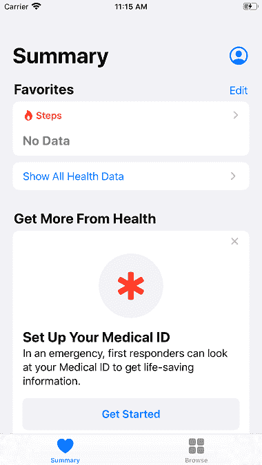 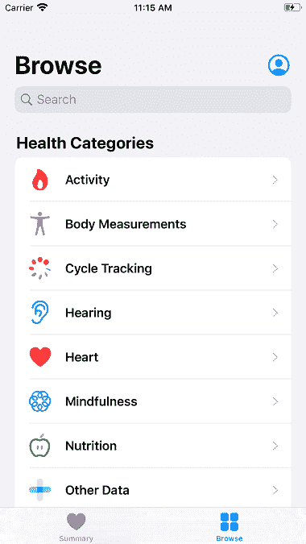

选项卡栏控制器维护一个视图控制器阵列，其中每个选项卡都与视图控制器导航堆栈或自定义视图控制器相关联。当用户选择特定选项卡时，将显示相关堆栈的根视图控制器。选项卡栏界面用于呈现不同类型的信息，或者使用完全不同的样式呈现相同类型的信息。

## 控制器属性和方法

UITabBarController 类包含以下属性和方法。

| 塞内加尔 | 财产 | 描述 |
| one | var 委托:UITabBarControllerDelegate？ | 它是 UITabBarControllerDelegate 协议的一个实例。 |
| Two | 协议 | 协议 UITabBarControllerDelegate 包含一组自定义选项卡栏行为的方法。 |
| three | 定位点:浮动 | 它是与控制器关联的标签栏。 |
| four | ViewController 在哪里:viewcontrollers？ | 选项卡栏界面中显示的是视图控制器阵列。 |
| five | var customizable view controls:[ui view controller]？ | 可以定制的是视图控制器阵列。 |
| six | var more navigation controller:ui navigation controller(ui 导航控制器) | 管理更多导航界面的导航控制器。 |
| seven | var selectedViewController： UIViewController？ | 它表示与当前选定选项卡关联的视图控制器。 |
| eight | var selectedIndex： Int | 它是当前选定的视图控制器的索引。 |
| nine | func setview controller([ui view controller])是否可用？，动画制作:Bool) | 它设置选项卡栏控制器的根视图控制器。 |

### 例 1

在这个例子中，我们将使用标签栏控制器创建一个非常简单的项目。这里，我们将只使用故事板来开发应用程序。

**主故事板**

首先，我们需要向故事板添加一个标签栏控制器。为此，在对象库中搜索 UITabBarController，并将结果拖到故事板中。这将在项目中创建一个选项卡栏控制器，如下图所示。

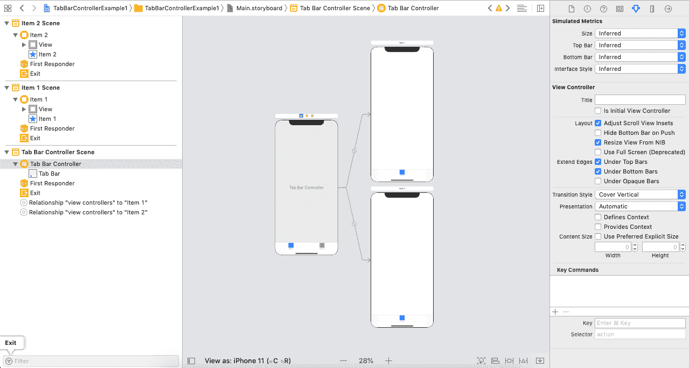

这里，我们观察到标签栏控制器最初管理具有项目 1 和项目 2 的两个子视图控制器，其中项目 1 已经被选择。如果我们通过将选项卡栏控制器作为初始视图控制器来按原样运行项目，那么我们将看到在选项卡栏界面中显示的项目 1 有两个项目，我们可以选择这两个项目来显示它们中的每一个，如下图所示。

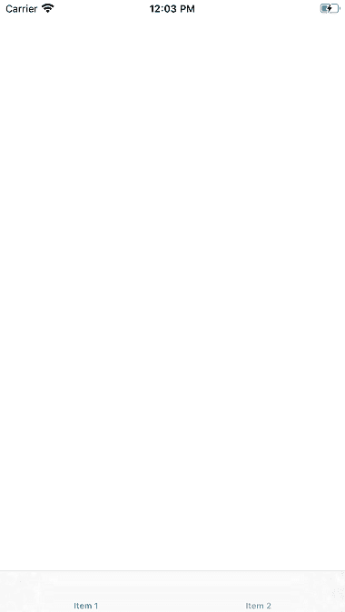

在这里，我们可以配置标签栏项目，并在属性检查器中选择一个自定义图像。在特定视图控制器中选择标签栏，然后转到属性检查器更改标签栏项目的自定义图像，如下图所示。

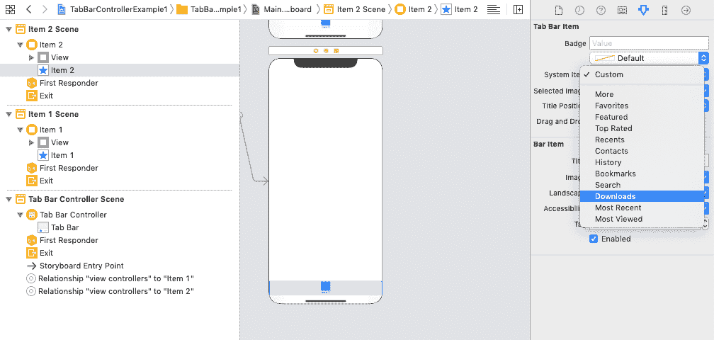

让我们更改系统项目以搜索项目 1，并搜索项目 2 的联系人。现在，我们将更改项目 1 和项目 2 的外观，以在标签栏界面中识别它们。因此，让我们更改第 1 项和第 2 项的背景颜色，并且我们还将向两个视图控制器添加标签。

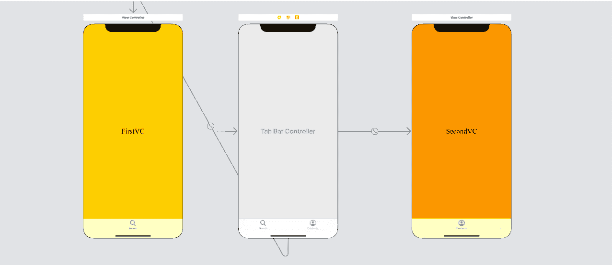

现在，运行这个项目，我们将获得以下输出。

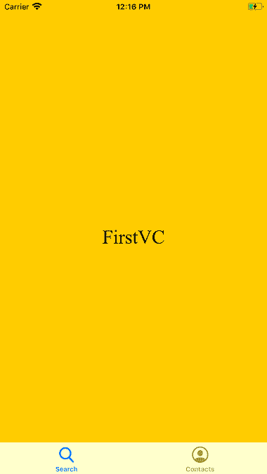 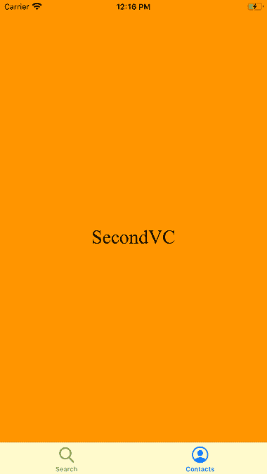

现在，让我们在项目中添加第三个视图控制器。为此，在对象库中搜索 UIViewController，并将结果拖到故事板中。要将视图控制器附加到选项卡栏控制器，我们必须定义它们之间的关系。控制从选项卡栏控制器拖动到视图控制器，并选择它们之间的视图控制器关系，如下图所示。

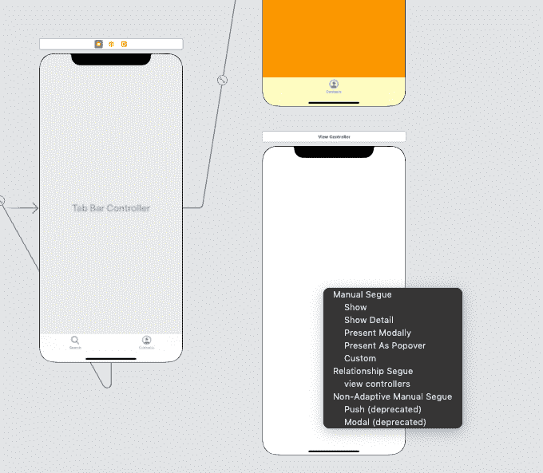

它会将新添加的视图控制器连接到选项卡栏控制器。现在，我们将更改视图控制器的外观，并为其添加一个标签以供识别。

最后，项目的界面构建器将如下图所示。

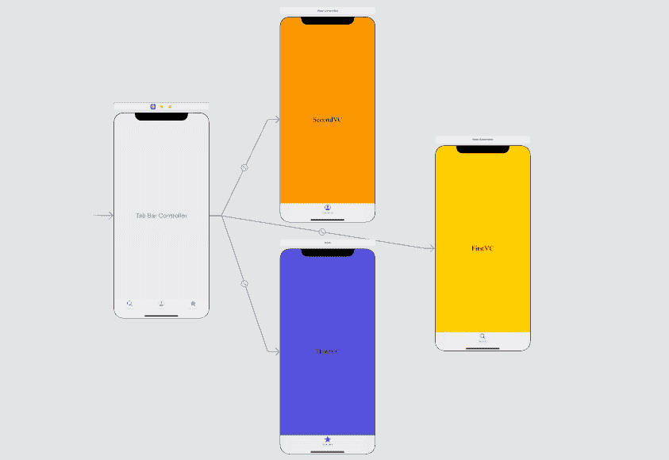

**输出**

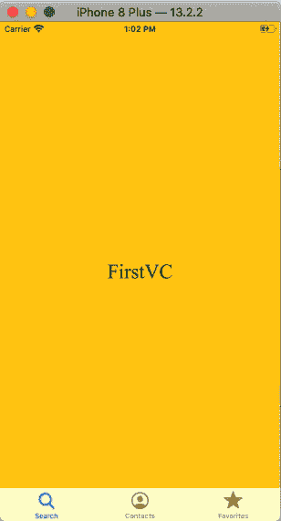

### 示例 2:创建 Javatpoint iOS 应用程序

在这个例子中，我们将使用 web 视图模拟 javatpoint 的 iOS 应用程序。在这里，我们将在标签栏控制器中配置三个视图控制器(HomeViewController、JavaViewController、PythonViewController)。

**界面构建器**

在界面构建器中，我们将添加一个具有三个子视图控制器的选项卡栏视图控制器，如下图所示。

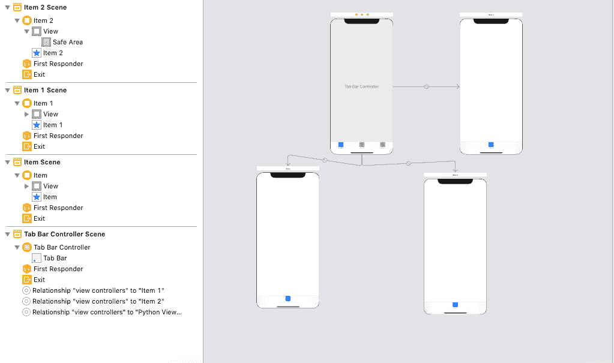

在本例中，我们将使用网络视图来加载视图控制器中的特定链接。因此，我们需要将特定的 web 视图添加到视图控制器中。在对象库中搜索网络视图，并将结果拖到每个视图控制器上。此外，在视图控制器中定义网络视图的约束。

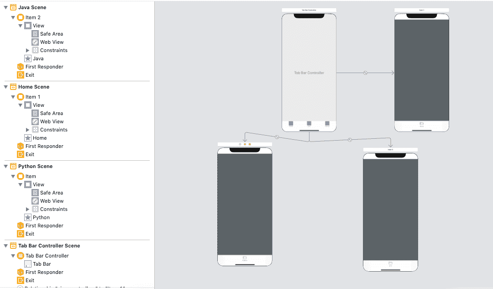

**HomeViewController.swift**

```

import UIKit
import WebKit

class HomeViewController: UIViewController {
    @IBOutlet weak var webView: WKWebView!

    override func viewDidLoad() {
        super.viewDidLoad()

        // Do any additional setup after loading the view.

        guard let url = URL(string: "https://www.javatpoint.com/") else {return}

        webView.load(URLRequest(url: url))

    }

}

```

**JavaViewController.swift**

```

import UIKit
import WebKit

class JavaViewController: UIViewController {

    @IBOutlet weak var webView: WKWebView!
    override func viewDidLoad() {
        super.viewDidLoad()

        // Do any additional setup after loading the view.
         guard let url = URL(string: "https://www.javatpoint.com/java-tutorial") else {return}

         webView.load(URLRequest(url: url))

    }

}

```

**python view controller . swift**

```

import UIKit
import WebKit

class PythonViewController: UIViewController {
    @IBOutlet weak var webView: WKWebView!

    override func viewDidLoad() {
        super.viewDidLoad()

        // Do any additional setup after loading the view.

        guard let url = URL(string: "https://www.javatpoint.com/python-tutorial") else {return}

         webView.load(URLRequest(url: url))
    }

}

```

**输出**


* * *