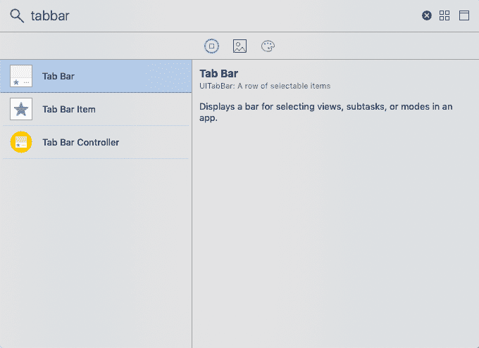
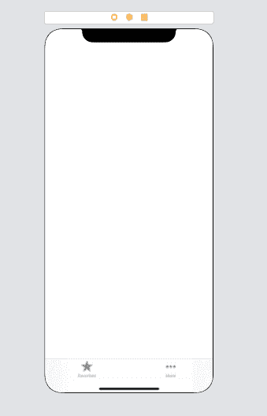
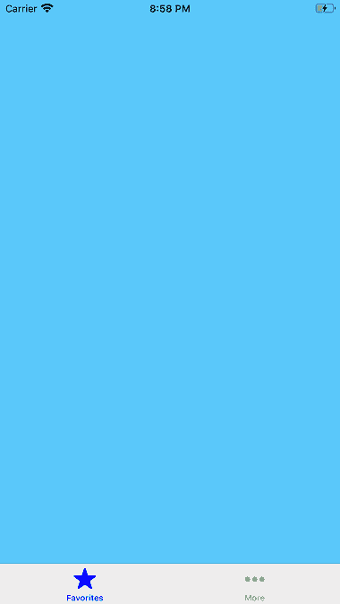

# 选项卡栏

> 原文：<https://www.javatpoint.com/ios-tab-bar>

标签栏是一种控件，用于显示和配置标签栏中的一个或多个栏按钮项，以便在 iOS 应用程序中的不同子任务、视图或模式之间进行选择。标签栏与标签栏控制器结合使用，以显示应用程序中的标签列表。但是，我们可以在应用程序中将标签栏用作独立控件。标签栏是继承了 UIView 的 UITabBar 类的实例。

```

class UITabBar : UIView

```

标签栏总是出现在屏幕的下边缘。一个 UITabBar 对象包含一个或多个 UITabBarItem 对象。但是，我们可以通过根据界面更改标签栏的背景颜色、图像或色调来自定义标签栏的外观。当我们使用 UITabBarController 对象时，我们获得了一个内置的 UITabBar 对象，可以使用接口生成器或以编程方式进行自定义。

UITabBar 对象与委托对象相关联，该委托对象在对选项卡栏中的项目的选择、添加、移除或重新排序的响应中得到通知。UITabBarDelegate 协议包含一组通知用户与标签栏项目交互的方法。

## 配置标签栏项目

我们可以使用界面构建器来配置标签栏的项目。我们还可以使用 UITabBar 类的属性和方法以编程方式配置它们。当我们将 UITabBarController 对象添加到故事板时，相关的 UITabBar 会预先配置一些初始的标签栏项目。但是，我们可以根据界面需求添加、删除、重新排序项目。

当我们向选项卡栏控制器添加新的视图控制器并定义它们之间的关系段时，它会自动向与选项卡栏控制器关联的选项卡栏添加一个新项目。

### 界面构建器属性

| 塞内加尔 | 属性 | 描述 |
| one | 背景 | 它表示要为标签栏显示的背景图像。当我们配置背景对象时，标签栏会忽略色调颜色信息。 |
| Two | 阴影 | 它表示选项卡栏的自定义阴影图像。如果没有自定义标签栏的背景图像，则无法设置此属性。 |
| three | 选择 | 它表示用于选定选项卡的图像。可以使用 selectionIndicatorImage 属性以编程方式设置此属性。 |
| four | Tint 图像 | 它表示要应用于选定项目的色调。这可以使用 tintColor 属性以编程方式访问。 |
| five | 风格 | 它表示应用于栏的基本样式。要以编程方式设置样式，我们必须使用 UITabBar 类的 barStyle 属性。 |
| six | 红酒吧 | 它表示要应用于条形的色调。我们可以使用 barTintColor 属性以编程方式设置这个属性。 |
| seven | 项目定位 | 这表示要应用于项目的定位方案。这决定了项目在条形长度上的间距。 |

### 例子

在这个例子中，我们将配置 UITabBar 的外观。这里，我们将不使用标签栏控制器。相反，我们将把标签栏添加到现有的 UIViewController 中。

**界面构建器**

要配置 TabBar，我们必须将 UITabBar 对象添加到视图控制器中。为此，在对象库中搜索标签栏，并将结果拖到现有的视图控制器故事板中。



它将向视图控制器添加一个标签栏。定义标签栏的约束，使其贴在屏幕底部。之后，故事板将看起来像下图。



我们可以从对象库中向标签栏添加更多标签栏项目。我们将分配 ViewController.swift 类，并在该类中创建 UITabBar 插座连接。

**ViewController.swift**

```

import UIKit
class ViewController: UIViewController {
    @IBOutlet weak var tabBar: UITabBar!

    override func viewDidLoad() {
        super.viewDidLoad()
        // Do any additional setup after loading the view.
        tabBar.barStyle = .default
        tabBar.barTintColor = .white
        tabBar.backgroundColor = .blue

        tabBar.itemPositioning = .fill
        tabBar.tintColor = .blue
    }   
}

```

**输出:**



## 工具栏和标签栏的区别

UIToolBar 和 UITabBar 类外观相似，但用例不同。我们使用标签栏让用户在应用程序中访问不同的模式。相比之下，我们使用工具栏向用户呈现与当前呈现的内容相关的一组操作。

* * *