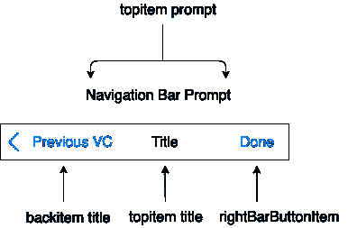
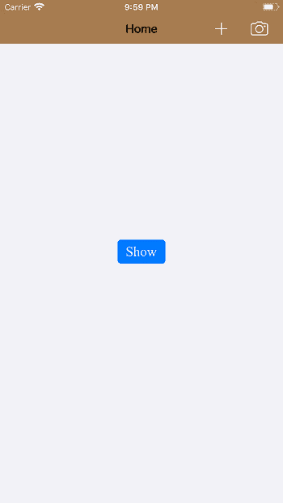

# 导航栏

> 原文：<https://www.javatpoint.com/ios-navigation-bar>

导航栏用于与显示在屏幕顶部的导航控制器相关联。它是继承 UINavigationBar 类的实例。

```

class UINavigationBar : UIView

```

UINavigationBar 对象是一个沿着嵌入在导航控制器中的视图控制器窗口顶部显示的栏。导航栏包含导航项目，通常是用于在屏幕层次结构中导航的条形按钮项目。典型的导航栏包含显示在栏左侧的后退按钮、中央视图控制器标题和可选的右侧栏按钮。



导航栏最常用于与 UINavigationController 对象的关联。导航控制器创建并管理相关的导航栏。它还使用视图控制器的属性来控制导航栏的内容。

配置与导航控制器关联的导航栏的外观需要以下步骤。

1.  将视图控制器嵌入到导航控制器中，或者通过实例化 UINavigationController 类来创建视图控制器。
2.  使用 UINavigationController 对象上的 navigation bar 属性访问关联的导航栏。
3.  通过在每个推送到导航堆栈的 UIViewController 上设置标题和导航项属性来控制导航栏的内容。

### 使用独立导航栏

我们也可以在不使用导航控件的情况下使用导航栏。要使用导航栏，我们必须在对象库中搜索 UINavigationBar，并将结果拖到视图控制器中。配置界面中独立使用的 UINavigationBar 的外观需要以下步骤。

1.  设置自动布局规则，以控制界面中导航栏的位置和大小。
2.  创建一个根导航项目来提供初始标题。
3.  配置委托对象以处理用户与导航栏的交互。
4.  自定义导航栏的外观。
5.  将应用程序配置为推送和弹出相关导航项目。

### 配置导航栏外观

UINavigationBar 的 barStyle 属性用于配置条形图样式。通常，导航栏有两种外观样式:黑色或默认。黑色样式使导航栏具有黑色背景和白色文本。我们也可以将其设置为半透明，使其半透明。下表说明了用于配置导航栏的界面生成器属性。

### 界面构建器属性

### 核心属性

| 塞内加尔 | 属性 | 描述 |
| one | 风格 | 它表示导航栏的栏样式。它控制条形色调和标题颜色。该值可以在运行时使用 barStyle 和 isTransluecent 属性进行访问。 |
| Two | 红酒吧 | 它控制导航栏的色调。该值可以在运行时使用 barTintColor 属性访问。 |
| three | 阴影像 | 它控制导航栏下方显示的阴影图像。该值可以在运行时使用 shadowImage 属性访问。 |
| four | 背面图像 | 它控制用于显示在后退按钮边缘的图像。可以在运行时使用 backIndicatorImage 属性访问该值。 |
| five | 背部面具 | 它指定了与背景图像属性关联的掩码。这必须与背景图像属性关联使用，因为它控制动画过渡期间背景按钮的外观。可以使用 back indicatortransitionmaskimage 属性访问该值。 |

### 标题属性

| 塞内加尔 | 属性 | 描述 |
| one | 标题字体 | 它表示用于在导航栏中心显示标题的字体。可以在运行时使用 titleTextAttributes 字典中的字体键访问该值。 |
| Two | 标题颜色 | 它控制导航栏标题的颜色。它可以在运行时使用 titleTextAttributes 字典中的 foregroundColor 键来访问。 |
| three | 标题阴影 | 它指定渲染导航栏时阴影的颜色和偏移。可以使用 titleTextAttributes 字典中的阴影键来访问它。 |

## 更新导航栏内容

正如我们已经讨论过的，导航栏包含导航堆栈上最顶端的视图控制器的标题。每次导航控制器更改最顶端的视图控制器时，导航栏的内容也会更改，包括标题和栏按钮项。导航栏包含左、中、右三个位置的内容。工具栏按钮项是工具栏按钮项类的实例。

UINavigationBar 的“色调”属性用于更改导航栏中项目的色调。我们还可以通过使用 UINavigationBar 的 barTintColor 属性来更改条形色调。

### 左侧项目

导航栏中的左侧项目提供了导航堆栈中前一个视图控制器的向后导航。但是，如果当前最顶端的视图控制器包含一个自定义的左栏按钮项，那么它将被显示。视图控制器导航项的左栏按钮项属性用于设置自定义左栏按钮项。

如果顶层视图控制器不包含自定义左栏按钮项，但是前一个视图控制器的导航项在其 backBarButtonItem 属性中有一个对象，则导航控制器显示该项目。

但是，如果没有使用上一个视图控制器的标题设置自定义左栏按钮项，将始终显示默认后退按钮。

### 中心项目

如果顶级视图控制器不包含任何自定义导航栏标题视图，则显示默认的标题栏标题。但是，可以使用视图控制器导航项目的“标题视图”属性来设置自定义标题视图。视图控制器的标题属性显示为导航栏的标题。但是，视图控制器导航项的 title 属性可用于显示不同的项。

### 右侧项目

导航栏的右侧是可选的，也就是说，如果尚未设置自定义权限项目，则不会为权限项目设置默认内容。要指定自定义右栏按钮项，我们使用右栏按钮项属性。

### 例子

**ViewController.swift**

```

import UIKit

class ViewController: UIViewController {

    let sb = UIStoryboard(name: "Main", bundle: nil)

    override func viewDidLoad() {
        super.viewDidLoad()
        // Do any additional setup after loading the view.
        self.navigationController?.navigationBar.barStyle = .black

        self.navigationController?.navigationBar.barTintColor = UIColor.brown

        self.navigationItem.title = "Home"

        let rightBarButtonItem = UIBarButtonItem(barButtonSystemItem: .camera, target: self, action: #selector(clickedCamera))
        let rightButton2 = UIBarButtonItem(barButtonSystemItem: .add, target: self, action: #selector(clickedAdd))

        navigationItem.rightBarButtonItems = [rightBarButtonItem,rightButton2]

        rightBarButtonItem.tintColor = UIColor.white
        rightButton2.tintColor = UIColor.white
    }

    @IBAction func clickedButtonShow(_ sender: Any) {
        let secondVC = sb.instantiateViewController(identifier: "SecondVC")
        self.navigationController?.pushViewController(secondVC, animated: true)
    }

    @objc func clickedCamera(){
        debugPrint("Camera Clicked")
    }

    @objc func clickedAdd(){
        debugPrint("Add button Clicked")
    }
}

```

**输出**



* * *