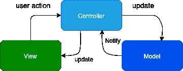

# 模型视图控制器

> 原文：<https://www.javatpoint.com/ios-model-view-controller>

在开发 iOS 应用程序时，我们总是面临着管理项目以便轻松扩展的挑战。我们应该始终遵循最佳实践来开发任何项目。在本教程的这一部分，我们将讨论在架构设计模式中创建 iOS 应用程序的最佳实践。

MVC 是 iOS 应用程序中最常见、最容易遵循的模式。在这里，我们不会编写任何代码，但是我们将通过最佳实践来浏览使用 MVC 的项目。

## 什么是 MVC？

MVC 是常用的初级软件架构设计模式，由以下对象组成。

*   模型包含用于处理应用程序数据的东西。这些模型用于通过服务器的应用编程接口解析请求和响应。像持久性、模型对象、解析器、管理器和网络代码这样的东西驻留在这里。
*   视图被视为应用程序的表面。像 UILabel 和 UITextField 这样的对象是在屏幕上呈现数据的视图对象。该视图不包含任何特定于域的逻辑。
*   通过委托模式，控制器被用作模型和视图之间的中介。控制器不需要知道它工作的具体视图。然而，控制器包含业务逻辑来呈现由模型解析并由视图对象显示的数据。

## 数据和行为的封装(模型对象)

模型层封装了应用程序的数据和行为。模型对象包含保存应用程序数据的类。它还定义了用于操作数据以在应用程序中显示的逻辑。所有重要的数据都封装在设计良好的 iOS 应用程序的模型对象中。模型对象没有与用于在应用程序中呈现数据的用户界面的显式连接。在使用应用编程接口调用在运行时获取其数据的动态 iOS 应用程序中，请求和响应模型用于解析作为获取应用编程接口响应来自服务器或作为发布应用编程接口请求去往服务器的所有数据。

除了请求和响应模型之外，该层还可能包含项目中使用的其他类。

*   **网络代码:**在遵循 MVC 设计模式的每个应用程序中，只使用一个类来包含网络通信代码。所有的网络调用都是通过整个应用程序中的一个类进行的。它帮助我们在代码中实现可重用性，其中 HTTP 请求头和错误处理对所有调用都是通用的。它还实现了代码的灵活性。为了改变整个应用程序中的请求，我们只需要改变一个类。
*   **持久化代码:**在应用内维护本地数据库的应用中，这个层可以用来拥有应用将数据持久化到数据库时使用的持久化代码。
*   **抽象层:**每个应用程序都使用托管对象，这些对象在其他类中用作中介对象。抽象层可以是低级包装器、iOS 上的钥匙链包装器、处理通知的类等。
*   **常量文件:**这是每个 iOS 应用都要管理的东西。它是一个文件，包含应用程序中使用的所有常量。然而，常数必须存储为一组结构，其中该结构包含在应用程序的不同组件中使用的具有常数的变量。在这里，我们可以存储视图控制器名称、屏幕文本等。在项目代码中多次使用的。
*   **扩展:**在这里，我们可以覆盖，或者将方法添加到内置的 swift 类中，比如 UIViewController、String、UIColor、UIButton 等。我们可以将扩展代码放在模型层。

## 向用户呈现信息(视图)

视图对象包含向用户显示来自应用程序模型的数据的代码。视图不负责存储它所显示的数据。但是，视图可能会缓存重复数据以提高应用程序性能。视图对象是可重用和可配置的，以提供应用程序之间的一致性。UIKit 提供了 XCode 对象库中存在的各种视图对象，所有 iOS 应用程序都在使用 Xcode 对象库，以确保视图对象(例如 UIButton)在所有应用程序中表现相同。视图对象可以允许用户编辑数据，并因此向模型通知用户所做的更改。视图图层包含以下类别的类。

*   UIView 子类
*   核心图形
*   核心动画
*   对象库小部件的子类，为整个应用程序中的对象提供通用行为。例如，应用程序可能必须在整个应用程序中具有特定类型的 UILabel 对象。

## 将模型数据绑定到视图(控制器)

控制器对象充当应用程序视图和模型对象之间的中介。控制器确保视图显示的是正确的模型数据。它还确保视图与模型类交互。它管理其他对象的生命周期，并协调应用程序的任务。

为了灵活起见，控制器实现了核心视图对象(如表视图和集合视图)的委托和数据源对象。它是应用程序中可重用性最低的部分，因为它涉及特定于领域的代码。控制器包含定义整个应用程序功能的整个应用程序的业务逻辑。控制器定义了应用程序中视图之间的导航，还定义了何时访问应用程序数据或何时进行网络调用。控制器可以被视为大脑，或应用程序的引擎。

* * *