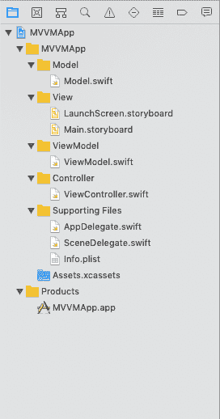

# 模型视图视图-模型

> 原文：<https://www.javatpoint.com/ios-model-view-view-model>

在前一节中，我们已经讨论了 MVC 设计模式，这种模式易于理解和使用。然而，MVC 有一些缺点，这导致了一种新的设计模式的演变，即模型视图视图模型。在教程的这一部分，我们将详细讨论 MVVM 的组成部分。我们还将研究模型视图控制器设计模式的局限性。

## 什么是 MVVM？

MVVM (Model View View-Model)是一种 iOS 架构设计模式，其中我们将对象分成三个主要组件。

*   **型号:**包含应用数据。它负责数据解析和数据持久化。
*   **视图:**负责在屏幕上显示模型数据，包括视觉元素和控件。它是 UIView 的子类，可重用性很高。
*   **视图模型:**它包含将模型数据转换为值并将其传递给视图的业务逻辑。在 MVVM，包括数据操作在内的所有业务逻辑都发生在视图模型中。

MVVM 在 MVC 设计模式中添加了一个新的组件视图模型，这样视图控制器的角色可以最小化，业务逻辑可以发生在视图模型中。

## MVC 的问题

MVC 最常见的问题是数据格式化。在 MVC 中，模型包含应用程序的数据。在开发 iOS 应用程序时，有一个要求，即在将数据呈现给用户之前，需要对其进行格式化。

假设在 iOS 应用程序中，需要向用户显示日期，该日期由服务器返回。但是，如果服务器将日期返回为长毫秒格式，并且我们向用户显示服务器返回的确切日期，那么用户将如何理解日期格式。因此，需要使用日期格式化程序将该日期格式化为字符串。

在 MVC 中，问题是格式化发生在哪里。模型不需要被告知向用户显示的数据。模型不需要理解显示给用户的数据；因此，唯一可以用来放置格式化代码的对象是 controller，因为在拥有如此多的业务逻辑(包括数据源和委托方法)之后，Controller 已经很重了。因此，在 MVC 中控制器变得非常重，因为所有的数据操作任务也发生在控制器上。

## 在哪里使用 MVVM

MVVM 为 MVC 中的一个重控制器问题提供了一个解决方案。它向方案中添加了第四个组件，即视图模型。视图模型负责管理数据操作任务，它还通过视图控制器将模型数据传输到视图来管理模型。当我们需要将模型转换成视图的另一种表示时，可以使用这种模式。例如，我们可以使用视图模型将日期对象转换成格式化的字符串，将十进制值转换成格式化的货币字符串，等等。这种模式很好地补充了 MVC。目的是通过添加另一个组件来最小化视图控制器的角色。然而，视图控制器仍然执行一些主要的处理，包括输出和将格式化的数据注入输出。

## MVVM 项目建筑

下图定义了一个遵循 MVVM 设计模式的 XCode 项目的架构。

* * *