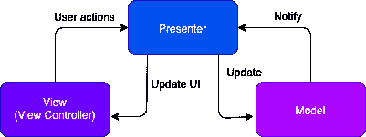
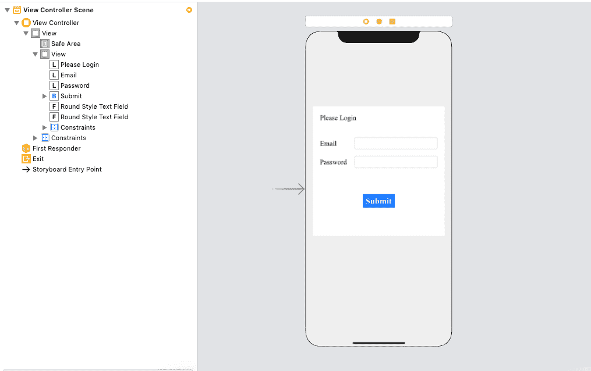
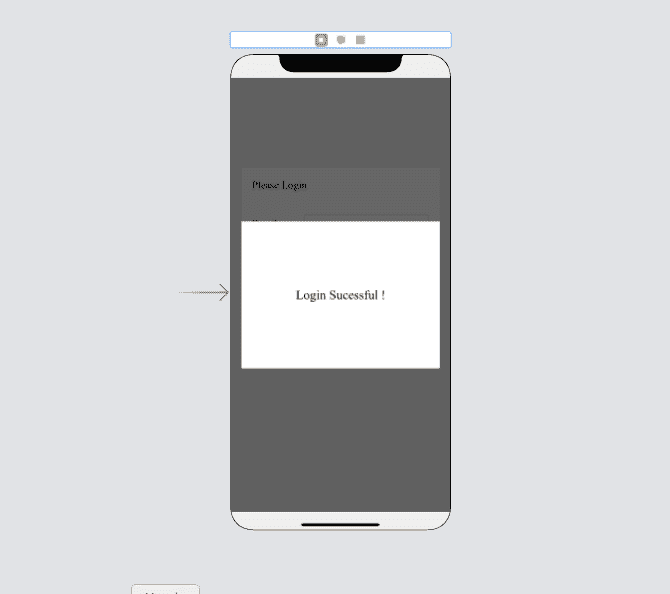
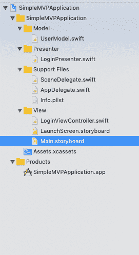

# 模型视图演示者

> 原文：<https://www.javatpoint.com/ios-model-view-presenter>

在本教程的前一部分中，我们讨论了 MVC 的另一种设计模式，模型视图视图模型，其中，我们创建了一个新的组件视图模型来处理数据操作任务。然而，我们可以有一个更好的选择，因为视图控制器仍然做很多工作，因此，在 MVC 中缺乏分布，在 MVVM 也有一点。

此外，控制器与视图生命周期紧密相连，因此，测试视图控制器确实成为一项艰巨的任务。在教程的这一部分，我们将讨论另一种替代设计模式，即 MVP (Model View Presenter)，它将主要组件 Presenter 添加到事物的方案中。

## 什么是 MVP？

模型视图展示器(MVP)是一种设计模式，它将对象分成三个主要组件:模型、视图和展示器。现在，视图控制器被视为视图，演示者包含应用程序的所有业务逻辑。

*   **视图:**视图由视图和视图控制器组成。它只包含视图相关的代码。它负责所有的用户界面设置和事件。
*   **演示者:**演示者包含应用程序的所有业务逻辑。它定义用户操作，并通过委托方法相应地更新用户界面。它不依赖于 UIKit，因此很容易测试。
*   **模型:**模型包含应用数据。网络调用、解析器、扩展、管理器等。发生在这里。



MVP 遵循被动视图模式；也就是说，所有操作都将被转发给使用委托更新 UI 元素的演示者。该视图将传递操作并听取演示者的更新。演示者还会相应地更新模型。

### 例子

在本例中，我们将构建一个遵循 MVP 架构的简单登录应用程序。在这里，我们将创建演示者、视图控制器和用户模型。

**界面构建器**

在这个项目的故事板中，我们将在一个视图控制器上添加两个视图。在第一个视图中，我们将添加两个文本字段来接受用户的输入，以及一个提交按钮，在另一个视图中，我们将显示一条成功消息。最初，第二个视图将被隐藏，并在成功登录时显示。



在上图中，内部视图显示在故事板中。现在我们将在这个视图上添加另一个视图，并使背景颜色为黑色，不透明度为 60 %。它看起来像下图。



现在，我们来看看项目的设计模式。在这里，我们将遵循 MVP 作为设计模式。我们将在项目中创建以下文件夹结构。



LoginPresenter 将包含应用程序的所有业务逻辑。当用户在输入用户名和密码后单击提交按钮时，将触发其提交按钮单击方法。它进行验证，并在确认时创建模型对象。它还通过视图控制器实现的委托方法更新用户界面。

**登录代表。swift**

```

import Foundation

protocol PresenterView:class {
    func updateLoginUI()
}
class LoginPresenter{
    weak var presenterView:PresenterView?
    var userName:String?
    var password:String?

    init(view:PresenterView){
        self.presenterView = view
    }

    func submitButtonClicked(){
        if(self.userName == "root" && self.password == "root"){
            let userModel = UserModel(name:self.userName, password:password)
            self.presenterView?.updateLoginUI()
        }
    }
}

```

**登录视图控制器.swift**

```

import UIKit

class LoginViewController: UIViewController {

    @IBOutlet weak var sucessView: UIView!
    @IBOutlet weak var userEmail: UITextField!
    @IBOutlet weak var userPassword: UITextField!

    lazy var presenter = LoginPresenter(view:self)

    override func viewDidLoad() {
        super.viewDidLoad()
        // Do any additional setup after loading the view.
        self.sucessView.isHidden = true
    }

    @IBAction func clickedSubmitBtn(_ sender: Any) {
        presenter.userName = userEmail.text
        presenter.password = userPassword.text
        presenter.submitButtonClicked()
    }
}

extension LoginViewController : PresenterView{
    func updateLoginUI() {
        self.sucessView.isHidden = false
    }

}

```

**UserModel.swift**

```

import Foundation

class UserModel{
    public var userName:String?
    public var password:String?

    init(name:String?, password:String?) {
        self.userName = name
        self.password = password
    }
}

```

* * *