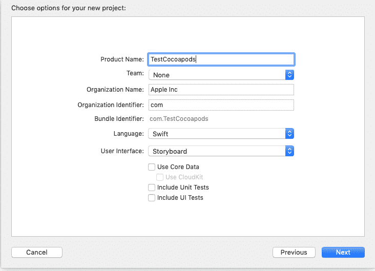
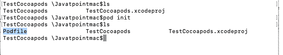
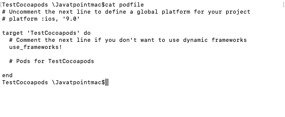
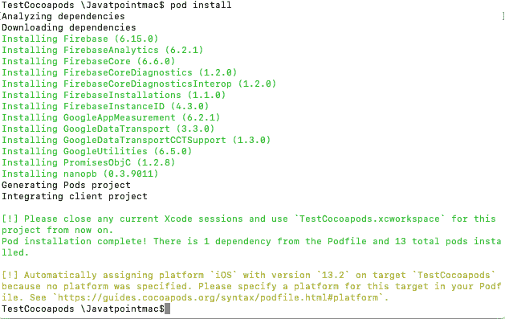
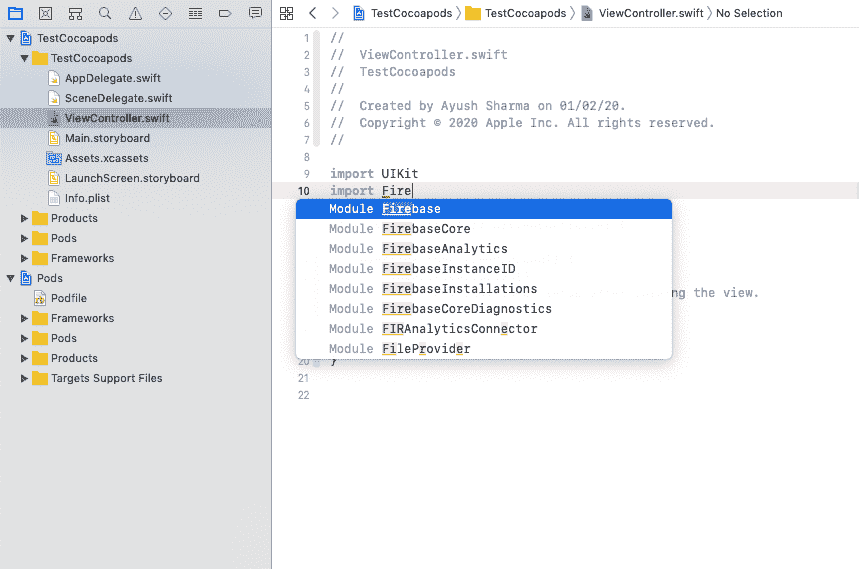

# 将 Cocoapods 用于 XCode 项目

> 原文：<https://www.javatpoint.com/ios-using-cocoapods-for-xcode-projects>

在本教程的前一部分，我们讨论了如何在系统上安装 cocoapods。在教程的这一部分，我们将使用 cocoapods 在项目中安装 firebase 框架。

为此，首先，让我们在 XCode 中创建新项目，并将其命名为 TestPodProject。在这里，我们将这个项目保存到桌面。



现在，我们已经创建了项目，我们关闭项目并打开终端，通过键入以下命令移动到项目目录。

```

$ cd /Desktop/TestCocoapods

```

现在，运行以下命令来初始化项目中的一个 Podfile。

```

$ pod init

```



现在，如果我们看看 Podfile 的内容，我们会发现以下内容。



现在，如果我们想在我们的项目中安装 firebase，我们需要在 Podfile 中提到它，作为 do - end 块中的 pod‘Firebase’，如下所示。

```

# Uncomment the next line to define a global platform for your project
# platform :ios, '9.0'

target 'TestCocoapods' do
  # Comment the next line if you don't want to use dynamic frameworks
  use_frameworks!

  # Pods for TestCocoapods

  pod 'Firebase'

end

```

现在，要安装 pod，我们需要在终端中运行以下命令。

```

$ pod install

```

它将在终端上生成以下输出。



现在，它将生成一个新的项目 xcworkspace 文件，该文件捆绑了原始的 XCode 项目、Firebase 库和依赖项。从现在开始，我们将使用 xcworkspace 文件，而不是 xcodeproj 文件。

如果我们打开 TestCocoapods.xcworkspace 文件，我们会发现 TestCocoapods 项目和 pod 项目，后者包含 Firebase 库。



* * *