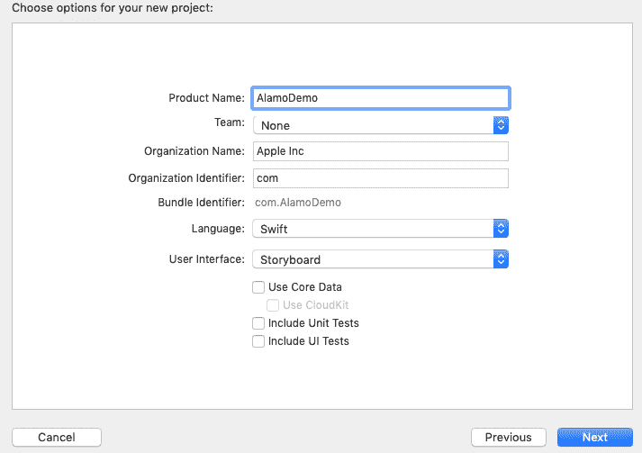
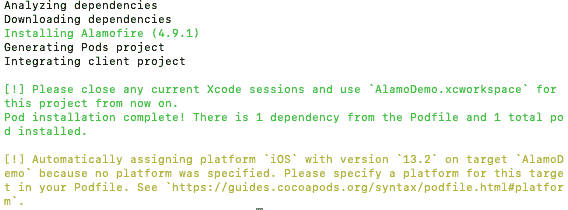

# 阿拉莫菲尔图书馆

> 原文：<https://www.javatpoint.com/ios-alamofire-library>

Alamofire 是一个基于 HTTP 网络的库，用于处理 iOS 和 MacOS 中的 web 请求和响应。它是 URLSession 的包装类，并在苹果网络堆栈的顶部提供了一个接口。它简化了常见的网络任务，如准备 HTTP 请求和解析 JSON 对象。

Alamofire 的主要优势是它完全是用 swift 编写的，没有继承 objective C 中用于网络调用的 AFNetworking 库的任何东西。

它提供了请求和响应方法、JSON 参数和响应序列化、身份验证和许多其他功能。因为 Alamofire 简化了 iOS 项目中的 HTTP 网络调用。在阿拉莫菲尔之前，我们习惯于独自准备所有的请求。多部分请求和响应也是一个复杂的过程，包括文件上传和下载。

在教程的这一部分，我们将讨论广泛使用的网络库 Alamofire 的工作和使用。我们将建立一个项目，看看如何在其中使用阿拉莫菲尔。

## 在 iOS 项目中设置 Alamofire

Alamofire 可以使用 Cocoapods 或迦太基安装在项目中。由于我们在本教程中使用了 cocapods，因此我们将坚持使用 cocapods 进行安装。阿拉莫菲尔项目可以在 GitHub 上作为[https://github.com/Alamofire/Alamofire](https://github.com/Alamofire/Alamofire)找到，在那里我们可以找到关于其安装的文档。

但是，让我们为网络呼叫创建一个新项目，并将其命名为 AlamoDemo。这里，我们将它保存在桌面上一个名为 Alamofire 的文件夹中。



创建项目后，打开终端，通过以下命令将目录更改为项目目录。

```

$ cd Desktop/Alamofire/AlamoDemo

```

通过以下命令初始化 Podfile。

```

$ pod init

```

现在，在 Podfile 中，添加以下行来为 Alamofire 安装 pods。

```

pod 'Alamofire'

```

现在运行以下命令来安装 pods，成功安装后，打开项目 xcworkspace 文件。

```

$ pod install

```



## 基本网络术语

在本教程中，我们没有讨论像 HTTP、JSON 和 REST APIs 这样的基本网络术语，我们将在本教程的这一部分中使用这些术语。但是，这将为您提供一些关于常见网络术语的信息。

### 超文本传送协议

HTTP 代表超文本传输协议，是一种应用协议或一组规则。它管理互联网上的数据传输。HTTP 提供了一组规则，每个网站都遵循这些规则将数据从网络服务器传输到客户端的网络浏览器。互联网上的每个网址都以 HTTPS 的 HTTP 为前缀。还有其他应用协议，如 FTP、Telnet 和 SSH。客户端使用 HTTP 定义的以下请求方法来指示操作。

*   **GET:**GET 请求用于从数据库中检索数据。它不会改变服务器上的数据。
*   **POST:** 用于将数据发送到服务器执行更新动作。
*   **HEAD:** 与 GET 请求相同。但是，它只发送标题，而不发送实际数据。
*   **PUT:** 用于将数据发送到网络服务器上的特定位置。
*   **DELETE:** 用于删除特定位置的数据。

### 休息

REST 代表代表性状态转移，它定义了一组规则来设计一致且易于使用的网络应用程序接口。它定义了一些架构规则，这些规则跨 web 请求保持状态，使请求可缓存并提供统一的访问。作为应用程序开发人员，在将 REST APIs 集成到应用程序中时，我们不需要跟踪请求中的数据状态。

### 数据

JSON 代表 JavaScript 对象符号。它提供了一种人类可读的机制来在两个系统之间传输数据。简单来说，REST APIs 以 JSON 格式发送数据，这需要在客户端进行解析。JSON 有许多数据类型，如字符串、布尔值、数字、数组、对象和空值。

As an application Developer, our main task is to parse the JSON data coming through the API from the server. We need to convert our objects in memory to JSON and vice versa. For this purpose, we may use the JSONSerialization class or JSONEncoder and JSONDecoder classes. However, we may also use a number of third-party libraries for handling JSON like SwityJSON. The combination of HTTP, REST, and JSON provides an excellent combination to provide us the web services. However, the Alamofire library makes it easy to work with these services. However, with Alamofire set up in the iOS project, we will discuss how to handle the data through the get request using alamofire in the next section of this tutorial.

* * *