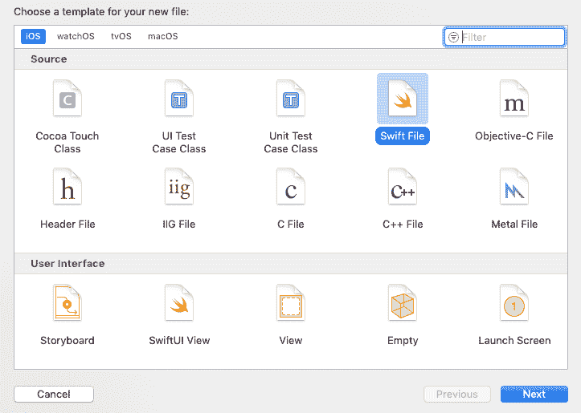

# 解析 JSON 响应

> 原文：<https://www.javatpoint.com/ios-parsing-json-response>

在本教程的前一部分，我们讨论了使用 Alamofire 发出 get 请求。我们创建了一个项目，其中我们使用 tableview 在应用程序中显示艺术家的信息。

在本教程的这一部分中，我们将通过创建响应模型来扩展该项目，并解析响应模型中的响应数据。

为了创建响应模型，我们需要通过 command + n 短键创建一个新的 swift 文件，并选择 swift 文件。



ArtistResponseModel 类应该是 swift 中可解码的基类。

**art response model . swift**

```

import Foundation

class ArtistResponseModel:Decodable{
    public var resultCount:Int?
    public var results:[Results]?
}

class Results : Decodable{
    public var wrapperType : String?
    public var kind : String?
    public var artistId : Int?
    public var collectionId : Int?
    public var trackId : Int?
    public var artistName : String?
    public var collectionName : String?
    public var trackName : String?
    public var collectionCensoredName : String?
    public var trackCensoredName : String?
    public var artistViewUrl : String?
    public var collectionViewUrl : String?
    public var trackViewUrl : String?
    public var previewUrl : String?
    public var artworkUrl30 : String?
    public var artworkUrl60 : String?
    public var artworkUrl100 : String?
    public var collectionPrice : Double?
    public var trackPrice : Double?
    public var releaseDate : String?
    public var collectionExplicitness : String?
    public var trackExplicitness : String?
    public var discCount : Int?
    public var discNumber : Int?
    public var trackCount : Int?
    public var trackNumber : Int?
    public var trackTimeMillis : Int?
    public var country : String?
    public var currency : String?
    public var primaryGenreName : String?
    public var isStreamable : Bool?
}

```

为了解析 Alamofire API 请求中的响应，我们将使用 JSONDecoder，这是一个从 JSON 对象中解码数据类型实例的对象。

JSONDecoder 的解码方法用于解码 JSON 响应。它返回我们指定类型的值，从 JSON 对象解码而来。语法如下。

```

func decode<T>(T.Type, from: Data) -> T

```

在这里，我们将传递 ArtistResponseModel 的实例和响应数据。语法如下。

```

do{
let result: ArtistResponseModel = try JSONDecoder().decode(ArtistResponseModel.self, from: response.data!)
}
catch{
}

```

它将返回 ArtistResponseModel 的实例，该实例现在包含解析后的 json 响应。

ViewController.swift 文件包含以下代码。

**ViewController.swift**

```

import UIKit
import Alamofire

class ViewController: UIViewController {

    @IBOutlet weak var tableView: UITableView!

    var artist = Array<Results>()

    override func viewDidLoad() {
        super.viewDidLoad()
        // Do any additional setup after loading the view.
        loadJsonData()
        tableView.delegate = self
        tableView.dataSource = self
        //tableView.rowHeight = UITableView.automaticDimension
    }
    func loadJsonData()
    {
       Alamofire.request("https://itunes.apple.com/search?media=music&term=bollywood").responseJSON { (response) in
            //print("Response value \(response)")
        do{
            if(response.result.isSuccess){
                let result: ArtistResponseModel = try JSONDecoder().decode(ArtistResponseModel.self, from: response.data!)
                debugPrint(result)
                self.artist = result.results ?? []
                self.tableView.reloadData()
        }

        }catch{

        }
        }

    }
}

extension ViewController : UITableViewDataSource{
    func tableView(_ tableView: UITableView, numberOfRowsInSection section: Int) -> Int {
        return artist.count
    }

    func tableView(_ tableView: UITableView, cellForRowAt indexPath: IndexPath) -> UITableViewCell {
        let cell = tableView.dequeueReusableCell(withIdentifier: "MainTableViewCell") as! MainTableViewCell
        if(artist.count > 0){
            do{
            let artistData = artist[indexPath.row]
                cell.artistImgView.image = try UIImage(data: Data(contentsOf: URL(string: artistData.artworkUrl60!) ?? URL(string: "http://www.google.com")!))
                cell.trackName.text = artistData.trackName
                cell.artisName.text = artistData.artistName
                cell.artistCountry.text = artistData.country
            }catch{

            }

        }
        return cell

    }

}
extension ViewController : UITableViewDelegate{
    func tableView(_ tableView: UITableView, heightForRowAt indexPath: IndexPath) -> CGFloat {
        return 220
    }

}

```

[Click Here to Download Project](https://static.javatpoint.com/tutorial/ios/download/ArtistProject-ResponseModel.zip)

* * *