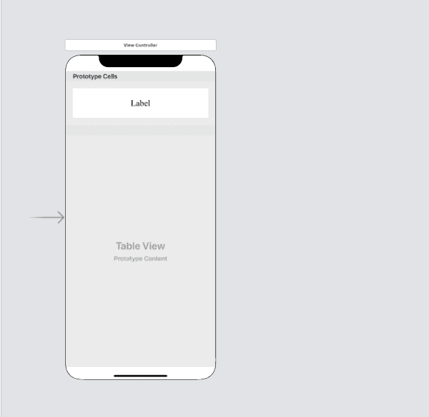

# 拉取刷新功能

> 原文：<https://www.javatpoint.com/ios-pull-to-refresh-functionality>

拉动式更新已经不仅仅是移动应用的要求。目的是为用户提供下拉它以刷新表或集合视图内容的功能。在 iOS 应用程序中，向 tableview 或 collectionview 添加拉取刷新功能已经变得很简单。

## 添加刷新控件

苹果为我们提供了 UIRefreshControl 类，它简化了添加拉取刷新的过程。我们需要做的第一件事是实例化 UIRefreshControl 类。

```

let refreshControl = UIRefreshControl()

```

这里，我们需要将这个刷新控件添加到我们的 tableview 中。我们可以将 tableview 的 refreshControl 属性分配给这个实例。然而，我们必须注意到，在 iOS 10 之前，没有像 refreshControl 这样的属性。我们必须将它作为子视图添加到 tableview 中。

```

if #available(iOS 10.0, *) {
    tableView.refreshControl = refreshControl
} 
else {
    tableView.addSubview(refreshControl)
}

```

现在，我们希望我们的应用程序对表视图刷新执行一些操作。我们可以将其作为目标添加到 UIRefreshControl 实例中。语法如下。

```

refreshControl.addTarget(self, action: #selector(function(_:)), for: .valueChanged)

```

现在，我们都被设置为在应用程序中具有拉取刷新功能。考虑下面的例子，其中我们向 tableview 添加了要刷新的请求。

### 例子

在这个简单的例子中，我们将创建一个 tableview 并用数组填充它。刷新时，我们将向该数组中添加一些值，并用该数组重新加载 tableview。

**主故事板**

Here, we have created a tableview and add a prototype cell in it. We have added a label inside the cell to display the message. The tableview content will be refreshed on pulling it down. 

**ViewController.swift**

```

import UIKit

class ViewController: UIViewController {

    @IBOutlet weak var tableView: UITableView!

    let refreshControl = UIRefreshControl()
    var arr = Array<String>()

    override func viewDidLoad() {
        super.viewDidLoad()
        // Do any additional setup after loading the view.
        tableView.delegate = self
        tableView.dataSource = self
        arr = ["Value 1","Value 2","Value 3","Value 4"]
        tableView.refreshControl = refreshControl
        refreshControl.addTarget(self, action: #selector(refreshData), for: .valueChanged)
    }

    @objc func refreshData(){
        for i in 7..<12{
            arr.append("Value "+i.description)
        }
        tableView.reloadData()
        refreshControl.endRefreshing()
    }
}
extension ViewController : UITableViewDelegate{
    func tableView(_ tableView: UITableView, heightForRowAt indexPath: IndexPath) -> CGFloat {
        return 100
    }
}

extension ViewController : UITableViewDataSource{
    func tableView(_ tableView: UITableView, numberOfRowsInSection section: Int) -> Int {
        return arr.count
    }
    func tableView(_ tableView: UITableView, cellForRowAt indexPath: IndexPath) -> UITableViewCell {
        let cell = tableView.dequeueReusableCell(withIdentifier: "TableViewCell") as! TableViewCell
        cell.lbl.text = arr[indexPath.row]
        return cell
    }
}

```

* * *