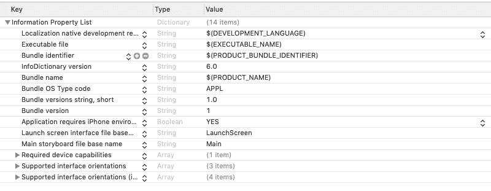

# 什么是用户默认值？

> 原文：<https://www.javatpoint.com/ios-saving-data-in-userdefaults>

用户默认值用于在应用程序中保存小块数据。它可以用来保存应用程序的设置、一些标志或用户令牌。用户默认值是应用程序包中的属性列表文件。

它将数据存储为键值对(字典)；因此，用户默认值被认为是键值存储(KVS)。用户默认值是苹果提供的用户默认值类的实例。它以前被称为 NSUserDefaults。

用户默认值声明如下。

```
class UserDefaults : NSObject

```

在内部，用户默认值以列-行格式存储为属性列表文件。它类似于存储在应用程序包中的 info.plist 文件，其中包含关于应用程序的信息，如包标识符、ATS 设置、构建版本等等。

Info.plist 文件如下图所示。



用户默认值的完美例子是我们为每个应用程序存储在其中的用户令牌。试想一个应用程序，要求用户每次登录正在使用的应用程序。用户每次登录 app 都会变得非常气人。相反，我们可以在成功点击服务器上的登录应用编程接口后，将用户令牌存储在 userdefaults 中。但是，一旦应用程序从设备上卸载，用户默认值中的数据将被销毁。

## 将数据保存在用户默认值中

在用户默认值中，我们可以存储许多数据类型，如布尔、整数、字符串和浮点。我们还可以用数据存储二进制数据，用日期存储日期，用网址数据类型存储网址。我们还可以将数组和字典存储到用户默认值中。

要将数据保存在用户默认值中，首先，我们需要使用标准属性获取对用户默认值的引用。

```
UserDefaults.standard

```

以下代码可用于在用户默认值中保存字符串。

```
let token = "ABCDEFGD!@#$456MK"
UserDefaults.standard.set(token, forKey: "userToken")

```

在内部，我们创建了一个键值对，将值令牌分配给密钥用户令牌。

```
{
"userToken" : "ABCDEFGD!@#$456MK"
}

```

在这里，我们还可以覆盖之前保存的值。对于上面的代码，如果我们为用户令牌存储另一个值，那么先前的值将从用户默认值中删除。

要从用户默认值中移除任何值，请使用 removeObject()方法。在这里，我们想要移除密钥 userToken 的值，我们可以编写以下代码。

```
UserDefaults.standard.removeObject(forKey : "userToken ")

```

用户默认值缓存在 iPhone 的内存中。它会一直存在，直到应用程序继续运行。

* * *