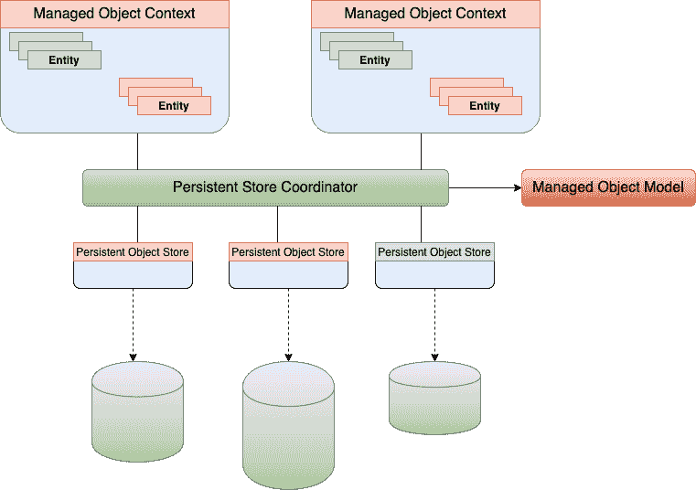

# 持久对象协调器

> 原文：<https://www.javatpoint.com/ios-persistent-object-coordinator>

持久存储协调器包括持久对象存储和托管对象模型，并向托管对象上下文呈现外观，使得一组持久存储作为单个聚合存储出现。

它是 NSPersistentStoreCoordinator 的对象。它包含对定义存储中实体的 NSManagedObjectModel 对象的引用。它是核心数据堆栈中的中心对象。

在许多应用程序中，我们只有一个存储，但是在复杂的应用程序中，可能有几个存储，每个存储可能包含不同的实体。持久存储协调器的角色是管理这些存储，并向其托管对象上下文呈现单个统一存储的外观。当我们获取记录时，核心数据会从所有记录中检索结果，除非您指定我们感兴趣的存储。

每个持久存储都包含它的特性，也就是说，它可以是只读的，存储为二进制或 SQLite 或内存中，或者我们实现的 NSIncrementalStore。可以将模型的不同部分存储在不同的持久存储中，以利用这种灵活性。

* * *