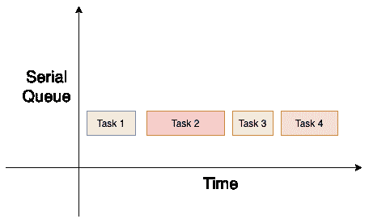
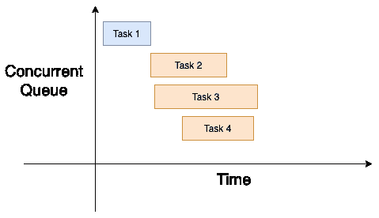

# swift 中的并发

> 原文：<https://www.javatpoint.com/concurrency-in-swift>

在本教程的前一部分，我们已经讨论了 Swift 中的 GCD 概念，它允许 swift 中的[多线程。在本教程的这一部分，我们将讨论 swift 中线程的并发执行。我们还将包括 GCD 使用的队列类型和服务质量类别。](multithreading-in-swift)

正如我们已经提到的，大中央调度(GCD)使用调度队列，该队列用于任务提交，其中任务以先进先出的方式执行。在 [iOS](https://www.javatpoint.com/ios-development-using-swift) 中，进程或应用程序包含一个或多个线程；操作系统有责任彼此独立地调度和管理线程。

但是，每个线程都可以并发执行。操作系统决定哪些线程将同时执行，以及何时执行。归档并发性最常用的方法之一是时间切片，其中每个线程都有相同的执行时间，系统在每个时间间隔执行上下文切换。时间切片大多在单核系统中存档。

另一方面，多核系统可以利用并行性同时执行多个线程。然而，GCD 是建立在线程之上的；它管理一个共享线程池，我们可以在其中添加代码块来调度队列。GCD 总是根据系统和可用资源来决定所需的并行度。

### 调度队列

正如我们在上一节中已经讨论过的，GCD 对调度队列进行操作。 [swift](https://www.javatpoint.com/swift-tutorial) 中的调度队列是 dispatch queue 的一个实例，我们将任务提交给这个队列。GCD 按照先进先出的顺序执行调度队列中的任务。这里，调度队列是线程安全的，可以被多个线程同时访问。

但是，队列可以是并发的，也可以是串行的。顾名思义，串行队列在给定时间只执行一个线程。这里，然后 GCD 决定执行时间。我们永远无法知道执行一项任务所花费的时间。

另一方面，并发队列同时执行多个任务。我们永远不知道开始下一个任务需要多少时间。任务将按照它们添加的相同顺序开始执行。然而，它们可能以不同的顺序结束。我们不能假设一次运行的线程数量。

这里，它取决于 GCD，什么时候启动线程。如果两个线程的执行相互重叠，GCD 还决定是否在不同的内核上运行任务。

GCD 有三种类型的队列。

1.  主队列:主队列在主线程上运行，它执行线程的串行执行。
2.  全局队列:全局队列是一个并发队列，由整个系统共享。有四个全局队列运行在不同的优先级上。优先级有高、缺省、低和后台，其中后台优先级队列拥有最低优先级。
3.  自定义队列:开发人员创建自定义队列。它们可以是并发的，也可以是串行的。

### 服务质量等级

当任务被发送到全局队列时，我们指定一个服务质量类属性。服务质量类决定任务的优先级，然后允许 GCD 执行它们。

系统中存在以下类别的服务质量类别。

1.  **用户交互:**当我们在 iOS 中启动一个应用时，为了获得良好的用户体验，我们需要一些任务立即执行。这样的任务是用户交互的，为了良好的用户体验而执行。作为开发人员，我们必须将这些任务用于用户界面更新、事件处理和小型工作负载。用户交互任务需要在主线程上执行。
2.  **用户发起:**这些任务由用户从用户界面发起。这些是异步任务，当用户在应用程序中等待即时结果时使用，例如一些应用编程接口调用。用户启动的任务在高优先级全局队列中执行。
3.  **实用程序:**这些是长时间运行的任务，通常带有进度指示器。这些类型的线程用于联网、计算、输入/输出等。这些任务在低优先级全局队列中执行。

**后台:**这些是在应用后台运行的任务。用户不知道这些任务。这些任务用于预取、下载、上传、维护和其他类似任务。这必须在后台全局优先级队列中执行。

* * *