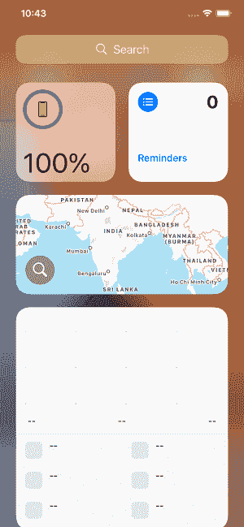

# iOS 14 的功能

> 原文：<https://www.javatpoint.com/features-of-ios-14>

2020 年 6 月，苹果推出了最新版本的移动操作系统，即 iOS 14，并于 9 月 16 日正式发布。苹果在 iOS 14 中进行了多次更新，这是迄今为止最大的更新。iOS 14 带来了许多改进，比如主屏幕设计的改变、Siri 的改进、对现有应用程序的更新等。此外，用户还可以进行多次调整，以简化 iOS 界面。但是，在本文中，我们将详细讨论 iOS 14 的功能。

### 特征

iOS 14 包含以下功能。

### 主屏幕辞职

苹果推出了新的主屏幕设计，提供了更多的定制功能。用户可以隐藏应用程序的整个页面。此外，它还提供了一个新的应用程序库，其中包含了安装的所有内容，并显示用户一目了然。

多个新的小部件被放置在一个新的主屏幕设计上，可以对其进行编辑以添加或删除一些小部件。

### 小工具

小部件也经过了重新设计，看起来更漂亮，包含更多的数据。iOS 14 有默认应用的小部件，如天气、时钟、日历、地图、健身、照片、提醒、股票、音乐、电视、提示等。我们可以在主屏幕上放置这样的小部件，以便一目了然地获得所需的信息。我们还可以改变小部件的大小，使它们变小、变中或变大。

然而，我们可以创建一个多达 10 个小部件的堆栈来利用主屏幕上的大部分空间。在小部件库中，我们甚至可以根据设备智能选择小部件的智能堆栈，以便在正确的时间显示正确的小部件。比如早上可以看到天气 app，白天可以看到日历事件，晚上可以看到苹果地图等。开发人员还可以创建他们的小部件，这些小部件可以放在主屏幕上，并在适当的时候显示给用户。

我们可以编辑主屏幕，并通过长按主屏幕从小部件库中添加小部件。小部件库显示基于用户活动的小部件建议。

### 应用程序库

滑动到主屏幕页面的末尾，即可访问应用程序库。它将所有应用程序组织成一个简单且易于导航的视图。它根据用户的活动向用户推荐应用程序。它还将所有应用程序分类为有序的顺序，如社交、娱乐等。我们还可以使用应用程序库顶部的搜索栏来搜索应用程序库。我们从应用商店下载的应用可以在应用程序库中找到，这使得获取它们变得很容易。

### 紧凑的用户界面

IOS 14 给出了更紧凑的用户界面，允许用户进行多任务处理。当用户接到电话时，它会显示为横幅，而不是整个屏幕。它便于用户跟踪正在进行的操作，并且单元格不能中断用户的流程。用户可以向上滑动横幅以取消呼叫，向下滑动横幅以扩展到电话应用程序以获得更多选项，并轻按横幅以接听呼叫。苹果还引入了一个开发者应用编程接口，这样像 skype 这样的应用程序就可以支持紧凑的来电。它还改进了面部时间呼叫，现在它显示为横幅，而不是占据整个屏幕。

苹果还提供了画中画功能，即现在用户可以在查看邮件或找时间看电视节目的同时进行视频通话。此外，用户可以调整画中画窗口的大小，以适应更大或更小的屏幕。用户还可以将画中画窗口拖到屏幕的任何角落。但是，画中画窗口可以最小化，以便完全访问正在使用的应用程序。

### 搜索

苹果还改进了搜索功能。现在，最相关的结果就显示在顶部，这样更容易找到用户需要的东西。当我们开始在搜索栏中输入内容时，搜索建议也会出现在搜索栏下方。iOS 14 还提供了一个快速启动器，只需键入几个字符并点击 go，就可以快速启动应用程序。现在在网上搜索也变得更容易了。用户需要键入一些内容，并从显示在顶部的网站和网络搜索建议中选择适当的结果。

### 信息

我们可以将最喜欢的对话固定在对话列表的顶部，以便于访问。如果群组对话被锁定，那么当最近的参与者向群组发送任何消息时，我们也可以看到他们被锁定。我们可以在一个帐户上通过 iOS、iPadOS 和 macOS 同步多达 9 个固定对话。我们还可以在群聊中启用智能通知，以便仅在提到用户时通知用户。我们可以直接回复群聊中的消息。现在，我们可以为所有参与者的群组对话设置照片、memoji 或表情符号。

### 拟我表情

梅莫吉有 11 种发型可供选择。我们可以定制男士发髻、顶结等等。我们也可以通过改变头饰的样式来定制我们的 memoji。有 19 种这样的风格来展示爱好或职业，包括自行车头盔、护士帽等。三个新的 memoji 贴纸可以分享给朋友。我们还可以根据我们的年龄定制六种新时代选项的外观。

### 地图

现在地图上增加了各种功能，包括自行车道、小路或道路上的自行车路线。苹果通过提供定制的骑行语音辅助，让导航变得更加容易。用户可以预览乘坐的高度，也可以预览沿途的交通情况。地图还提供了城市最佳游览地点的建议。指南为用户提供了在城市中最佳的饮食、购物或探险地点的建议。指南也可以保存，这有助于我们以后找回它们。地图也变得更加智能，以支持电动汽车。它显示了沿途的充电站。它还计算充电时间，同时评估预计到达时间。地图显示了城市中的拥堵区域，有助于减少交通。地图还能检测沿途的速度摄像头和红灯摄像头。

### 翻译

在 iOS 14 中，翻译变得更加智能。分屏显示为横向模式，显示转换两侧的文本。用户可以通过麦克风提供输入，语言检测在屏幕两侧转录原始和翻译的文本。用户还可以将他们的语音从一种语言翻译成另一种语言，即使下载的语言没有活跃的互联网连接。用户不需要下载单独的键盘，因为所有语言的键盘都包含翻译文本。用户还可以将翻译保存在收藏夹选项卡中，以便以后访问。Translate 支持 11 种语言的组合，即英语(美国和英国)、西班牙语、汉语、日语、韩语、俄语、古尔曼语、法语、意大利语、葡萄牙语和阿拉伯语。

### Siri 改进

在 iOS 14 中，Siri 也通过新的紧凑设计进行了改进。它允许我们参考屏幕上的信息并进一步启动。当我们启动任何请求时，Siri 会在屏幕底部弹出，而信息会作为通知出现在顶部。Siri 还有一个重大的知识升级，现在事实增加了 20 倍。有了 Siri，我们现在不需要浏览网页；它可以为更广泛的问题提供答案。现在，我们还可以用 iOS 和 Carplay 发送音频消息。我们也可以向 Siri 询问骑行方向。开车时，我们可以让 Siri 和一个联系人分享路线的预计到达时间。Siri 可以翻译的语言也有了重大更新。现在，先生可以翻译超过 65 种语言对。Siri 的声音也被批准使用先进的文本到语音技术，听起来更加自然。

### 旅行队

在 iOS 14 中，Safari 可以翻译整个网页。safari 的地址栏中显示有翻译图标，可用于将网页翻译成一组语言，包括英语、西班牙语、简体中文、法语、德语、俄语或巴西葡萄牙语。Safari 提供了访问隐私报告的选项，该报告显示了智能跟踪系统在 safari 中阻止的跨站点跟踪器。Safari 在高速 JavaScript 引擎的性能方面也比安卓的 chrome 有优势。Safari 还会监控保存的密码，以关注可能与数据泄露有关的密码。

在本文中，我们已经介绍了所有新 iOS 14 的功能。但是，iOS 14 提供了大量功能。我们建议所有的开发人员阅读这些特性，根据新特性开发应用程序。

* * *