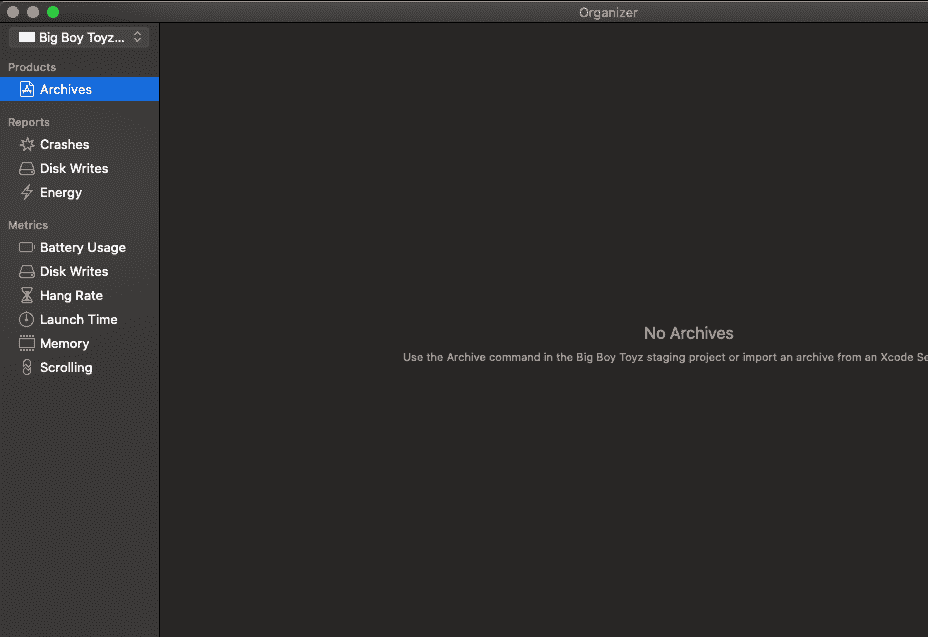

# XCode 12 特性

> 原文：<https://www.javatpoint.com/xcode-12-features>

2020 年 6 月，在 WWDC，苹果宣布发布 XCode 12，所有新功能和改进将面向全球开发者。苹果在 XCode 12 上做了很多改进。它包括 [Swift](https://www.javatpoint.com/swift-tutorial) 5.3、 [iOS](https://www.javatpoint.com/ios-development-using-swift) 14、iPadOS14 和 MacOS Big Sur 的 SDK。苹果与 [XCode](https://www.javatpoint.com/ios-introduction-to-xcode-ide) 12 一起提供了以下进步。

**1。苹果电脑大苏尔的用户界面改进**

XCode 12 做了很多改进，使其外观和感觉与所有新的 macOS Big Sur 兼容。

1.  我们可以使用文档选项卡打开任何文档，这些选项卡可以在轻量级编辑器选项卡中打开文档、日志、资产目录和用户界面文件。
2.  侧边栏、工具栏和图标的设计经过改进，以匹配 macOS 大苏尔。
3.  我们可以手动将导航字体的大小设置为自定义值。
4.  管理器经过改进，可以报告新的应用指标，如电池使用、磁盘写入、挂起率、启动时间、内存和滚动。

**2。Swift 和 SwiftUI**

1.  XCode 12 在 SwiftUI 中提供了应用生命周期，这使得整个应用能够完全用 SwiftUI 编写。
2.  我们现在有一个基于 SwiftUI 的 WidgetKit。它允许我们共享运行在 iOS、macOS 和 iPadOS 上的小部件的代码。
3.  在性能方面，SwiftUI 进行了重大升级。XCode 12 提供了 Lazy 视图的概念，可以高效地处理庞大的数据集。
4.  现在，使用多平台模板可以轻松地在所有苹果平台上共享 SwiftUI 代码。
5.  我们可以将 SwiftUI 视图变成可重用的组件。
6.  Swift 语言诊断得到了改进，使得理解编码错误变得更加容易，尤其是对于 SwiftUI。

3.现在，我们可以创建 App Clip Target，它从应用程序中提供一个小的、集中的体验。可以快速安装。

4.苹果利用 Storekit 测试框架和交易管理器，可以轻松调试应用内购买。

**5。Mac Catalyst**

1.  与 iPad 和 iPhones 一样，我们可以用 100%原生 mac 大小查看应用的用户界面，并使用所有新的 mac 习惯用法。
2.  有各种框架和控件可用，包括 HomeKit 和 AVCapture。
3.  XCode 12 提供了键盘 API，这使得用键盘控制应用变得更加容易。
4.  使用 mac catalyst 构建的应用程序继承了所有新 macOS Big Sur 的外观和感觉。

6.苹果团队在 XCode 12 的故事板中提供了最小值，以简化设计。这个最小值允许我们对整个画布有一个概述。在视图和视图控制器之间导航时，它很有帮助。我们也可以通过选择编辑器->画布->小地图来打开或关闭这个小地图。

7.我们现在可以在资产目录中添加 SVG 图像，这有助于减小 iOS 应用程序的大小。此外，我们不需要为 PNG 图像提供 1X、2X、3X 尺寸。

8.带有 XCode 12 的模拟器现在可以全屏模式使用。这些模拟器将永远在所有窗口的顶部。我们可以通过选择窗口->保持在顶部来打开或关闭该功能。

* * *