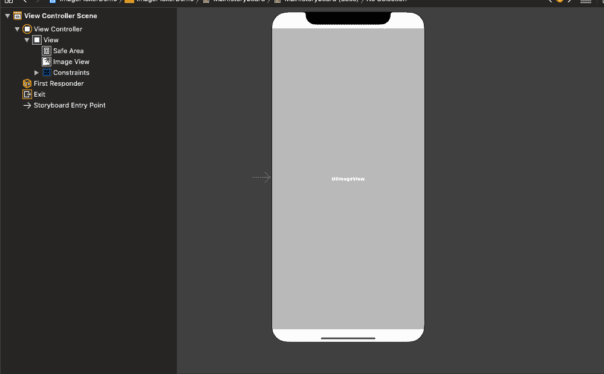

# 如何使用 iOS 应用捕捉图像

> 原文：<https://www.javatpoint.com/how-to-capture-image-using-ios-app>

我们可以使用 [iOS](https://www.javatpoint.com/ios-development-using-swift) 中的框架 AVFoundation 在 iOS 应用中拍照。但是，在本教程中，我们将使用 UIImagePickerControllerDelegate 方法。在这里，我们将构建一个简单的应用程序，它将使用设备摄像头捕获图片，并将其设置为图像视图。在本教程中，我们不会使用 AVFoundation。相反，我们将使用 UIImagePickerController。

图像拾取控制器主要用于管理用户交互，并将交互结果传递给委托对象。图像拾取器控制器的角色和外观取决于我们在呈现它之前分配给它的*源类型*。

在 XCode 中创建一个项目，并将 ImageView 添加到故事板的 ViewController 中。



现在，在视图控制器类中创建插座。我们需要确保我们的视图控制器类符合 UIImagePickerControllerDelegate 和 UINavigationControllerDelegate 协议。

```

class ViewController: UIViewController,UIImagePickerControllerDelegate,UINavigationControllerDelegate

```

一旦我们使我们的视图控制器符合上述协议，创建一个@objc 类型的函数作为 openCam()，它将包含打开摄像机的业务代码。openCam()的声明如下。

```

@objc func openCamera(){}

```

在 ViewController 中，在 viewDidLoad()中创建一个 TapGestureRecognizer，这样一旦我们点击 ViewController，摄像机就会打开。

```

override func viewDidLoad() {
        super.viewDidLoad()
        // Do any additional setup after loading the view.
        let gesture = UITapGestureRecognizer(target: self, action: #selector(openCamera))
        self.view.addGestureRecognizer(gesture)  
    }

```

现在，我们将定义 openCamera 函数，它将包含 UIImagePickerController 的实例。例如，我们需要定义属性，并呈现属性。

```

@objc func openCamera(){
         let imgPicker = UIImagePickerController()
         imgPicker.delegate = self
        imgPicker.sourceType = .camera
        imgPicker.allowsEditing = false
        imgPicker.showsCameraControls = true
       self.present(imgPicker, animated: true, completion: nil)
    }

```

一旦我们完成了上面的步骤，我们将需要实现 UIImagePickerControllerDelegate 的 didFinishPickingMediaWithInfo 方法。我们将获得方法内部的图像，该图像由用户捕获，可以设置为我们在步骤 1 中创建的图像出口。

```

func imagePickerController(_ picker: UIImagePickerController,didFinishPickingMediaWithInfo info: [UIImagePickerController.InfoKey :Any]) {
 if let img = info[UIImagePickerController.InfoKey.editedImage] as?   UIImage {
self.imgV.image = img        
self.dismiss(animated: true, completion: nil)      
}else {   
print("error")
}   
}}

```

我们需要在 info.plist 中添加相机使用描述键，并描述我们的应用程序为什么要使用相机。将以下代码添加到 info.plist 文件中。

```

<key>NSCameraUsageDescription</key>
<string>This app will use camera to take pictures</string>

```

我们需要在实际的 iOS 设备上运行这个应用程序，因为我们不能运行相同的 iOS 模拟器。

应用程序代码如下所示。

```

import UIKit

Class ViewController: UIViewController, UIImagePickerControllerDelegate, UINavigationControllerDelegate {

    @IBOutlet weak var imgView: UIImageView!
    override func viewDidLoad() {
        super.viewDidLoad()
        // Do any additional setup after loading the view.
        let gesture = UITapGestureRecognizer(target: self, action: #selector(openCamera))
        self.view.addGestureRecognizer(gesture)
    }

    @objc func openCamera(){
         let imgPicker = UIImagePickerController()

         imgPicker.delegate = self
        imgPicker.sourceType = .camera
        imgPicker.allowsEditing = false
        imgPicker.showsCameraControls = true
       self.present(imgPicker, animated: true, completion: nil)
    }

    func imagePickerController(_ picker: UIImagePickerController, didFinishPickingMediaWithInfo info: [UIImagePickerController.InfoKey : Any]) {

     if let img = info[UIImagePickerController.InfoKey.editedImage] as?    UIImage {

    self.imgView.image = img

    self.dismiss(animated: true, completion: nil)

    } else {

    print("error")

    }

    } }

```

* * *