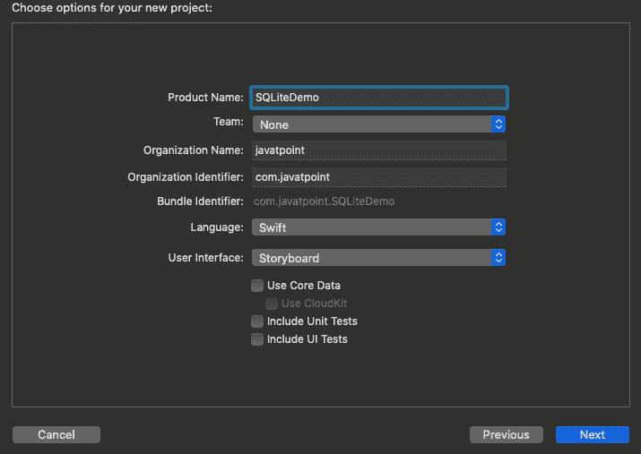
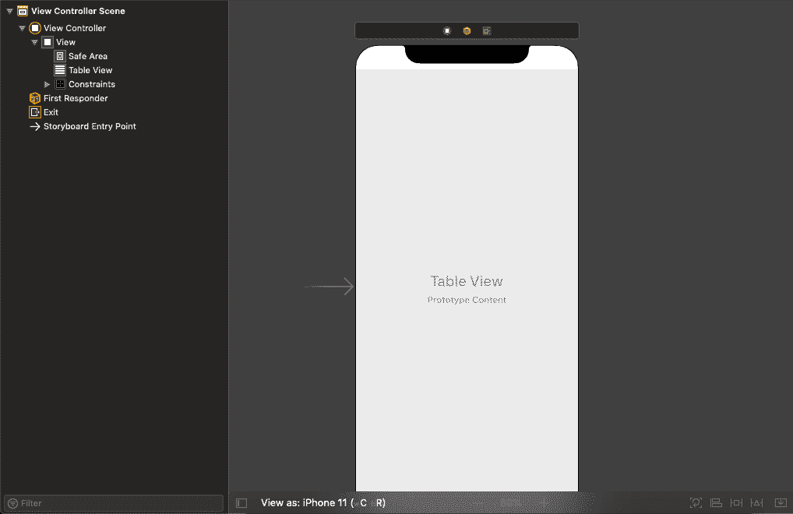
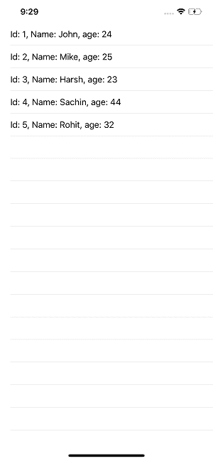

# 在 iOS 应用程序中使用 SQLite

> 原文：<https://www.javatpoint.com/using-sqlite-in-ios-app>

在软件开发中，我们经常需要将数据保存在应用程序中。然而，我们使用数据结构来管理和导航应用程序中的数据，但是我们可能还需要存储这些结构以备将来使用。换句话说，一旦应用程序被杀死，数据结构就不会存在于内存中。我们必须将数据结构保存在某个地方，以便在需要时访问它们。

将结构化数据存储在数据库中有多种解决方案，如 [SQLite](https://www.javatpoint.com/sqlite-tutorial) 、Realm、 [CoreData](https://www.javatpoint.com/ios-coredata) 等。在本教程中，我们将讨论如何在 SQLite 数据库中存储和管理数据。但是，如果我们以前使用过 CoreData，那么我们已经使用过 SQLite 了，因为 CoreData 只是 SQLite 之上的一层。在本教程中，我们将在 [iOS](https://www.javatpoint.com/ios-development-using-swift) 应用程序中执行以下数据库操作。

1.  创建并连接到数据库。
2.  创建表格。
3.  插入、更新和删除行。
4.  查询数据库以获取结果。

### 入门指南

让我们创建一个单一视图的 iOS 应用程序作为 SQLiteDemo，从 SQLite 操作开始。



创建完项目后，打开 Main .故事板文件，并向视图控制器添加一个表格视图，如下图所示。



为了使用表视图，我们还需要在 ViewController.swift 类中创建它的出口。一旦我们实现了委托和数据源方法，ViewController.swift 就会包含以下代码。

```

import UIKit

class ViewController: UIViewController {

    @IBOutlet weak var tableView: UITableView!

    override func viewDidLoad() {
        super.viewDidLoad()
        // Do any additional setup after loading the view.
        tableView.delegate = self
        tableView.dataSource = self
    }

}

extension ViewController : UITableViewDelegate{
    func tableView(_ tableView: UITableView, heightForRowAt indexPath: IndexPath) -> CGFloat {
        return UITableView.automaticDimension
    }
}

extension  ViewController : UITableViewDataSource{
    func tableView(_ tableView: UITableView, numberOfRowsInSection section: Int) -> Int {
        return 5
    }
    func tableView(_ tableView: UITableView, cellForRowAt indexPath: IndexPath) -> UITableViewCell {
        let cell = tableView.dequeueReusableCell(withIdentifier: "tableViewCell") ?? UITableViewCell()
        return cell
    }
}

```

现在，我们将创建一个模型类员工。在我们的项目中，员工有姓名、年龄和身份证。为此，创建一个新的 swift 文件并添加以下代码。

```

import Foundation

class Employee
{

    var name: String = ""
    var age: Int = 0
    var id: Int = 0

    init(id:Int, name:String, age:Int)
    {
        self.id = id
        self.name = name
        self.age = age
    }
}

```

现在，我们将创建一个包含数据库操作的类。我们将这个类命名为 DBManager。它包括创建数据库、创建表、在表中插入、从表中读取以及执行删除的方法。DBManager 包含以下代码。

```

import Foundation
import SQLite3

class DBManager
{
    init()
    {
        db = openDatabase()
        createTable()
    }

    let dbPath: String = "myDb.sqlite"
    var db:OpaquePointer?

    func openDatabase() -> OpaquePointer?
    {
        let filePath = try! FileManager.default.url(for: .documentDirectory, in: .userDomainMask, appropriateFor: nil, create: false)
            .appendingPathComponent(dbPath)
        var db: OpaquePointer? = nil
        if sqlite3_open(filePath.path, &db) != SQLITE_OK
        {
            debugPrint("can't open database")
            return nil
        }
        else
        {
            print("Successfully created connection to database at \(dbPath)")
            return db
        }
    }

    func createTable() {
        let createTableString = "CREATE TABLE IF NOT EXISTS person(Id INTEGER PRIMARY KEY,name TEXT,age INTEGER);"
        var createTableStatement: OpaquePointer? = nil
        if sqlite3_prepare_v2(db, createTableString, -1, &createTableStatement, nil) == SQLITE_OK
        {
            if sqlite3_step(createTableStatement) == SQLITE_DONE
            {
                print("person table created.")
            } else {
                print("person table could not be created.")
            }
        } else {
            print("CREATE TABLE statement could not be prepared.")
        }
        sqlite3_finalize(createTableStatement)
    }

    func insert(id:Int, name:String, age:Int)
    {
        let persons = read()
        for p in persons
        {
            if p.id == id
            {
                return
            }
        }
        let insertStatementString = "INSERT INTO person (Id, name, age) VALUES (?, ?, ?);"
        var insertStatement: OpaquePointer? = nil
        if sqlite3_prepare_v2(db, insertStatementString, -1, &insertStatement, nil) == SQLITE_OK {
            sqlite3_bind_int(insertStatement, 1, Int32(id))
            sqlite3_bind_text(insertStatement, 2, (name as NSString).utf8String, -1, nil)
            sqlite3_bind_int(insertStatement, 3, Int32(age))

            if sqlite3_step(insertStatement) == SQLITE_DONE {
                print("Successfully inserted row.")
            } else {
                print("Could not insert row.")
            }
        } else {
            print("INSERT statement could not be prepared.")
        }
        sqlite3_finalize(insertStatement)
    }

    func read() -> [Employee] {
        let queryStatementString = "SELECT * FROM person;"
        var queryStatement: OpaquePointer? = nil
        var emps : [Employee] = []
        if sqlite3_prepare_v2(db, queryStatementString, -1, &queryStatement, nil) == SQLITE_OK {
            while sqlite3_step(queryStatement) == SQLITE_ROW {
                let id = sqlite3_column_int(queryStatement, 0)
                let name = String(describing: String(cString: sqlite3_column_text(queryStatement, 1)))
                let year = sqlite3_column_int(queryStatement, 2)
                emps.append(Employee(id: Int(id), name: name, age: Int(year)))
                print("Query Result:")
                print("\(id) | \(name) | \(year)")
            }
        } else {
            print("SELECT statement could not be prepared")
        }
        sqlite3_finalize(queryStatement)
        return emps
    }

    func deleteByID(id:Int) {
        let deleteStatementStirng = "DELETE FROM person WHERE Id = ?;"
        var deleteStatement: OpaquePointer? = nil
        if sqlite3_prepare_v2(db, deleteStatementStirng, -1, &deleteStatement, nil) == SQLITE_OK {
            sqlite3_bind_int(deleteStatement, 1, Int32(id))
            if sqlite3_step(deleteStatement) == SQLITE_DONE {
                print("Successfully deleted row.")
            } else {
                print("Could not delete row.")
            }
        } else {
            print("DELETE statement could not be prepared")
        }
        sqlite3_finalize(deleteStatement)
    }

}

```

最后，我们需要将数据保存在视图控制器的数据库中。为此，我们将使用 DBManager 类来保存和检索数据。ViewController.swift 包含以下代码。

```

import UIKit

class ViewController: UIViewController {

    @IBOutlet weak var tableView: UITableView!
    var db = DBManager()
    var emps = Array()

    override func viewDidLoad() {
        super.viewDidLoad()
        // Do any additional setup after loading the view.
        tableView.delegate = self
        tableView.dataSource = self

        db.insert(id: 1, name: "John", age: 24)
        db.insert(id: 2, name: "Mike", age: 25)
        db.insert(id: 3, name: "Harsh", age: 23)
        db.insert(id: 4, name: "Sachin", age: 44)
        db.insert(id: 5, name: "Rohit", age: 32)
        emps = db.read()

    }

}

extension ViewController : UITableViewDelegate{
    func tableView(_ tableView: UITableView, heightForRowAt indexPath: IndexPath) -> CGFloat {
        return UITableView.automaticDimension
    }
}

extension  ViewController : UITableViewDataSource{
    func tableView(_ tableView: UITableView, numberOfRowsInSection section: Int) -> Int {
        return emps.count
    }
    func tableView(_ tableView: UITableView, cellForRowAt indexPath: IndexPath) -> UITableViewCell {
        let cell = tableView.dequeueReusableCell(withIdentifier: "tableViewCell") ?? UITableViewCell()
        cell.textLabel?.text = "Id: " + emps[indexPath.row].id.description + ", Name: " + emps[indexPath.row].name + ", age: " + emps[indexPath.row].age.description
        return cell
    }
} 
```

输出如下图所示。



* * *