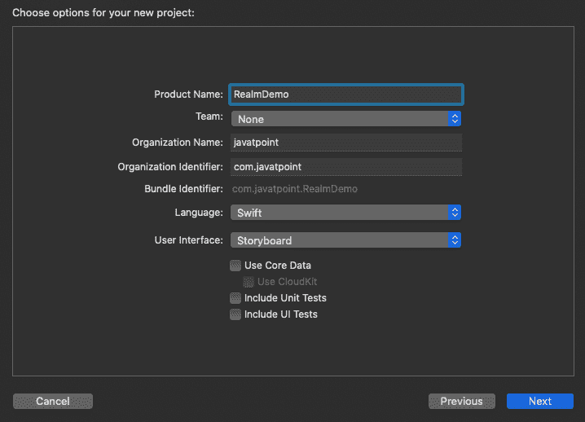

# 在 iOS 应用程序中使用领域数据库

> 原文：<https://www.javatpoint.com/using-realm-database-in-ios-app>

我们已经使用了 SQLite 和 CoreData 来在 iOS 应用程序中保存数据。这个领域是苹果 CoreData 的替代品。它比 CoreData 和 SQLite 更快更容易使用。在我们利用 Realm 的云功能之前，它免费无限使用。在本教程中，我们将创建一个新的 iOS 项目来使用 Realm 存储数据。我们将讨论数据库的基本 CRUD(创建、读取、更新、删除)操作。

### 什么是境界

Realm 是一个数据库，旨在为 [iOS](https://www.javatpoint.com/ios-development-using-swift) 和[安卓](https://www.javatpoint.com/android-tutorial)提供移动应用。它比用于 iOS 应用的 [SQLite](https://www.javatpoint.com/sqlite-tutorial) 和 CoreData 运行得更好更快。它更容易使用，并且需要更少的代码来存储和检索数据。它可以免费用于 iOS 和安卓应用，没有任何限制。Realm 是移动数据库的一种替代方案，因为目前，除了 SQLite 或任何在 SQLite 之上工作的包装器(如 CoreData)之外，我们没有太多选择。它主要设计为易于使用，因为它不是 ORM，因为它使用持久性引擎来提供速度和性能。

### 为什么使用领域

Realm 在速度方面优于其他移动数据库。它更容易使用，并且检索和存储数据所需的代码也更少。在教程的这一部分，我们将讨论 Realm 数据库的优缺点。

1.  **易于安装:**在 iOS 中，在应用程序中安装 Realm 非常简单。我们只需使用 Cocoapods 就可以轻松地在 iOS 应用程序中安装 Realm。
2.  **比其他数据库工作更快:**在 Realm 中保存、检索或执行任何数据库操作都更快。对于 iOS 应用程序，Realm 比 SQLite 和 CoreData 快。
3.  **跨平台** : Realm 数据库是跨平台的，因此无论我们使用什么技术，都可以轻松在 iOS 和 android 上工作。
4.  **可扩展性:**在开发处理大量用户及其记录的应用时，考虑数据库的可扩展性是非常重要的。我们可以使用 Realm 在更短的时间内处理大量数据。我们还将在应用程序中使用 Realm 时获得速度和平滑度。
5.  **良好的文档&支持:**领域团队提供了关于在我们的应用程序中安装和使用领域数据库的丰富文档。
6.  **免费**:领域是免费的，它提供了所有的好处。

### **概念概述**

为了理解 Realm 数据库的正确功能，我们需要了解我们将在本教程中使用的类。

*   **领域**:领域实例是框架的基本构件。它作为底层数据库的访问点，就像核心数据管理的对象上下文一样。可以使用 Realm()初始值设定项创建实例。
*   **对象**:这是境界模型。我们需要创建模型来定义数据库模式。为了创建模型，我们需要子类化对象并定义我们想要作为属性保存的字段。
*   **关系**:我们可以通过声明我们想要引用的对象类型的属性来创建对象之间的一对多关系。我们可以通过 List 类型的属性创建多对一和多对多关系。
*   **写事务**:数据库中的任何操作，如创建、编辑或删除对象，都必须通过在领域实例上调用 write(_:)在**写操作**中执行。
*   **查询**:要从数据库中检索对象，可以使用查询。最简单的查询形式是在 Realm 实例上调用 objects()，并传入您要查找的对象的类。如果您的数据检索需求更复杂，您可以使用谓词，链接查询并对结果进行排序。
*   **结果**:结果是一个自动更新的容器类型，可以从对象查询中获得。它们与常规数组有许多相似之处，包括下标语法。

### 入门指南

首先，我们需要创建一个新的 [XCode](https://www.javatpoint.com/ios-introduction-to-xcode-ide) 项目。使用 swift 创建单视图 iOS 应用程序，如下所示。



在本教程中，为了将 Realm 数据库添加到我们的项目中，我们将使用 Cocoapods。为此，请打开终端，导航到项目目录，然后运行以下命令。

```

$ pod init

```

它将在项目目录中生成 Podfile 我们需要打开它并添加 pod 来下载 Realm。

Podfile 将包含以下代码。

```

# Uncomment the next line to define a global platform for your project
# platform :ios, '9.0'

target 'RealmDemo' do
  # Comment the next line if you don't want to use dynamic frameworks
  use_frameworks!

  # Pods for RealmDemo
pod 'RealmSwift'

end

```

现在，在终端中运行以下命令来安装 pod。

```

$ pod install

```

一旦我们完成了为 Realm 安装豆荚，我们需要关闭所有 XCode 实例并打开。xcworkspace 文件。

**使用领域数据库进行数据持久化**

首先，我们需要创建一个在 Realm 中使用的对象。为此，使用以下代码添加 swift 文件 Employee.swift。

```

import Foundation
import RealmSwift

class Employee: Object {
    @objc dynamic var age = 0
    @objc dynamic var id = 0
    @objc dynamic var name = ""
}

```

现在，我们需要从 Realm 中保存和检索员工。让我们创建一个名为 EmployeeDAO 的类，并将以下代码写入其中。

```

import Foundation

import RealmSwift

class EmployeeDAO {
    var realm: Realm = try! Realm()
}

```

在 EmployeeDAO 中，我们已经创建了作为类成员的领域数据库。现在，我们需要添加方法来保存和检索雇员类型的对象。

```

func saveEmployees(_ emp:Employee){
        try! realm.write {
            realm.add(emp)
        }
    }

```

这里，Realm.write 启动一个写事务。写事务可能会失败，因此我们需要将其标记为抛出。现在我们需要查看代码来检索对象。

```

public func findEmployeesByName(_ title: String) -> Results {
        let predicate = NSPredicate(format: "name = %@", title)
        return realm.objects(Employee.self).filter(predicate)
    } 
```

让我们在员工数据库中添加一个方法来添加新员工。我们将把这个方法放在 EmployeeDAO 类中。将以下代码添加到 EmployeeDAO 类中。

```

    public func addNewEmployee(_ age: Int, name: String, id: Int ) -> Employee
    {
        let emp = Employee()
        emp.age = age
        emp.name = name
        emp.id = id
        return emp
    }

```

现在，我们将尝试保存和检索视图控制器类中的员工。为此，在视图控制器中添加以下代码。

```

import UIKit

class ViewController: UIViewController {

    let empDb = EmployeeDAO()

    override func viewDidLoad() {
        super.viewDidLoad()
        // Do any additional setup after loading the view.
        saveAndGetEmployees()
    }

    func saveAndGetEmployees() {
        let emp = empDb.addNewEmployee(24, "john",1001)
        empDb.saveEmployees(emp)

        let foundEmp = empDb.findEmployeesByName("john")
      debugPrint(foundEmp)

    }

}

```

**输出**

它在 XCode 控制台中打印检索到的员工。

```
Results <0x7f9aca60e5b0> (
[0] Employee {
age = 24;
id = 1001;
name = john;
}
) 
```

现在，让我们尝试从数据库中删除该对象。为此，在 EmployeeDAO 类中添加以下方法。

```

 public func deleteEmployee(_ emp: Employee) {
        if (realm != nil) {
            try! realm.write {
                realm.delete(emp)
            }
        }
    }

```

为了测试 delete 方法的实现，让我们在数据库中添加一个名为 Mike 的新员工，将其删除，然后检索名为 Mike 的员工。为此，让我们在视图控制器的 saveAndGetEmployees 方法中添加以下代码。

```

let newEmp = empDb.addNewEmployee(30, "Mike", 1002)
     empDb.saveEmployees(newEmp)
     var foundEmp = empDb.findEmployeesByName("Mike")
     debugPrint(foundEmp)
     empDb.deleteEmployee(newEmp)
     foundEmp = empDb.findEmployeesByName("Mike")
     debugPrint(foundEmp)

```

这将在控制台中打印以下输出。

```
Results <0x7fc1c1f6d040> (
[0] Employee {
age = 30;
id = 1002;
name = Mike;
}
)
Results <employee><0x7fc1c1c11bb0> (

)</employee> 
```

现在，我们的视图控制器将包含以下代码。

```

import UIKit

class ViewController: UIViewController {

    let empDb = EmployeeDAO()

    override func viewDidLoad() {
        super.viewDidLoad()
        // Do any additional setup after loading the view.
        saveAndGetEmployees()
    }

    func saveAndGetEmployees() {
        let emp = empDb.addNewEmployee(24, "john",1001)
        empDb.saveEmployees(emp)

        let newEmp = empDb.addNewEmployee(30, "Mike", 1002)
        empDb.saveEmployees(newEmp)
        var foundEmp = empDb.findEmployeesByName("Mike")
        debugPrint(foundEmp)
        empDb.deleteEmployee(newEmp)

        foundEmp = empDb.findEmployeesByName("Mike")
      debugPrint(foundEmp)

    }

}

```

我们的 EmployeeDAO 类将包含以下代码。

```

import Foundation

import RealmSwift

class EmployeeDAO {
    var realm: Realm = try! Realm()

    func saveEmployees(_ emp:Employee){
        try! realm.write {
            realm.add(emp)
        }
    }
    public func findEmployeesByName(_ title: String) -> Results {
        let predicate = NSPredicate(format: "name = %@", title)
        return realm.objects(Employee.self).filter(predicate)
    }
    public func addNewEmployee(_ age: Int, _ name: String, _ id: Int ) -> Employee
    {
        let emp = Employee()
        emp.age = age
        emp.name = name
        emp.id = id
        return emp
    }
    public func deleteEmployee(_ emp: Employee) {

        if (realm != nil) {
            try! realm.write {
                realm.delete(emp)
            }
        }
    }
} 
```

* * *