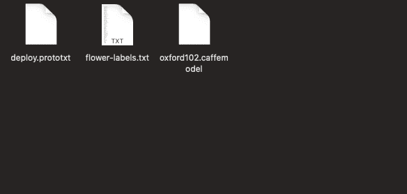
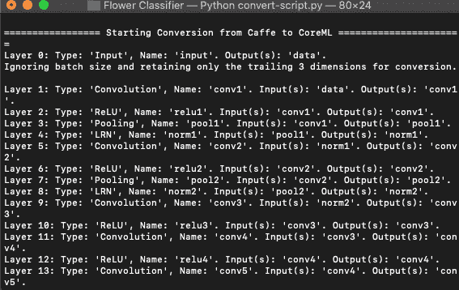
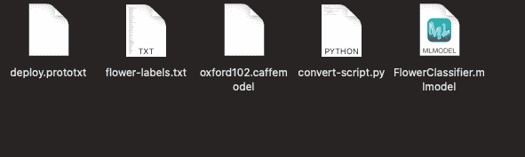
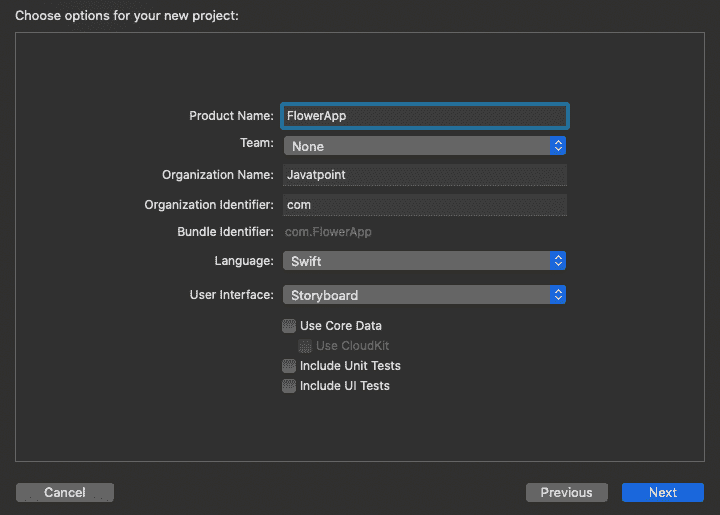
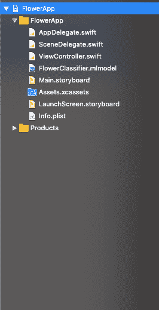
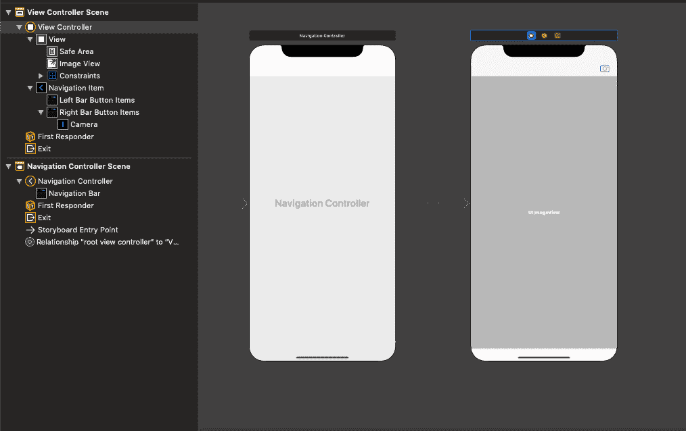

# 使用高级 CoreML

> 原文：<https://www.javatpoint.com/using-advanced-coreml>

正如我们已经讨论过的，我们可以使用 [CoreML](what-is-coreml) 通过将现成的 MLModel 添加到我们的 XCode 项目中来执行图像识别。在本教程中，我们将更进一步，看看如何将预训练的 Caffe 模型转换为 MLModel 格式。

我们将在本教程中使用的 Caffe 模型已经针对成千上万的图像进行了训练。我们可以将数据集与预先训练的 Caffe 模型一起使用，并将其转换为 MLModel，以便与 [XCode](https://www.javatpoint.com/ios-introduction-to-xcode-ide) 和 [Swift](https://www.javatpoint.com/swift-tutorial) 类一起使用。苹果已经发布了使用 [python](https://www.javatpoint.com/python-tutorial) 的开源工具，允许我们转换任何使用 Caffe、 [Keras](https://www.javatpoint.com/keras) 、Turi 等训练的预训练模型。转换为 MLModel 格式。在本教程中，我们将构建一个花卉识别应用程序，该应用程序将识别使用该应用程序捕获的花卉种类。它也可以在没有互联网连接的情况下工作。对于这个项目，我们将使用已经在牛津 102 花卉数据集上训练的模型。让我们启动 python 配置，将 Caffe 模型转换为 MLModel。

### 使用 Python 画中画安装 CoreML 工具

首先，我们需要安装 Python PIP，这是一个包管理系统，用于安装和管理用 Python 编写的包。换句话说，我们可以说它就像 Python 包的 CocoaPods。

我们需要在 mac 上安装 python 2 或 python 3 来安装 PIP。要检查 mac 上安装了哪个 python 版本，请在终端上使用以下命令。

$ python -v

然而，我们也可以在 mac 上安装 python 2 和 python 3。然而，在终端上使用 python 3 时，我们需要提到版本 3。使用下面的命令来使用 python 3。

$ python3

要在 mac 上安装 PIP，首先，安全地下载 get-pip.py，然后在终端上运行以下命令。

$ python get-pip.py

这将在 mac 上成功安装最新版本的 PIP。

现在，我们需要在终端上使用 pip 安装 coremltools。为此，请使用以下命令。

$ pip3 install -U coremltools

这将在我们的 mac 上下载并安装 coremltools。

### 将 caffe 模型转换为 momodel

我们将在本教程中使用这个模型(花卉分类)。一旦我们下载并解压缩使用给定链接下载的模型，我们将找到三个文件，如下所示。

[点击此处下载项目](https://static.javatpoint.com/tutorial/ios/download/flower-classfication-model.zip)



为了将这个模型转换成 MLModel，我们需要创建一个 python 脚本。为此，我们将使用崇高文本作为编辑器来创建脚本。

打开“升华文本”，将“花卉分类器”文件夹拖到其中，在编辑器中打开它。现在，在崇高文本中创建一个名为 convert-script.py 的文件，其中包含以下 python 代码。

```

import coremltools

caffe_model = ('oxford102.caffemodel', 'deploy.prototxt')

labels = 'flower-labels.txt'

coreml_model = coremltools.converters.caffe.convert(
caffe_model,
class_labels = labels,
image_input_names = 'data'
)

coreml_model.save('FlowerClassifier.mlmodel')

```

一旦我们保存了这段代码，打开终端并导航到上面代码所在的目录。我们还需要确保所有的 Caffe 模型文件都存在于同一个目录中。要运行上述 python 脚本，请运行以下命令。

```

$ python convert-script.py

```

这将在终端上产生以下输出。



如果我们查看目录，我们会在 finder 中看到一个新创建的 FlowerClassfier.mlmodel 文件，如下所示。



### 在 xcode 项目中使用 momodel

由于我们已经将 Caffe 模型转换为 MLModel，现在我们将开始使用新创建的 FlowerClassifier.mlmodel 创建我们的 iOS 应用程序。



首先，我们需要将我们的 FlowerClassfier.mlmodel 文件导入到 XCode 项目中，如下所示。



现在，在 main .故事板中，在 NavigationController 中嵌入 ViewController，并在 ViewController 的导航栏中添加一个条形按钮项，点击它即可打开 iOS 设备摄像头。我们还将向视图控制器添加一个图像视图，向用户显示捕获的图像。

main .故事板将包含以下设计。



我们还将在 ViewController.swift 中创建一个动作出口来触发用户事件。

我们还将使用 UIImagePickerController 在 iOS 应用程序中使用相机功能。一旦我们在项目中实现了 UIImagePickerController，ViewController 就会包含以下代码。

```

import UIKit

class ViewController: UIViewController, UINavigationControllerDelegate, UIImagePickerControllerDelegate {

    @IBOutlet weak var imgView: UIImageView!
    let imagePicker = UIImagePickerController()

    override func viewDidLoad() {
        super.viewDidLoad()
        // Do any additional setup after loading the view.
        imagePicker.delegate = self
        imagePicker.sourceType = .camera
        imagePicker.allowsEditing = false

    }

    @IBAction func tappedCamera(_ sender: Any) {
        self.present(imagePicker, animated: true, completion: nil)
    }
    func imagePickerController(_ picker: UIImagePickerController, didFinishPickingMediaWithInfo info: [UIImagePickerController.InfoKey : Any]) {
    if let img = info[UIImagePickerController.InfoKey.originalImage] as?
    UIImage {
          self.imgView.image = img
          self.dismiss(animated: true, completion: nil)

     }
    }
}

```

一旦我们点击相机栏按钮项目，这将打开设备的相机。现在，我们的任务是使用我们的 mlmodel 检测捕获的图像。为此，我们将把捕获的图像转换成 CIImage。在委托方法中关闭图像拾取器控制器后，添加以下代码进行转换。

```

guard let ciImage = CIImage(image: img) else{
            debugPrint("Can't convert image to CIImage")
            return
        }

```

现在，我们需要编写代码来检测图像。为此，我们将在 ViewController 中添加 detect()方法。这将使用 mlmodel 对象创建一个 VNCoreMLRequest 并从中获取结果。detect()方法将包含以下代码。

```

func detect(image:CIImage){
        guard let model = try? VNCoreMLModel(for: FlowerClassifier().model) else{
            debugPrint("Can't convert model to VNCoreMLModel")
            return
        }
        let request = VNCoreMLRequest(model: model) { (request, error) in
            guard let result = request.results as? [VNClassificationObservation] else{
                debugPrint("")
                return
            }
            debugPrint(result)
            if let firstResult = result.first{
                self.navigationItem.title = firstResult.identifier
            }
        }
            let handler = VNImageRequestHandler(ciImage:image)
            do{
                try handler.perform([request])
            }catch{
                debugPrint(error)
            }

    }

```

我们需要在创建 CIImage 后立即在委托方法中调用 detect()方法。然而，我们的 ViewController.swift 将包含以下代码。

```

import UIKit
import CoreML
import Vision

class ViewController: UIViewController, UIImagePickerControllerDelegate, UINavigationControllerDelegate {

    @IBOutlet weak var imgView: UIImageView!
    let imagePicker = UIImagePickerController() 
    override func viewDidLoad() {
        super.viewDidLoad()
        // Do any additional setup after loading the view.
        imagePicker.delegate = self
        imagePicker.sourceType = .camera
        imagePicker.allowsEditing = false
    }

    @IBAction func tappedCamera(_ sender: UIBarButtonItem) {
        self.present(imagePicker, animated: true, completion: nil)
    }

    func imagePickerController(_ picker: UIImagePickerController, didFinishPickingMediaWithInfo info: [UIImagePickerController.InfoKey : Any]) {
       if let img = info[UIImagePickerController.InfoKey.originalImage] as?
       UIImage {
             self.imgView.image = img
             self.dismiss(animated: true, completion: nil)
        guard let ciImage = CIImage(image: img) else{
            debugPrint("Can't convert image to CIImage")
            return
        }
        detect(image: ciImage)
          }
          else {
             print("error")
          }
       }
    func detect(image:CIImage){
        guard let model = try? VNCoreMLModel(for: FlowerClassifier().model) else{
            debugPrint("Can't convert model to VNCoreMLModel")
            return
        }
        let request = VNCoreMLRequest(model: model) { (request, error) in
            guard let result = request.results as? [VNClassificationObservation] else{
                debugPrint("")
                return
            }
            debugPrint(result)
            if let firstResult = result.first{
                self.navigationItem.title = firstResult.identifier
            }
        }
            let handler = VNImageRequestHandler(ciImage:image)
            do{
                try handler.perform([request])
            }catch{
                debugPrint(error)
            }

    }
}

```

* * *