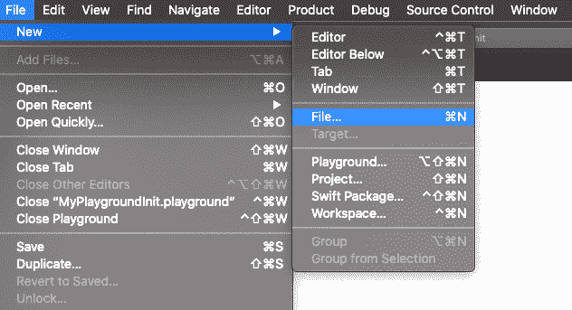

# 在 iOS 应用程序中解析静态 JSON 文件

> 原文：<https://www.javatpoint.com/parsing-a-static-json-file-in-ios-application>

在 iOS 应用程序中，我们经常需要解析 JSON 数据，无论它是作为响应还是作为本地文件保存在我们的设备上。在本文中，我们将讨论如何从本地 JSON 文件中解析 JSON。

请考虑以下步骤。

1.首先，我们需要将 [JSON](https://www.javatpoint.com/json-tutorial) 文件从我们的文件系统存储到 [XCode](https://www.javatpoint.com/ios-introduction-to-xcode-ide) 中。我们还可以在 XCode 中创建新文件，并用扩展名 json 保存，如下所示。



让我们在文件中添加以下 JSON。

```

{
    "quiz": {
        "sport": {
            "q1": {
                "question": "Which one is correct team name in NBA?",
                "options": [
                    "New York Bulls",
                    "Los Angeles Kings",
                    "Golden State Warriros",
                    "Huston Rocket"
                ],
                "answer": "Huston Rocket"
            }
        },
        "maths": {
            "q1": {
                "question": "5 + 7 = ?",
                "options": [
                    "10",
                    "11",
                    "12",
                    "13"
                ],
                "answer": "12"
            },
            "q2": {
                "question": "12 - 8 = ?",
                "options": [
                    "1",
                    "2",
                    "3",
                    "4"
                ],
                "answer": "4"
            }
        }
    }
}

```

2.我们需要为上面的 JSON 准备一个模型；为此，我们需要查看 JSON 的每个对象，并在单独的类中对其进行解码。

要创建模型，请在 XCode 中创建一个新文件 QuizResponseModel.swift，并放置以下代码。

```

import Foundation

public class QuizResponseModel:Decodable{
    public var quiz : Quiz?
}

public class Quiz:Decodable{
    public var sport : Sport?
    public var maths : Maths?
}
public class Maths : Decodable{
    public var q1 : Question?
    public var q2 : Question?
}

public class Sport : Decodable{
    public var q1 : Question?
}

public class Question : Decodable{
    public var question : String?
    public var options : Array?
    public var answer : String?
} 
```

3.现在，在视图控制器中添加以下代码来解析 SampleJson。

```

func parseJSON(_ name: String){
        guard let path = Bundle.main.path(forResource: name, ofType: "txt") else{ return}
        debugPrint(path)
        let url = URL(fileURLWithPath: path)
        debugPrint(url)
        do{
            let data = try Data(contentsOf: url)
            let response = try JSONDecoder().decode(QuizResponseModel.self, from: data)
            debugPrint(response)
        }catch{
            debugPrint(error)
        }
    }

```

让我们看看我们的模型中是否收到了一些数据。为此，让我们在控制台上打印问题。

将以下代码添加到 viewDidLoad()方法中。

```

for response in (quizResponse.quiz?.sport?.q1?.question!)!{
            debugPrint("Question: \(response)")
        }

```

ViewController.swift 包含以下代码。

```

import UIKit

class ViewController: UIViewController {

    var quizResponse = QuizResponseModel()

    override func viewDidLoad() {
        super.viewDidLoad()
        // Do any additional setup after loading the view.
        parseJSON("SampleJSON")
        for response in (quizResponse.quiz?.sport?.q1?.question!)!{
            debugPrint("Question: \(response)")
        }
    }
    func parseJSON(_ name: String){
        guard let path = Bundle.main.path(forResource: name, ofType: "txt") else{ return}
        debugPrint(path)
        let url = URL(fileURLWithPath: path)
        debugPrint(url)
        do{
            let data = try Data(contentsOf: url)
            let response = try JSONDecoder().decode(QuizResponseModel.self, from: data)
            quizResponse = response
        }catch{
            debugPrint(error)
        }
    }
}

```

使用 [Swift](https://www.javatpoint.com/swift-tutorial) 读取 JSON 文件(本地或网络)非常容易。这里，我们使用可解码协议将 JSON 响应解码成我们的可解码模型，并在代码中的任何地方使用它。

* * *