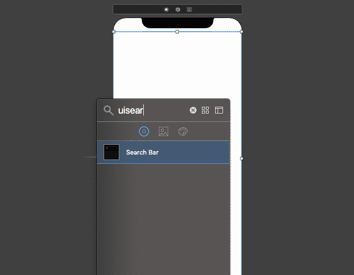
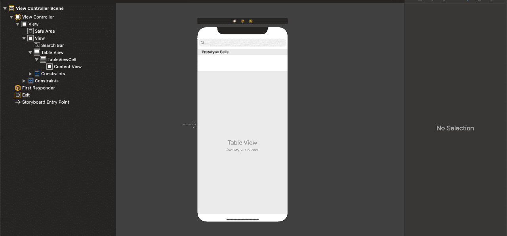

# iOS 应用程序中的搜索栏

> 原文：<https://www.javatpoint.com/search-bar-in-ios-applications>

在 iOS 应用程序中，我们经常需要使用一些关键字从列表中过滤数据。为此，苹果提供了 UISearchBar，供用户在 iOS 应用程序中的项目集合中进行搜索。这是一个专门的视图，用于从用户那里接收与搜索相关的信息，例如关键字。

在本文中，我们将讨论如何在 iOS 应用程序中使用搜索栏为用户实现搜索功能。但是 [iOS](https://www.javatpoint.com/ios-development-using-swift) 中的搜索栏只提供用户界面；我们需要根据我们的需求实现任何过滤逻辑。

### 使用 UISearchBar

这是在 iOS 应用程序中实现搜索功能最常用的方式。如果我们在屏幕上有各种其他项目，如收藏视图、表格视图或栏按钮项目，在 iOS 应用程序中使用 UISearchBar 是灵活的。

简单来说，UISearchBar 提供了一个用于输入搜索文本的文本字段、一个作为文本字段右视图的搜索按钮、一个书签按钮和一个取消按钮。我们需要遵守 UISearchBarDelegate 协议，并实现 UISearchBar 委托方法，以便在搜索栏中输入搜索文本或单击按钮时执行操作。

在 swift 中，我们使用 UISearchBar 类对象来实现搜索栏。UISearchBar 的语法如下。

```

class UISearchBar : UIView

```

UISearchBar 类包含以下属性来更改引发事件触发器委托的外观。

| 塞内加尔 | 财产 | 描述 |
| one | var 委托:UISearchBarDelegate？ | 它表示 UISearchBar 的委托对象。视图控制器需要符合 UISearchBarDelegate 协议并实现其委托方法。 |
| Two | var 占位符:字符串？ | 它表示搜索文本字段中显示的占位符文本。 |
| three | var 提示:字符串？ | 它代表搜索栏顶部显示的单行文本。 |
| four | 哪里文字:字串？ | 它表示用于在 collectionview 或 tableview 中显示的数据列表中进行搜索的搜索文本。 |
| five | var barTintColor： UIColor？ | 它表示要应用于搜索文本字段背景的色调。 |
| six | var searchBarStyle： UISearchBar.Style | 它表示在 UISearchBar 的值中分配的搜索栏样式。样式枚举。 |
| seven | enum UISearchBar.Style | 它是一个枚举类型变量，表示搜索栏是否有背景。 |
| eight | Var DyedColor： UIColor！ | 它表示要应用于搜索栏中关键元素的色调。 |
| nine | 是不透明的:Bool | 这是一个布尔类型属性，用于确定搜索栏是否半透明。 |
| Ten | var barStyle： UIBarStyle | 它是枚举类型 UIBarStyle 的一个实例，它指定了搜索栏的外观。 |
| Eleven | 枚举 UIBarStyle | 它代表了不同类型视图的风格外观。 |
| Twelve | var input assistant item:uitextinputassistant item | 它是用于配置键盘快捷栏的输入助手项。 |
| Thirteen | var 显示书签按钮： 布尔 | 它是一个布尔类型属性，表示书签按钮是否显示在搜索栏中。 |
| Fourteen | var showCancelButton： Bool | 它是一个布尔类型属性，表示取消按钮是否显示在搜索栏中。 |
| Fifteen | var showSearchResultsButton： Bool | 它是一个布尔类型属性，表示搜索结果按钮是否显示在搜索栏中。 |
| Sixteen | var isSearchResultsButtonSelected： Bool | 它是一个布尔类型属性，表示是否在搜索栏中选择了搜索结果按钮。 |
| Seventeen | var scope buttontitles:[字符串]？ | 它是一个字符串数组，用于指定范围按钮的标题。 |
| Eighteen | var selectedscopebuttoneindex:int | 它表示选定范围按钮的索引。 |
| Nineteen | var showssccopebar:bool | 它是一个布尔类型属性，表示范围栏是否显示在搜索栏中。 |
| Twenty | var backgroundImage: UIImage？ | 这是 UISearchBar 中显示的背景图像。 |

下面给出了用于触发用户操作的最重要的委托方法。

| 塞内加尔 | 方法 | 描述 |
| one | func searchBar（UISearchBar， textDidChange： String） | 此方法通知用户更改了搜索栏文本。 |
| Two | func searchBarShouldBeginEditing（UISearchBar） -> Bool | 它询问委托是否应该用给定的文本替换指定范围内的文本。 |
| three | func searchBarTextDidBeginEditing（UISearchBar） | 此方法通知委托用户开始编辑搜索文本。 |
| four | func searchbarhounditioning(uisearchbar)-> bool | 它要求代理在指定的搜索栏中停止编辑。 |
| five | func search bartxtdinddition(uisearchbar) | 它通知代理用户已经编辑了搜索栏中的文本。 |

**例**

让我们创建 XCode 项目，在这个项目中，我们将过滤 tableview 中的数据。为此，以 XCode 为例创建一个项目。让我们在主故事板中为项目创建界面

### 界面构建器

在故事板中，首先，添加一个位于父视图顶部的搜索栏。要添加搜索栏，请在对象库中开始键入或浏览搜索栏，如下所示。



现在，将搜索栏与视图顶部对齐，在超级视图中将前导和尾随指定为 0。现在，向视图控制器添加一个 tableView，它包含项目中的数据列表。



现在，在视图控制器类中为搜索栏和表格视图创建出口。

**ViewController.swift**

当我们在这个应用程序中使用 UISearchBar 和 UITableView 时，我们需要使我们的视图控制器符合 UISearchBarDelegate、UITableViewDelegate 和 UISearchBarDataSource 协议。视图控制器具有以下代码来实现项目中的搜索功能。

```

import UIKit

class ViewController: UIViewController {

    @IBOutlet weak var tableView: UITableView!
    @IBOutlet weak var searchBar: UISearchBar!

    var dataSourceArr = ["John", "David" ,"Mike", "Smith", "Josh", "Michhel", "Barac", "Donald"]
    var filteredArr = Array()
    var searching:Bool?

    override func viewDidLoad() {
        super.viewDidLoad()
        // Do any additional setup after loading the view.
        tableView.delegate = self
        tableView.dataSource = self
        searchBar.delegate = self
    }

}

extension ViewController : UITableViewDelegate {
    func tableView(_ tableView: UITableView, heightForRowAt indexPath: IndexPath) -> CGFloat {
        return 80
    }
}

extension ViewController : UITableViewDataSource{
    func tableView(_ tableView: UITableView, numberOfRowsInSection section: Int) -> Int {
        if(searching ?? false){
            return filteredArr.count
        }else{
            return dataSourceArr.count
        }

    }
    func tableView(_ tableView: UITableView, cellForRowAt indexPath: IndexPath) -> UITableViewCell {
        let cell = tableView.dequeueReusableCell(withIdentifier: "TableViewCell")!
        if(!(searching ?? false)){
            cell.textLabel?.text = dataSourceArr[indexPath.row]
        }else{
            cell.textLabel?.text = filteredArr[indexPath.row]
        }

        return cell
    }
}

extension ViewController : UISearchBarDelegate{
    func searchBar(_ searchBar: UISearchBar, textDidChange searchText: String) {

        if(searchText.isEmpty){
            filteredArr = dataSourceArr
        }else{
            filteredArr = dataSourceArr.filter{$0.contains(searchText)}
        }
        searching = true
        tableView.reloadData()
    }

} 
```

* * *