# 在 iOS 应用程序中使用 UIBezierPath

> 原文：<https://www.javatpoint.com/working-with-uibezierpath-in-ios-applications>

创建用户界面是移动应用程序开发所需的最重要任务之一。苹果在创建 iOS 应用的过程中提供了多种开发用户界面的方法。作为 iOS 开发人员，我们有多个选项来创建应用程序的用户界面，包括故事板和 Swift UI。我们还可以使用 UIKit 提供的类以编程方式创建用户界面。

在开发移动应用时，有时我们需要创建复杂的用户界面，其中可能包括不同类型的形状。这个问题可以通过使用苹果提供的 UIBezierPath 类来创建基于向量的路径来解决。使用这个类，我们可以创建不同类型的自定义路径，可以包含我们想要的任何形状。我们可以使用自定义路径来实现各种形状，如矩形、正方形、椭圆形和圆形。使用 UIBezierPath，我们可以通过在一些路径上添加线条来创建高度复杂的形状。我们可以在任何路径上添加直线和曲线。

UIBezierPath 需要一个核心图形上下文来进行渲染。我们可以使用以下方法来创建核心图形上下文，以在 iOS 应用程序中呈现 UIBezierPath。

1.  我们可以使用一个 CGContext 类实例。
2.  我们可以子类化一个需要绘制特定形状的 UIView 类。然后，我们可以覆盖 UIView 生命周期的 draw()方法来创建我们的 UIBezierPath。
3.  现金图层对象也可用于创建核心图形上下文。

在本教程中，我们将创建一个 iOS 应用程序，看看如何创建 UIBezierPath 来创建自定义形状。我们还将研究如何使用 CAShapeLayer 和 UIView 来获得一个核心图形上下文来呈现 UIBezierPath。

让我们在 XCode 中创建新的 iOS 项目，如下所示。

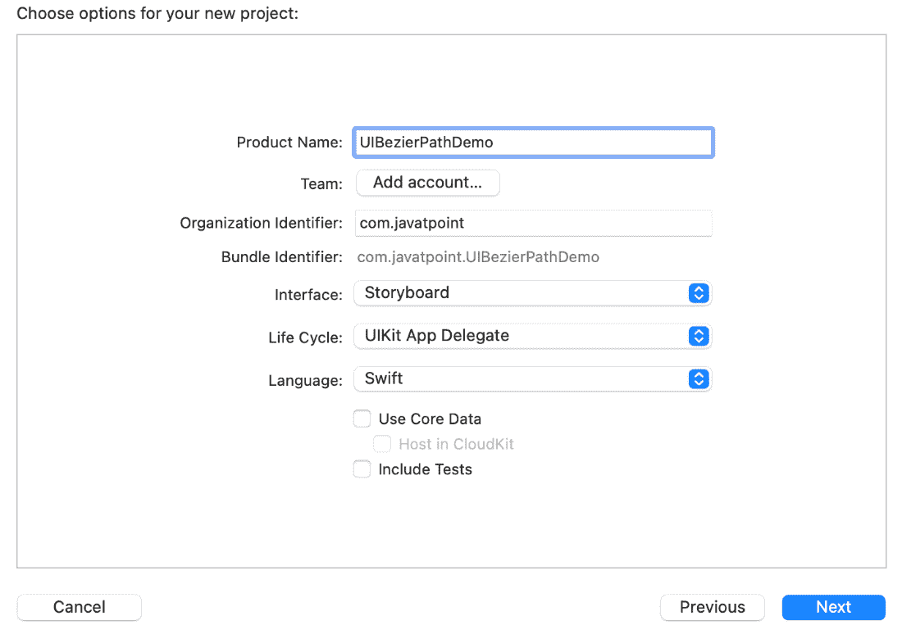

创建完项目后，我们需要将 UIView 的子类创建为 DemoPathView。

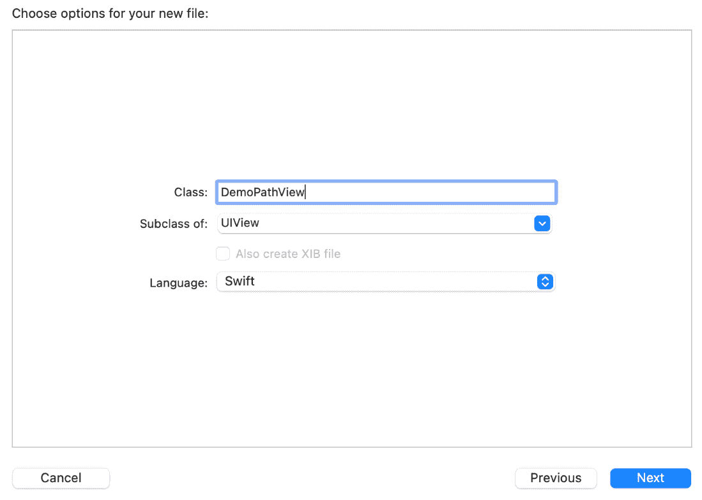

现在，将下面的代码添加到 ViewController.swift 文件中。

```

   override func viewWillAppear(_ animated: Bool) {
        let width: CGFloat = 200
        let height: CGFloat = 200

        let demoView = DemoPathView(frame: CGRect(x: self.view.frame.size.width/2 - width/2,
                                              y: self.view.frame.size.height/2 - height/2,
                                              width: width,
                                              height: height))

        self.view.addSubview(demoView)
    }

```

上面代码中的 viewdiappear(_ animated:Bool)方法将 demoView 添加到视图控制器中，视图控制器是 UIView 子类的一个实例。现在，我们需要向 DemoPathView 类添加以下代码。

```

import UIKit

class DemoPathView: UIView {

    var demoPath: UIBezierPath!

    override init(frame: CGRect) {
        super.init(frame: frame)

        self.backgroundColor = UIColor.gray
    }

    required init?(coder aDecoder: NSCoder) {
        super.init(coder: aDecoder)
    }
}

```

如果我们在模拟器上运行代码，我们将获得模拟器上显示的以下视图。

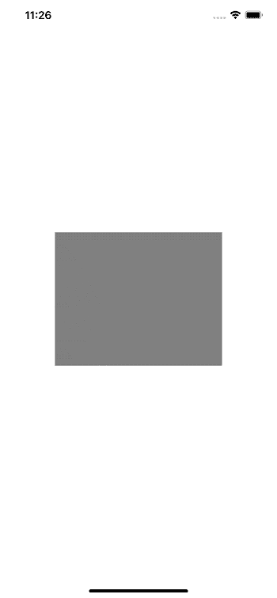

现在，让我们创建 UIBezierPath 的实例，以便在 iOS 应用程序中创建路径和形状。让我们在下面的例子中创建一个矩形。

```

  func createRectangle() {
        // Initialize the demoPath.
        demoPath = UIBezierPath()
        demoPath.move(to: CGPoint(x: 0.0, y: 0.0))
        demoPath.addLine(to: CGPoint(x: 0.0, y: self.frame.size.height))
        demoPath.addLine(to: CGPoint(x: self.frame.size.width, y: self.frame.size.height))
        demoPath.addLine(to: CGPoint(x: self.frame.size.width, y: 0.0))
        demoPath.close()
    }

```

我们需要在 DemoPathView 类的 draw()方法中调用 createRectangle()。

```

  override func draw(_ rect: CGRect) {
        createRectangle()
    }

```

在上面的代码中，我们初始化了 UIBezierPath 对象，并将这些行添加到路径中以创建一个矩形，如下所示。

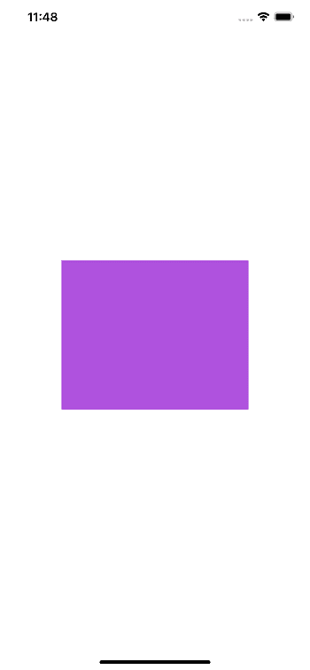

然而，我们在上面的例子中创建了矩形形状，但是画一个形状来勾勒视图的确切框架有点没有意义。

### 创建三角形

到目前为止，我们一定已经在教程中注意到，创建任何形状都需要指定指向 UIBezierpath 的适当点。让我们在下面的例子中创建一个三角形。

向 DemoPathView 类添加以下代码来创建矩形。

```

import UIKit

class DemoPathView: UIView {

    var demoPath: UIBezierPath!

    override init(frame: CGRect) {
        super.init(frame: frame)

        self.backgroundColor = UIColor.clear
    }

    override func draw(_ rect: CGRect) {
        createTriangle()
        UIColor.purple.setFill()
        demoPath.fill()        
        UIColor.orange.setStroke()
        demoPath.stroke()
    }

    required init?(coder aDecoder: NSCoder) {
        super.init(coder: aDecoder)
    }

    func createTriangle(){
        demoPath = UIBezierPath()
        demoPath.move(to: CGPoint(x: self.frame.width/2, y: 0.0))
        demoPath.addLine(to: CGPoint(x: 0.0, y: self.frame.size.height))
        demoPath.addLine(to: CGPoint(x: self.frame.size.width, y: self.frame.size.height))
        demoPath.close()

    }
}

```

它将在屏幕上显示以下三角形，如下所示。

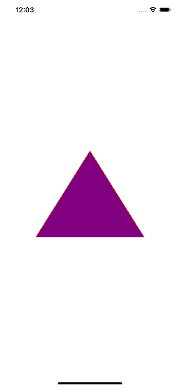

### 创建椭圆

我们还可以使用 UIBezierpath 创建椭圆。但是，我们需要使用 UIBezierpath()的不同初始值设定项方法。

```

import UIKit

class DemoPathView: UIView {

    override init(frame: CGRect) {
        super.init(frame: frame)
        self.backgroundColor = UIColor.clear
    }

    override func draw(_ rect: CGRect) {
        let demoPath = UIBezierPath(ovalIn: self.bounds)
        UIColor.purple.setFill()
        demoPath.fill()

        // Specify a border (stroke) color.
        UIColor.orange.setStroke()
        demoPath.stroke()
    }

    required init?(coder aDecoder: NSCoder) {
        super.init(coder: aDecoder)
    }

}

```

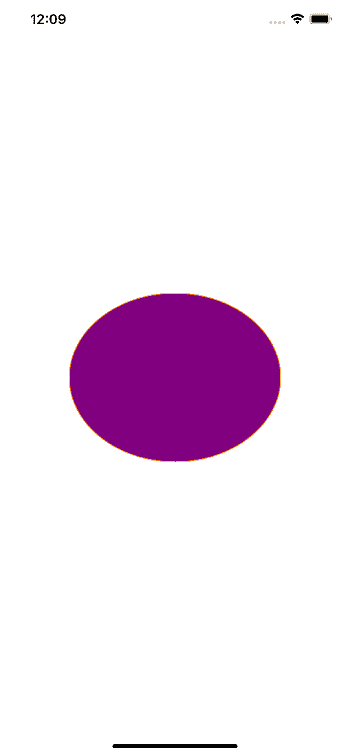

我们也可以在上面的初始化器中提供 CGrect，而不是提供如下所示的 self.bounds。

```

override func draw(_ rect: CGRect) {
        let demoPath = UIBezierPath(ovalIn: CGRect(x: 0, y: 0, width: 200, height: 200))
        UIColor.purple.setFill()
        demoPath.fill()

        // Specify a border (stroke) color.
        UIColor.orange.setStroke()
        demoPath.stroke()
    }

```

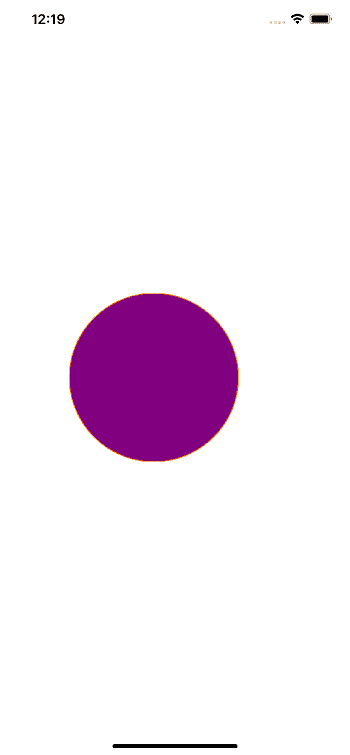

### 创建圆角矩形

为了创建一个圆角矩形，我们需要使用另一个初始化器，如下所示。

```

  override func draw(_ rect: CGRect) {
        let demoPath = UIBezierPath(roundedRect: self.bounds, cornerRadius: 15)
        UIColor.purple.setFill()
        demoPath.fill()

        // Specify a border (stroke) color.
        UIColor.orange.setStroke()
        demoPath.stroke()
    }

```

上面的代码根据初始值设定项中作为角半径提供的值对角进行舍入。

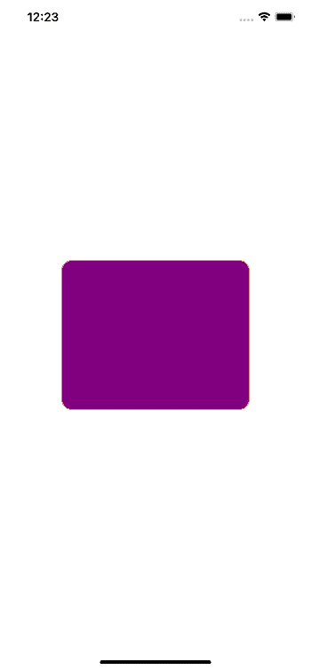

有时候，我们需要把矩形的任意一个角变圆。在下面的示例中，我们将只舍入视图的左上角和右下角。

```

override func draw(_ rect: CGRect) {
        let demoPath = UIBezierPath(roundedRect: self.bounds, byRoundingCorners: [.topLeft, .bottomRight], cornerRadii:  CGSize(width: 15.0, height: 0.0))
        UIColor.purple.setFill()
        demoPath.fill()

        // Specify a border (stroke) color.
        UIColor.orange.setStroke()
        demoPath.stroke()
    }

```

上述代码中的初始值设定项接受以下参数。

1.  **圆角:**是将在视图中显示的矩形的框架。
2.  **byRoundingCorners:** 它代表将要被倒圆的角。然而，如果我们只需要绕一个角，我们不需要提供数组。
3.  **角半径:**代表角半径。它需要接受宽度和高度参数的 CGSize 值。但是只考虑宽度，高度不考虑。

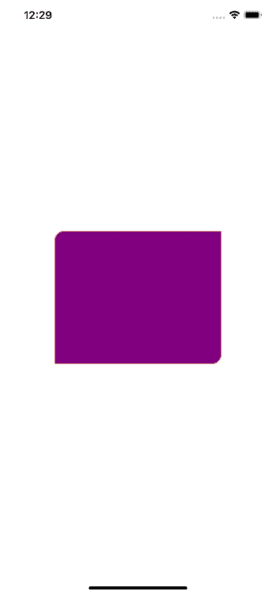

### 创建弧

我们也可以使用 UIBezierPath 创建 Arcs 但是，使用 UIBezierPath 创建弧很复杂。为了创建一个弧，我们需要使用下面的初始值设定项。

```

UIBezierPath(arcCenter: <CGPoint>, radius: <CGFloat>, startAngle: <CGFloat>, endAngle: <CGFloat>, clockwise: <Bool>)

```

上面的初始值设定项接受以下参数。

1.  **弧中心:**它代表圆弧将要画到的圆心。该参数将始终是 CGPoint 值。
2.  **半径:**表示圆弧将要画到的圆的半径。因为圆的直径是视图的高度，所以它的一半是半径。
3.  **起始角度:**表示将要绘制的圆弧的起始角度。它可以看作是圆弧开始绘制的点。角度将始终以弧度(而不是度数)传递。
4.  **endAngle:** 表示正在显示的弧的终点。与 startAngle 类似，endAngle 也应该以弧度传递。
5.  **顺时针方向:**是一个布尔值，表示是顺时针方向画弧，还是逆时针方向画弧。

让我们创建一个在曲面上绘制圆弧的示例。为此，在 DemoPathView 类中添加以下代码。

```

import UIKit

class DemoPathView: UIView {

    override init(frame: CGRect) {
        super.init(frame: frame)

        self.backgroundColor = UIColor.clear
    }

    func deg2rad(_ number: Double) -> CGFloat {
        return CGFloat(number * .pi / 180)
    }

    override func draw(_ rect: CGRect) {
        let demoPath = UIBezierPath(arcCenter: CGPoint(x: self.frame.size.width/2, y: self.frame.size.height/2), radius: self.frame.size.height/2,
                                startAngle: deg2rad(180.0),
                                endAngle: deg2rad(0.0),
                                clockwise: true)
        UIColor.purple.setFill()
        demoPath.fill()

        // Specify a border (stroke) color.
        UIColor.orange.setStroke()
        demoPath.stroke()
    }

    required init?(coder aDecoder: NSCoder) {
        super.init(coder: aDecoder)
    }

}

```

它将在模拟器上显示以下视图。

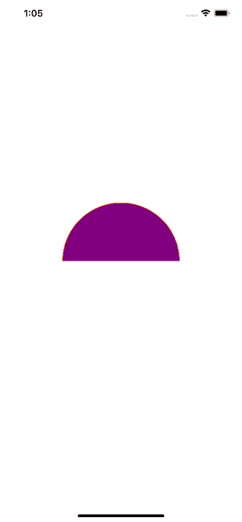

### 使用现金图层创建 UIBezierPath

在本教程中，我们创建了 UIView 的子类，并在子类中覆盖了 draw(_:)方法。但是，并不是每次我们想要在 iOS 应用程序中使用 UIBezierPath 时都需要覆盖 draw()方法。正如我们在教程中已经说过的，我们需要有核心图形上下文来呈现 UIBezierPath。

我们可以使用 CAShapeLayer 对象，而不是覆盖 UIView 子类中的 draw()方法，后者渲染速度更快，并且提供了灵活性。CAShapeLayer 类是 CALayer 的一个子类，我们可以使用它向视图添加额外的层。它提供了各种属性，可以设置这些属性来自定义视图的结果。CAShapeLayer 的大多数属性本质上都是可动画化的，即这些属性的值可以以动画方式更改。

每次实例化时，我们都必须提供一个 CAShapeLayer 的路径。为此，我们可以首先创建一个 UIBezierPath，然后将其分配给 CAShapeLayer 对象。我们将在本教程中使用这种方法。

除了设置 CAShapeLayer 的路径，我们还需要设置其他属性，如填充颜色、描边颜色、线宽和位置。有两种方法可以在视图的图层中使用形状图层对象，即作为子图层或遮罩。

让我们首先创建一个简单的 CAShapeLayer 对象，它也将发生在我们的 DemoPathView.swift 类中。我们还需要注释掉我们之前在本教程中实现的整个 draw()方法，并创建一个 CAshapeLayer 对象，如下面的代码所示。

```

    func simpleShapeLayer(){
        createTriangle()
        let shapeLayer = CAShapeLayer()
        shapeLayer.path = self.demoPath.cgPath
        shapeLayer.fillColor = UIColor.systemPink.cgColor
        shapeLayer.strokeColor = UIColor.black.cgColor
        shapeLayer.lineWidth = 3.0
        self.layer.addSublayer(shapeLayer)
    }

```

上面实现的 simpleShapeLayer()方法将从我们的 DemoPathView 初始化器中调用。在这个方法中，首先，我们调用之前在教程中实现的 createTraingle()方法。

这里，为创建三角形而定义的路径将被设置为我们的 CAShapeLayer 的 path 属性。接下来，在这个方法中，我们创建 CAShapeLayer 对象，并将创建的 UIBezier 路径分配给它的 path 属性。我们还需要使用 addSubLayer()方法将这个创建的 CAShapeLayer 添加到我们的视图层中。现在，让我们从初始化器中调用这个方法，看看它在模拟器上显示的输出。

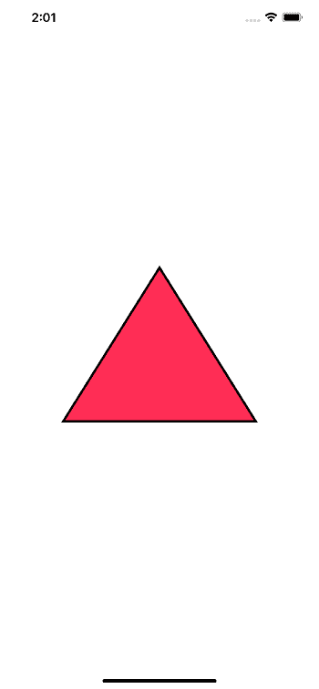

### 使用形状层作为遮罩或子层

正如我们在上面的教程中所述，现金图层可以用作视图的遮罩或子图层。让我们再次创建我们的 CAShapeLayer 对象，但是这一次，让我们将视图的背景颜色设置为黑色，而不是将其设置为清晰的颜色，并查看差异。

```

func simpleShapeLayer(){
        self.backgroundColor = UIColor.black
        createTriangle()
        let shapeLayer = CAShapeLayer()
        shapeLayer.path = self.demoPath.cgPath
        shapeLayer.fillColor = UIColor.systemPink.cgColor
        shapeLayer.strokeColor = UIColor.black.cgColor
        shapeLayer.lineWidth = 3.0
        self.layer.addSublayer(shapeLayer)
    }

```

让我们看看模拟器中显示的输出。

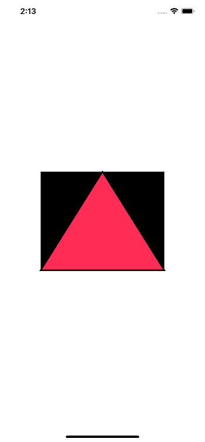

在这里，我们必须观察到没有填充颜色的路径仍然是黑色的。但是，让我们对 simpleShapeLayer()方法中的最后一条语句进行注释，并添加以下代码。

```

self.layer.mask = shapeLayer

```

现在，它将在模拟器上显示以下输出。

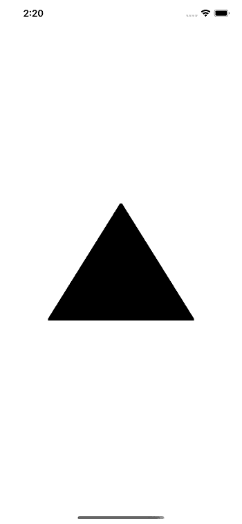

通过查看这两个场景中的输出，我们必须观察到，一旦我们将视图图层的蒙版属性设置为 shapeLayer，我们就会看到一个带有黑色的完整三角形，尽管我们已经为该三角形指定了填充颜色。我们还需要注意，没有被路径覆盖的视图部分没有显示出来。

然而，面具是这样工作的。不包含在路径中的视图的任何部分都将被剪裁。在这里，完整的视图由路径提供。这里，形状层显示了视图的背景颜色，目前为黑色。如果我们想改变图层的颜色，我们需要改变视图的背景颜色。

### 使用类别图层

CATextLayer 类类似于 CAShapeLayer 类，尽管它适用于图层上显示的文本。使用这个类是为了创建一个层(像 CAShapeLayer)来显示一些文本。

大多数 iOS 应用程序开发人员使用 UILabels 在 iOS 应用程序中显示文本。在某些情况下，使用 UILabel 不起作用；我们可以使用 CATextLayer，其中多个子图层被添加到包含标签的视图的图层中。

使用 CAtextLayer，我们可以在任何视图的顶部添加文本层。让我们创建下面的例子，我们创建一个文本层，并将其添加到视图层的顶部。

让我们将下面的代码添加到我们项目的 ViewController.swift 文件中。

```

import UIKit

class ViewController: UIViewController {

    override func viewDidLoad() {
        super.viewDidLoad()
        // Do any additional setup after loading the view.
    }

    override func viewDidAppear(_ animated: Bool) {
        createTextLayer()
    }

    func createTextLayer() {
        let textLayer = CATextLayer()
        textLayer.string = "Congrats!\n We have successfuly added the text on a layer"
        textLayer.foregroundColor = UIColor.white.cgColor
        textLayer.font = UIFont(name: "Ariel", size: 20.0)
        textLayer.fontSize = 20.0

        textLayer.alignmentMode = CATextLayerAlignmentMode.center
        textLayer.backgroundColor = UIColor.yellow.cgColor
        textLayer.frame = CGRect(x: 0.0, y: self.view.frame.size.height/2 - 20.0, width: self.view.frame.size.width, height: 40.0)
        textLayer.contentsScale = UIScreen.main.scale
        self.view.layer.addSublayer(textLayer)
    }
}

```

它在模拟器上显示以下输出。

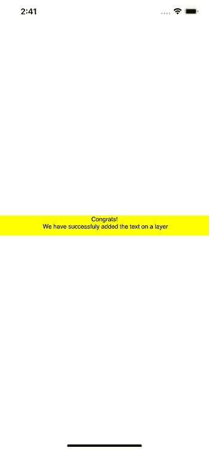

* * *