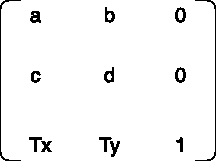
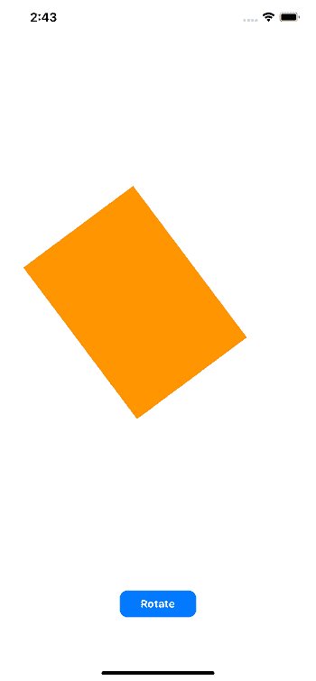

# 使用 CGAffineTransform 转换视图

> 原文：<https://www.javatpoint.com/transforming-views-with-cgaffinetransform>

Swift 提供了一个仿射变换矩阵作为 CGAffineTransform 来绘制 2D 图形。它是一种允许 UIView 被平移、缩放、倾斜或旋转的结构。我们必须为 UIView 定义名为 Transform 的 CGAffineTransform 类型属性。仿射变换是保持点之间的比例和共线性的变换。

### 变换矩阵

我们必须为 UIView 定义一个 3×3 的变换矩阵来应用仿射变换。转换被应用到 UIView 的绑定中心。



我们可以设置并获取 UIView 的转换属性。我们还可以使用以下代码为 UIView 转换属性分配标识矩阵。

```

self.view.transform = CGAffineTransform.identity

```

一个 3×3 的单位矩阵如下所示。


转换对象有一个布尔属性“身份”，可以用来检查视图的转换是否是身份转换。

```

self.view.transform.isIdentity

```

### 翻译矩阵

我们可以使用转换矩阵来改变 UIView 的位置。这将使用下面显示的矩阵的 Tx 和 Ty 值来转换视图的位置。


CGAffineTransform 类型提供了一个函数 translatedBy( x:y:)。

```

self.view.transform = view.transform.translatedBy(x: 100, y: 100)

```

它还提供了一个初始化器作为 cgafinetransform(translatex:，y:)。

```

self.view.transform = CGAffineTransform(translationX: 100, y: 100)

```

该函数用于创建转换矩阵，该矩阵用提供的值转换当前转换。让我们创建一个演示项目，将 UIView 转换为传递给方法的值。

将以下视图添加到界面生成器的视图控制器中。


让我们连接 UIView 的出口和 translate 按钮的动作出口。将以下代码添加到 ViewController.swift 文件中。

```

import UIKit

class ViewController: UIViewController {

    @IBOutlet weak var myView: UIView!

    override func viewDidLoad() {
        super.viewDidLoad()
        // Do any additional setup after loading the view.

    }
    @IBAction func clickedTranslateBtn(_ sender: Any) {
        self.myView.transform = myView.transform.translatedBy(x: 10, y: 10)
    }
}

```

当我们单击翻译按钮时，视图将按给定的 x 和 y 值进行翻译，如下图所示。


我们还可以使用下面的代码来操作变换矩阵的 Tx 和 Ty 值。

```

view.transform.tx = 100
view.transform.ty = 100

```

### 比例矩阵

比例矩阵用于通过改变 UIView 的宽度和高度来变换 ui view。为了改变 UIView 的缩放比例，我们需要对变换矩阵应用一个缩放矩阵。比例矩阵改变变换的 a 和 d 值，其中 a 是 xScale，d 是 yScale。a 和 d 的默认值将各为一。


我们可以使用 scaledBy(x:y:)函数来缩放视图。我们也可以将 cgaffinitetransform 初始值设定项用作 cgaffinitetransform(scaleX:，y:)。

我们将对上述项目进行一些更改，以缩放视图。我们将把 UIButton 的标题与行动出口标题一起更改为 Scale。

ViewController.swift 包含以下代码。

```

import UIKit

class ViewController: UIViewController {

    @IBOutlet weak var myView: UIView!

    override func viewDidLoad() {
        super.viewDidLoad()
        // Do any additional setup after loading the view.

    }
    @IBAction func clickedScaleBtn(_ sender: Any) {
        self.myView.transform = myView.transform.scaledBy(x: 1.5, y: 1.2)
    }
}

```

### 旋转矩阵

“旋转矩阵”应用于 UIView 的变换矩阵，使其向任何方向旋转。旋转矩阵影响变换矩阵的 a、b、c 和 d 属性，如下所示。


我们可以使用如下所示的 UIView CGAffineTransform 旋转(by:)函数。

```

view.transform = self.view.transform.rotated(by: CGFloat.pi)

```

我们也可以使用下面给出的 CGAffineTransform 初始化器。

```

self.view.transform = CGAffineTransform(rotationAngle: CGFloat.pi)

```

现在，我们将更改上面的项目来旋转视图。我们将更改动作出口以及按钮标题。ViewController.swift 包含以下代码。

```

import UIKit

class ViewController: UIViewController {

    @IBOutlet weak var myView: UIView!

    override func viewDidLoad() {
        super.viewDidLoad()
        // Do any additional setup after loading the view. 
    }
    @IBAction func clickedRotateBtn(_ sender: Any) {
        self.myView.transform = myView.transform.rotated(by: 10)
    }
}

```



* * *