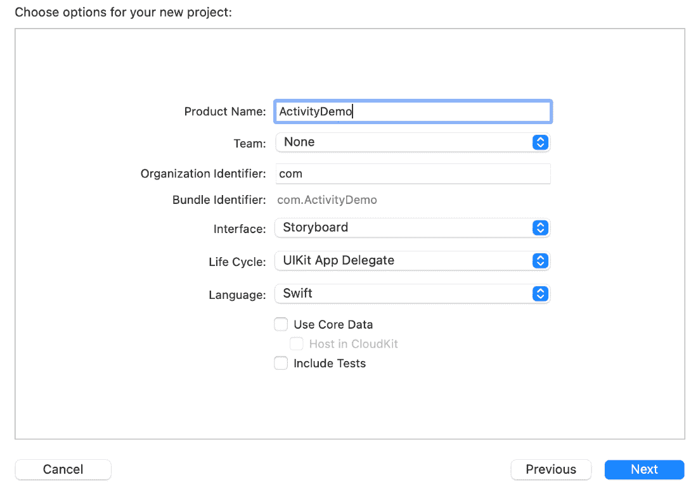
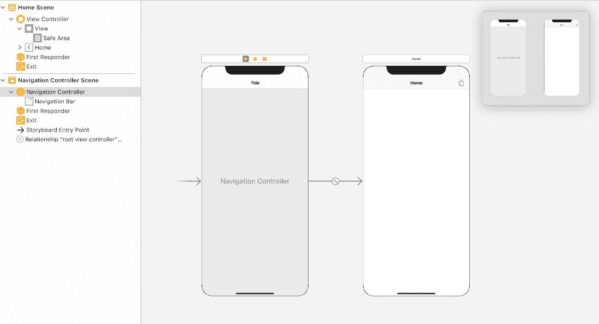
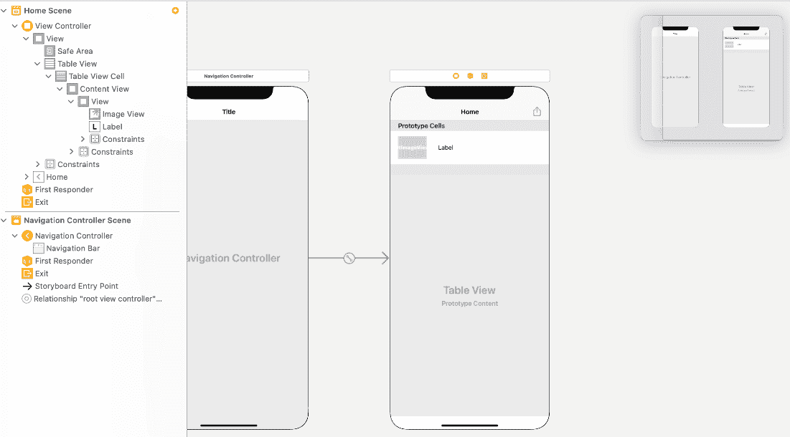
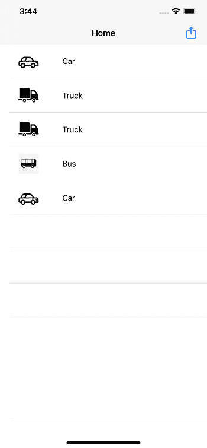
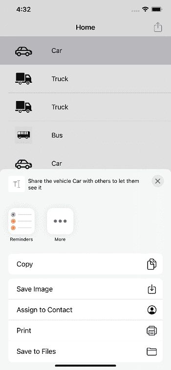

# iOS 中的 UIActivityViewController

> 噻:[https://www . javatppoint . com/uiactivityview controller-in-IOs](https://www.javatpoint.com/uiactivityviewcontroller-in-ios)

UIActivityViewController 是一个用于提供标准服务的对象，例如通过设备上可用的活动项目在应用程序中共享项目。UIActivityViewController 继承了 UIViewController 类。

UIActivityViewController 声明如下。

```

class UIActivityViewController : UIViewController

```

有几种标准服务，如将项目复制到粘贴板、使用电子邮件、短信或设备上的任何其他可用选项发送应用项目、将内容发布到社交媒体网站等。我们也可以在应用程序中定义我们的定制服务。

我们的应用程序配置、呈现和关闭 UIActivityViewController。但是，我们必须在呈现 UIActivityViewController 之前定义数据对象。我们还可以指定我们的应用程序支持的定制服务列表。在 iPad 上，应用程序必须在弹出窗口中显示 UIActivityViewController，而在 iPhones 和 iPod touch 上，我们可以以模式化的方式显示它。

在本教程中，我们将创建一个 iOS 应用程序，该应用程序使用 UIAcitivityViewController 在我们的应用程序中使用标准服务。我们将创建一个自定义共享按钮，该按钮将显示在应用程序中共享项目的选项。

让我们将 XCode 项目创建为 ActivityDemo，如下所示。



创建完项目后，让我们在界面构建器中配置视图控制器。在导航控制器中嵌入视图控制器，在导航栏中定义视图控制器的标题，并添加一个为共享而触发的栏按钮项。



在这个应用程序中，我们还将添加一个表格视图，它将显示一个车辆列表，以便在选择特定车辆后共享它们。

让我们向视图控制器添加一个表视图。



让我们创建 UITableViewCell 的子类，将其分配给我们的单元格，并为图像视图和标题标签连接插座。

在 ViewController.swift 中添加以下代码来配置表视图。

```

import UIKit

class ViewController: UIViewController {

    @IBOutlet weak var tableView: UITableView!

    var vehicleList = ["Car", "Truck", "Truck", "Bus", "Car"]
    override func viewDidLoad() {
        super.viewDidLoad()
        // Do any additional setup after loading the view.
        tableView.delegate = self
        tableView.dataSource = self
    }
}

extension ViewController : UITableViewDelegate{
    func tableView(_ tableView: UITableView, heightForRowAt indexPath: IndexPath) -> CGFloat {
        return UITableView.automaticDimension
    }
}

extension ViewController : UITableViewDataSource{

    func tableView(_ tableView: UITableView, numberOfRowsInSection section: Int) -> Int {
        return vehicleList.count
    }
    func tableView(_ tableView: UITableView, cellForRowAt indexPath: IndexPath) -> UITableViewCell {
        let cell = tableView.dequeueReusableCell(withIdentifier: "VehicleTableViewCell", for: indexPath) as! VehicleTableViewCell
        cell.titleLbl.text = vehicleList[indexPath.row]
        switch vehicleList[indexPath.row] {
        case "Car":
            cell.vehicleImgView.image =  imageLiteral(resourceName: "Car")
        case "Bus":
            cell.vehicleImgView.image =  imageLiteral(resourceName: "Bus")
        case "Truck":
            cell.vehicleImgView.image =  imageLiteral(resourceName: "Truck")
        default:
            debugPrint("")
        }
        return cell
    }
}

```

现在，如果我们在模拟器上运行该应用程序，主屏幕将如下所示。



要共享任何车辆，用户需要从列表中选择该车辆，然后单击添加为右栏按钮项目的共享按钮。为此，让我们连接右栏按钮项的操作出口和视图控制器中 tableview 的 didSelectRowAt(:)委托方法。

让我们在视图控制器中定义以下属性，以便在用户选择任何表格视图行时存储选定的车辆名称。

```

var selectedVehicleName:String?
var selectedVehicleImg:UIImage?

```

现在，在 tableview 委托方法中添加以下方法。

```

func tableView(_ tableView: UITableView, didSelectRowAt indexPath: IndexPath) {
        let cell = tableView.cellForRow(at: indexPath) as! VehicleTableViewCell
        selectedVehicleName = cell.titleLbl.text
  selectedVehicleImg = cell.vehicleImgView.image
}

```

让我们在 clickedShareButton 中编写共享按钮事件的代码。一旦用户点击共享按钮，我们将显示活动视图控制器。

在显示视图控制器之前，我们还需要在单击共享按钮之前验证用户是否选择了任何行。

```

@IBAction func clickedSharebutton(_ sender: Any) {
        if let selectedVehicle = selectedVehicleName{
            let activityController = UIActivityViewController(activityItems: ["Share the vehicle " + selectedVehicle + " with others to let them see it", selectedVehicleImg!], applicationActivities: nil)

            self.present(activityController, animated: true, completion: nil)

        }else{
            DispatchQueue.main.async {
                let alert = UIAlertController(title: "Error", message: "Kindly select any vehicle first.", preferredStyle: .alert)
                let action = UIAlertAction(title: "OK", style: .default) { (action) in
                    alert.dismiss(animated: true, completion: nil)
                }
                alert.addAction(action)
                self.present(alert, animated: true, completion: nil)
            }

        }
    }

```

现在，运行应用程序，选择任何车辆共享。该应用程序将如下所示运行。



该应用程序将显示更多选项，如电子邮件、WhatsApp 等。，具体取决于 iOS 设备上可用的共享选项。

默认情况下，活动控制器显示所提供项目类型(图像或字符串)的所有可用活动。但是，我们可以排除活动控制器的活动类型，如下所示。

```

activityController.excludedActivityTypes = [.copyToPasteboard]

```

这不会在活动控制器中显示复制选项。

ViewController.swift 包含以下代码。

**ViewController.swift**

```

import UIKit

class ViewController: UIViewController {

    @IBOutlet weak var tableView: UITableView!

    var selectedVehicleName:String?
    var selectedVehicleImg:UIImage?

    var vehicleList = ["Car", "Truck", "Truck", "Bus", "Car"]
    override func viewDidLoad() {
        super.viewDidLoad()
        // Do any additional setup after loading the view.
        tableView.delegate = self
        tableView.dataSource = self
    }
    @IBAction func clickedSharebutton(_ sender: Any) {
        if let selectedVehicle = selectedVehicleName{
            let activityController = UIActivityViewController(activityItems: ["Share the vehicle " + selectedVehicle + " with others to let them see it", selectedVehicleImg!], applicationActivities: nil)

            self.present(activityController, animated: true, completion: nil)

        }else{
            DispatchQueue.main.async {
                let alert = UIAlertController(title: "Error", message: "Kindly select any vehicle first.", preferredStyle: .alert)
                let action = UIAlertAction(title: "OK", style: .default) { (action) in
                    alert.dismiss(animated: true, completion: nil)
                }
                alert.addAction(action)
                self.present(alert, animated: true, completion: nil)
            }

        }
    }
}

extension ViewController : UITableViewDelegate{
    func tableView(_ tableView: UITableView, heightForRowAt indexPath: IndexPath) -> CGFloat {
        return UITableView.automaticDimension
    }
    func tableView(_ tableView: UITableView, didSelectRowAt indexPath: IndexPath) {
        let cell = tableView.cellForRow(at: indexPath) as! VehicleTableViewCell
        selectedVehicleName = cell.titleLbl.text
        selectedVehicleImg = cell.vehicleImgView.image
    }
}

extension ViewController : UITableViewDataSource{

    func tableView(_ tableView: UITableView, numberOfRowsInSection section: Int) -> Int {
        return vehicleList.count
    }
    func tableView(_ tableView: UITableView, cellForRowAt indexPath: IndexPath) -> UITableViewCell {
        let cell = tableView.dequeueReusableCell(withIdentifier: "VehicleTableViewCell", for: indexPath) as! VehicleTableViewCell
        cell.titleLbl.text = vehicleList[indexPath.row]
        switch vehicleList[indexPath.row] {
        case "Car":
            cell.vehicleImgView.image =  imageLiteral(resourceName: "Car")
        case "Bus":
            cell.vehicleImgView.image =  imageLiteral(resourceName: "Bus")
        case "Truck":
            cell.vehicleImgView.image =  imageLiteral(resourceName: "Truck")
        default:
            debugPrint("")
        }
        return cell
    }
}

```

* * *