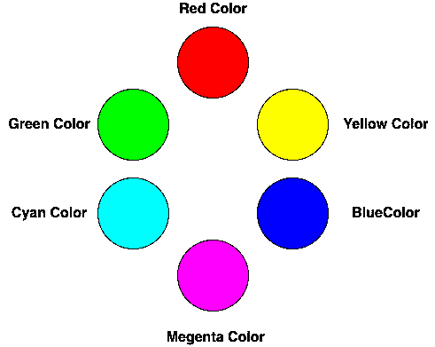
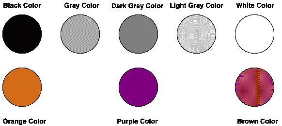
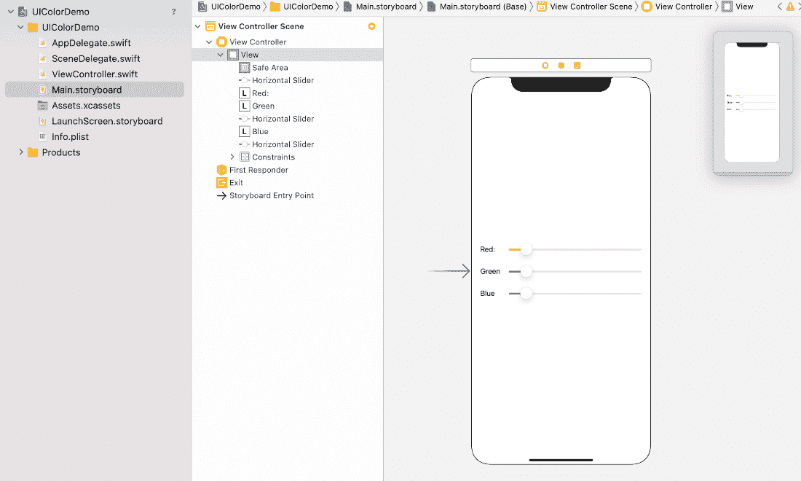
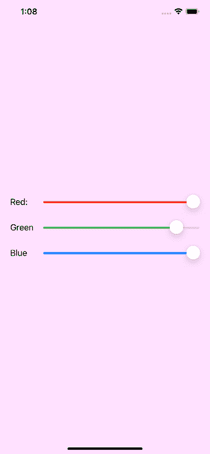

# 使用 UIColor 自定义应用程序外观

> 原文：<https://www.javatpoint.com/using-uicolor-to-customize-app-appearance>

UIColor 是 NSObject 的一个子类，用于存储 iOS 应用程序中某个对象的颜色和不透明度信息。UIColor 的声明如下所示。

```

class UIColor : NSObject

```

颜色是改善应用程序外观的最重要方面。我们可以使用颜色来帮助用户可视化数据。苹果提供了几种在应用程序中选择颜色的方法。最常用的两种颜色识别系统是 RGB 和 HSB。然而，程序员大多使用 RGB(红-绿-蓝)颜色系统。RGB 包含红色、绿色和蓝色的组合，其中每种颜色都包含 0 到 255 之间的值。255 代表全彩，而 0 代表无彩。

UIColor 类管理应用程序中使用的颜色。它提供了一个类属性列表，可以为用户界面元素(如标签、文本、按钮和图像)指定系统提供的颜色。我们还可以通过指定十六进制代码或提供不同于其他颜色对象的组件来创建颜色。我们还可以从一个对象创建基于图案的颜色。

### UIColor 方法

UIColor 类提供了以下方法来配置应用程序外观。

| 塞内加尔 | 方法 | 描述 |
| one | 函数集() | 此功能用于将后续描边和填充操作的颜色设置为接收器代表的颜色。 |
| 2. | func setFill() | 它用于将后续填充操作的颜色设置为接收器表示的颜色。 |
| 3. | func setStroke() | 它用于将后续笔画操作的颜色设置为接收器表示的颜色。 |
| 4. | func getHue(unsamplerepointer<cgfloat>？，饱和度:unsamplerepointer<cgfloat>？，亮度:不可测量<cgfloat>？，alpha:unsamplerepointer<cgfloat>？)->布尔</cgfloat></cgfloat></cgfloat></cgfloat> | 它返回在 HSB 颜色空间中形成颜色的成分。 |
| 5. | func get red(unsafetreplacepointer<cgfloat>？，绿色:unsamplerepointer<cgfloat>？，蓝色:不安全报告<cgfloat>？，alpha:unsamplerepointer<cgfloat>？)->布尔</cgfloat></cgfloat></cgfloat></cgfloat> | 它返回在 RGB 颜色空间中形成颜色的分量。 |
| 6. | func getWhite(unsafetreplacepointer<cgfloat>？，alpha:unsamplerepointer<cgfloat>？)->布尔</cgfloat></cgfloat> | 它返回颜色的灰度分量。 |
| 7. | func resolved color(with:uitraitcollection)-(ui color) | 它返回由指定特征产生的当前颜色版本。 |

### UIColor 属性

UIColor 包含以下属性。

| 塞内加尔 | 财产 | 描述 |
| one | 酸橙： CGColor | 它表示与颜色对象相对应的石英颜色。 |
| Two | 可变回旋馀地:回旋馀地 | 它表示对应于颜色对象的核心图像颜色。 |
| three | var accessibilityName： String | 它表示辅助功能属性颜色的本地化描述。 |

### 内置 UIColor 预设

苹果提供如下所示的各种内置颜色。内置颜色通过类变量来访问。




可以使用以下代码分配内置颜色。

```

let backgroundColor = UIColor.blue

```

正如我们已经提到的，内置颜色是类变量，我们可以直接从 UIColor 类中使用这些颜色。

### 创建自定义颜色对象

UIColor 类提供了各种初始化器，可以用来创建自定义的 UIColor。它方便我们创造我们的颜色，这将是在内置颜色之间。

| 塞内加尔 | 初始化程序 | 描述 |
| one | init(白色:CGFloat，alpha: CGFloat) | 它接受白色分量(在 0.0 和 1.0 之间)和 alpha(在 0.0 和 1.0 之间)的 CGFloat 值 |
| Two | init(Hu:cgfloat、sation:cgfloat、brightness: CGFloat、alpha: CGFloat) | 它接受色调、饱和度、亮度和 alpha 的 CGFloat 值。CGFloat 值介于 0.0 和 1.0 之间。 |
| three | init(红色:CGFloat，绿色:CGFloat，蓝色:CGFloat，alpha: CGFloat) | 它接受红色、绿色、蓝色和 alpha 的 CGFloat 值。CGFloat 值介于 0.0 和 1.0 之间。 |
| four | init(displayP3Red: CGFloat，green: CGFloat，blue: CGFloat，alpha: CGFloat) | 它接受显示 3 红色、绿色、蓝色和 alpha 的 CGFloat 值。CGFloat 值介于 0.0 和 1.0 之间。 |
| five | init（cgColor： CGColor） | 它接受一个 CGColor，这是一个 cgColor 类的实例。 |
| six | init(阵列影像:UIImage) | 它接受 UIImage 类型的模式图像。 |
| seven | init(ciColor: CIColor) | 它接受一个 CIColor，它是 ciColor 类的一个对象。 |

我们可以使用 UIColor 初始化器来构建一个自定义的 Color 对象，如下所示。

```

let redColor = UIColor(red: 1, green: 0, blue: 0, alpha: 1)

```

**例**

让我们创建一个 iOS 应用程序来演示如何使用 UIColor 对象来配置应用程序的外观。

我们将在我们的应用程序中使用 UISlider。我们可以通过更改滑块的值来控制红色、绿色和蓝色分量。该应用程序的界面构建器如下所示。



让我们为红色、绿色和蓝色滑块创建出口。我们还将为滑块创建动作出口，当滑块的值改变时，它将被触发。

在 ViewController.swift 中添加以下代码

```

import UIKit

class ViewController: UIViewController {

    @IBOutlet weak var blueSlider: UISlider!
    @IBOutlet weak var greenSlider: UISlider!
    @IBOutlet weak var redSlider: UISlider!
    override func viewDidLoad() {
        super.viewDidLoad()
        // Do any additional setup after loading the view.
        let redValue = CGFloat(redSlider.value)
        let greenValue = CGFloat(greenSlider.value)
        let blueValue = CGFloat(blueSlider.value)
        self.view.backgroundColor = UIColor(red: redValue, green: greenValue, blue: blueValue, alpha: 1)
    }

    @IBAction func sliderValueChanged(_ sender: UISlider) {
        let redValue = CGFloat(redSlider.value)
        let greenValue = CGFloat(greenSlider.value)
        let blueValue = CGFloat(blueSlider.value)
        self.view.backgroundColor = UIColor(red: redValue, green: greenValue, blue: blueValue, alpha: 1)
    }
}

```

现在，在模拟器上运行该应用程序，并看到如下所示的结果。当我们移动滑块时，视图的背景颜色将会改变。



* * *