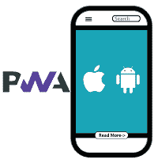
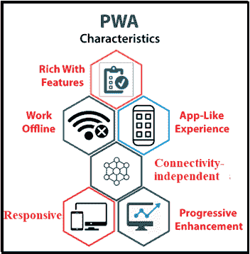
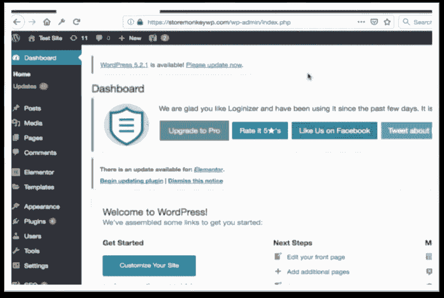
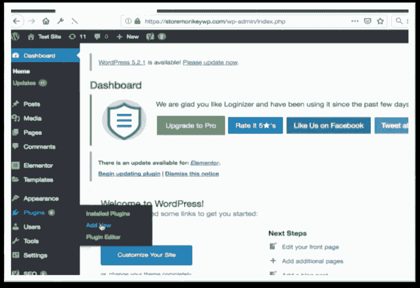
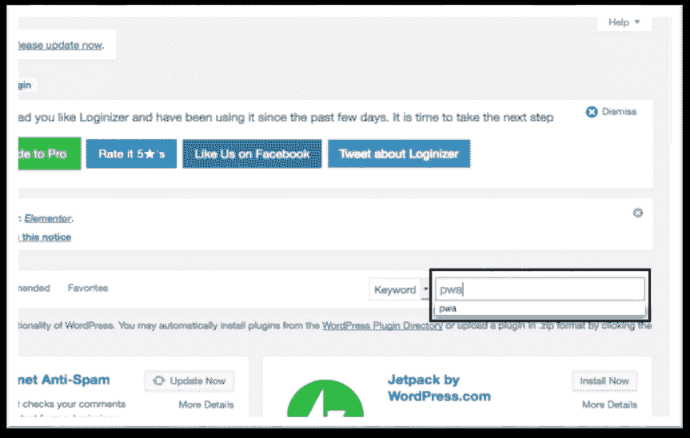
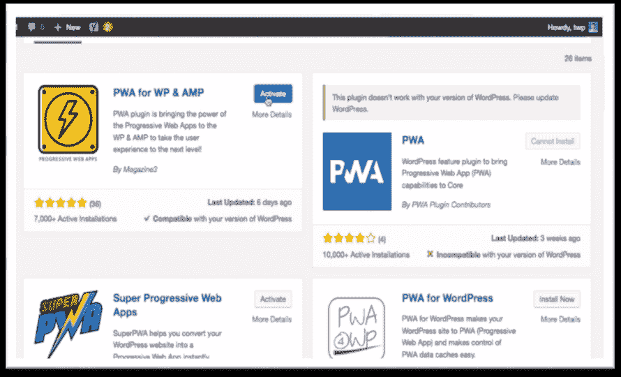
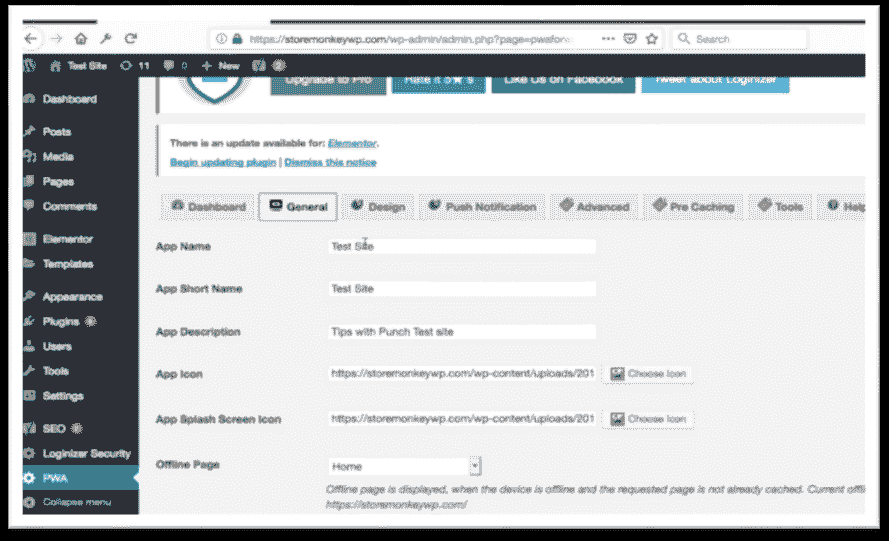
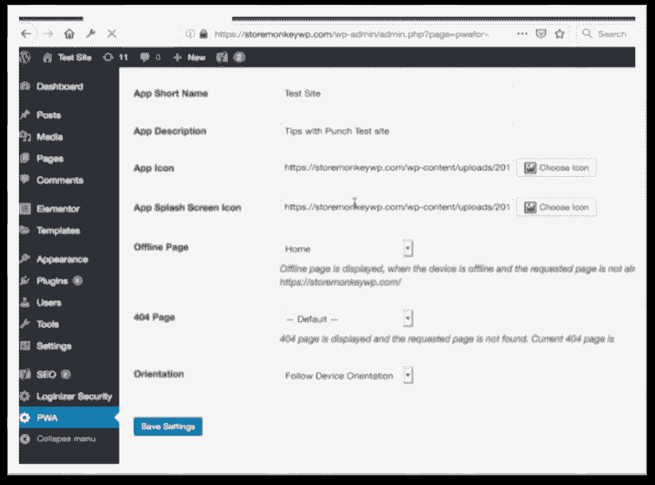
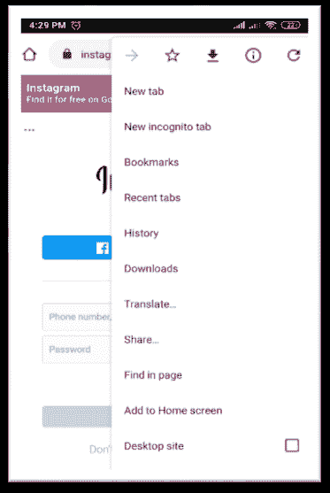

# 渐进式网络应用

> 原文：<https://www.javatpoint.com/progressive-web-applications>



PWA 的完整形式是渐进式网络应用。PWA 是 HTML 5 网页。它是一个类似移动应用程序的网络应用程序，直接从网站存储在手机上。换句话说，就是在用户的移动浏览器上运行的网站。PWA 是一项新技术。PWA 允许将网站存储在您的设备中。它以网站应用程序的形式创建一个图标，打开后感觉这个图标就像一个移动应用程序。

在设备中创建网站的 PWA 图标后，所有在互联网帮助下打开的帖子都会自动存储在您的设备中，不需要互联网进行二次阅读。这是一种将本地应用体验与浏览器功能相结合的方法。

一般来说，当你必须构建应用程序时，你必须为不同的平台开发那个应用程序，比如 [iOS](https://www.javatpoint.com/ios-development-using-swift) 、[安卓](https://www.javatpoint.com/android-tutorial)、 [Windows](https://www.javatpoint.com/windows) 。但是在 PWA 的情况下，您不需要为不同的平台开发单独的应用程序。您只需要创建基于 [HTML](https://www.javatpoint.com/html-tutorial) 5 的网页，就可以在任何移动浏览器上运行。

## PWA 的特性



渐进式 web 应用程序具有以下重要特征:

1.  **渐进式:**渐进式这个术语的意思是，一个 PWA 应用程序必须在任何设备上工作，并提高用户移动浏览器的性能和设计。
2.  **可发现:**PWA 是一个有一些额外功能的网站。可以通过谷歌 Chrome 等移动搜索应用进行搜索。这不需要应用商店或游戏商店。
3.  **响应式:**渐进式网络应用的 UI 应该适合设备的外形和屏幕大小。
4.  **类似应用程序:**PWA 应用程序应该看起来像本机应用程序。尽管创建、共享、启动和更新 PWA 的方法与原始应用程序完全不同。
5.  **连接性无关:**即使连接性很低，它也能工作。

## PWA 的优势

1.  PWA 的工作原理就像手机上的一个应用，看起来非常令人印象深刻。
2.  它不需要更新。
3.  它很容易保存在设备中。
4.  它会立即加载到您的手机上。
5.  与单独为安卓、iOS 和其他平台创建应用程序相比，它节省了金钱和时间。
6.  即使没有互联网，帖子也可以阅读。
7.  互联网数据在其中使用较少。
8.  PWA 比其他应用程序更便宜。

## PWA 的缺点

1.  它支持有限的移动浏览器。它不在 safari、edge 和 IE 浏览器上运行。
2.  iPhone 用户无法在其中安全地建立连接。
3.  它最大限度地利用了设备的电池。
4.  它需要托管在服务器上，因为它是一个 web 应用程序。
5.  不能从谷歌 Play、苹果 App Store 等热门应用商店下载。
6.  PWA 并不为所有设备提供相同级别的支持。比如 PWA 中的推送通知在安卓上可以用，在 iOS 上不行。
7.  它支持有限的硬件功能。

## PWA 和本机应用程序的区别

| 特征 | 渐进式网络应用 | 本机应用程序 |
| 功能脱机 | 是 | 是 |
| 安装要求 | 没有必要安装在手机上。 | 有必要把它装在手机里。 |
| 推送通知。 | 它支持推送通知功能。 | 它还支持推送通知功能。 |
| 平台 | 它支持跨平台。 | 它支持特定的平台。示例 iOS、安卓和 Windows |
| 数据消耗 | 低数据消耗 | 高数据消耗 |
| 互联网需求 | 没有互联网要求 | 互联网需求 |
| 费用 | 低成本 | 高成本 |
| 更新应用程序 | 它不需要更新应用程序。 | 它需要更新应用程序。 |
| 履行 | 很容易实现。 | 实现起来很复杂。 |
| 谷歌索引 | 是 | 不 |
| 可分担的 | 从任何人那里分享都很容易。 | 它共享整个应用程序，因此很复杂。 |

## PWA 的技术组件

PWA 有五个组成部分。

1.  网络应用清单
2.  应用程序外壳
3.  服务行业人员
4.  网页包
5.  传输层安全性

### 1.网络应用清单

网络应用程序清单是 PWA 的第一个组成部分。这是一个简单的 [JSON](https://www.javatpoint.com/json-tutorial) 文件，控制用户的应用程序。通常，它被命名为“manifest.json”。它是 PWA 存在的最重要的组成部分。当您第一次将 PWA 连接到网络时，移动浏览器会读取“manifest.json”文件，并将其本地存储在缓存中。

当 PWA 中没有网络访问时，移动浏览器在脱机时使用应用程序的缓存来运行 PWA 程序。

“manifest.json”文件帮助 PWA 给出一个原生应用的外观。借助 manifest.json 文件，PWA 开发人员可以控制应用程序如何呈现给用户移动屏幕。PWA 开发人员还可以为手机的闪屏和应用程序的地址栏设置一个主题。

“manifest.json”文件允许 PWA 开发人员搜索 web 应用程序元数据的集中位置。JSON 文件定义了图标和图标大小的链接、应用程序的全名和缩写名、类型、背景色、主题、位置以及类似应用程序的体验所需的其他视觉细节。

### 2.应用程序外壳

应用程序外壳是 PWA 的第三个技术组件。它专门用于分割应用程序的静态和动态内容。最小的 [CSS](https://www.javatpoint.com/css-tutorial) 、HTML、 [JavaScript](https://www.javatpoint.com/javascript-tutorial) 以及任何其他动态和静态资源为你的网页提供了结构。它减少了网页特有的实际内容。该组件确保了开发渐进式网络应用程序的非常关键的方法。

它允许在没有任何连接的情况下执行 PWA。这个组件的基本设计元素使它能够执行这样的任务。它特别适用于基于 JavaScript 的应用程序。

### 3.服务行业人员

服务工作者是网络工作者。这是一个运行在移动[浏览器](https://www.javatpoint.com/browsers)旁边的 JavaScript 文件。换句话说，它是促进 PWA 功能的另一个技术组件。服务工作人员从缓存中检索资源并传递消息。

它独立于它们所连接的应用程序，并具有许多后果:

*   服务人员不会阻止同步的 XHR，因此它不能在本地存储中使用(它被设计为完全异步的)。
*   即使应用程序没有运行，它也可以从服务器接收信息。它在 PWA 应用程序中显示通知，而不在移动浏览器中打开。
*   它不能直接访问 DOM。因此，邮件和消息事件侦听器方法用于与网页通信。PostMessage 方法用于发送数据，消息事件侦听器用于接收数据。

**要了解的事情:**

*   它是一个可编程的网络代理，可以帮助你监控你的页面如何处理网络请求。
*   它只在 HTTPS 工作，因为 HTTPS 非常安全，它拦截网络请求并修改响应。

### 服务人员生命周期

服务人员生命周期是 PWA 中最复杂的部分。服务人员的一生有三个阶段:

1.  登记
2.  装置
3.  激活

**注册**

服务人员基本上是一个 JavaScript 文件。您需要在关键的 JavaScript 代码中注册它来使用服务人员。注册会告诉您的浏览器服务人员的位置，并开始在后台安装它。服务人员文件与标准 JavaScript 文件的区别之一是，服务人员在远离手机主浏览器的后台运行。这个过程是服务人员生命周期的第一阶段。

服务人员注册的代码放在 main.js 文件中。

```

if ("Service-Worker- in navigator.js) 
{
  navigator. Service - worker. register ('/service-worker. json')
  then (function (registration) 
  {
    console.log ('Registration successful finish, scope is:', registration. scope.);
  }
  Catch (function (error) 
  {
    console.log ('Registration failed, error:', error.js);
  }
}

```

首先，这段代码检查浏览器是否支持服务人员。当服务人员返回承诺时，服务人员随后在**导航器.服务人员.注册**中注册。承诺履行的，登记成功；否则，注册失败。

**注册范围**

此范围决定了由服务人员管理的网页。服务人员的位置定义了默认范围。每当您在系统的主文件夹中注册服务人员文件时，指定其范围并不重要，因为它控制所有网页。

```

navigator.service.worker.register ('/sw.js', { scope: '/'  });

```

**安装**

在 navigator . serviceworker . register 的帮助下注册新的服务工作人员时，会下载 JavaScript 代码，并进入安装状态。如果安装成功，服务人员将进一步进入下一个状态。

```

const assets to.cache = [
'/js/app.js',
'/about.html',   
'/index.html',
'/css/app.css',    
]

self. addEventListener ('install', function (event) {
    event. wait Until (
        caches. Open('staticAssetsCache')
        then (function (cache) {
              return cache Add All (assetsToCache.);
        })
      );
});

```

**激活**

一旦成功安装了服务人员，它就会转换到激活阶段。如果有一个由前一个服务人员控制的打开页面，新的服务人员将进入等待状态。只有在旧的服务工作者中没有加载页面时，新的服务工作者才会被激活。安装后不会立即激活服务人员。

服务人员仅在以下情况下有效:

*   如果当前没有服务人员处于活动状态。
*   如果用户刷新网页。

**服务人员**

```

self.addEventListener('activate', function(event) {
  // Perform some task
});

```

服务人员可以管理网络请求，而不是缓存。它绕过了最新的[互联网](https://www.javatpoint.com/internet) API。

**1。获取:**获取应用编程接口是图形用户界面的基本资源。它比旧的 XMLHttprequests 更容易控制网页请求和响应，这通常需要额外的语法，它的例子是控制重定向。当网络上请求资源时，胎儿事件终止。

#### 注:支持 CORS(跨来源资源共享)。测试通常需要本地服务器。

提取请求示例:

```

fetch('ABCs/ABC.json')
then (function (response){
// response function
})
catch (function (error) 
{
console.log ('problem section: \n', error);
});

```

**2。缓存应用编程接口:**已经为服务工作应用编程接口提供了一个缓存接口，允许您根据请求创建响应存储库。然而，这个界面是为服务人员设计的。除非特别请求，否则它不会更新缓存中的内存。

**服务人员的特征**

*   **离线:**启用离线功能可能是要求最高的服务人员设施。
*   **缓存:**对缓存内容的控制是服务工作者最常见的功能。
*   **内容递送网络:**CDN 和其他外部材料可能难以处理。由于同源规则和 SSL，PWA 开发人员有时会从公共托管软件中进行选择，但您仍然可以从 cdn 上传脚本。
*   **推送通知:**推送通知的功能是与用户和访客互动的最佳方式。此功能增强了 PWA 应用程序的性能。
*   **后台同步:**在后台同步任务是服务工作者的另一个非常重要的特性。

### **4 .网页包〔t1〕**

网络包是 PWA 的第四个组成部分。用于设计 PWA 前端。它允许 PWA 开发人员在一个位置收集所有的 JavaScript 资源和数据。

### 5.传输层安全性

传输层安全性是 PWA 的第五个组成部分。该组件是任何两个应用程序之间所有健壮和安全数据交换的标准。数据的完整性要求网站通过 HTTPS 提供服务，并在服务器上安装 SSL 证书。

## 如何使用 WordPress 将网站转换成 PWA？

将网站转换为 PWA 有七个简单的步骤。

首先要做的是登录你网站的 WordPress 管理员。



**第二步**:之后要进入插件选项，点击添加新选项。



**第三步:**之后，点击搜索按钮，搜索渐进式网络应用的插件，安装在 WordPress 中。



**第五步:**然后，激活渐进式网络应用的插件。



**第六步:**现在，你会在你的仪表盘上看到很多选项(如应用名称、描述、图标、颜色)，可以根据你的选择进行自定义。



**第 7 步:**然后点击保存设置按钮。



## 如何安装 PWA？

在安卓手机上，安装 PWA 非常简单。

**第一步:**首先要做的是在手机上打开谷歌 chrome。


**第二步:**然后，打开网站，比如 Instagram.com。


**第三步:**现在，点击谷歌浏览器右上角的三个点。



**第 4 步:**然后，点击添加到主屏幕选项并添加。


在 iOS 上，您可以使用 Safari 浏览器访问网站，然后点按共享图标。这将打开一个子菜单，其中包含更多图标和保存到主屏幕的选项。

## 普华永道框架工具表

| 工具名称 | 类型 | 价格 | 主页链接 | 下载链接 |
| 反应 PWA 库 | 开放源码 | 自由的 | [https://www.reactpwa.com/](https://www.reactpwa.com/) | [https://github . com/atyantic/reac-pwa/archive/master . zip](https://github.com/Atyantik/react-pwa/archive/master.zip) |
| 角度 PWA 框架 | 开放源码 | 自由的 | [https://ionicframework.com/docs/angular/pwa](https://ionicframework.com/docs/angular/pwa) | [https://ionicframework.com/docs/angular/pwa](https://ionicframework.com/docs/angular/pwa) |
| PWA 框架视图 | 开放源码 | 自由的 | [https://onsen . io/view/](https://onsen.io/vue/) | [https://onsen . io/v2/guide/view/](https://onsen.io/v2/guide/vue/) |
| 离子 PWA 框架 | 开放源码 | 自由的 | [https://ionicframework.com/pwa](https://ionicframework.com/pwa) | [https://ionicframework.com/pwa](https://ionicframework.com/pwa) |
| 苗条的 PWA 框架 | 开放源码 | 自由的 | [https://svelte.dev/](https://svelte.dev/) | [https://svelte.dev/](https://svelte.dev/) |
| 普华永道建筑公司 | 开放源码 | 自由的 | [https://www.pwabuilder.com/](https://www.pwabuilder.com/) | [https://www.pwabuilder.com/](https://www.pwabuilder.com/) |
| web 包模块 Bundler | 开放源码 | 自由的 | [https://web pack . github . io/](https://webpack.github.io/) | [https://web pack . github . io/](https://webpack.github.io/) |
| 灯塔 PWA 分析工具 | 开放源码 | 自由的 | [https://developers . Google . com/web/ILT/pwa/灯塔-pwa-分析-工具](https://developers.google.com/web/ilt/pwa/lighthouse-pwa-analysis-tool) | [https://developers . Google . com/web/ILT/pwa/灯塔-pwa-分析-工具](https://developers.google.com/web/ilt/pwa/lighthouse-pwa-analysis-tool) |

## 进步网络应用的一些流行例子

### 全球速卖通

全球速卖通是阿里巴巴集团推出的一个受欢迎的电子商务网站。几年前，他们把自己的网站变成了手机的进步网络应用。

在换上一款进步网络应用后，全球速卖通看到了不可思议的结果:

*   新用户转化率提高 104%。
*   PWA 应用中的加载时间增加了 3 倍。
*   再参与度提高 50%。

### -什么

在印度，Flipkart 是最大的电子商务网站。Flipkart 最近将其面向移动用户的网站更新为一个名为 Flipkart Lite 的 PWA。Flipkart lite 结合了网络和本地应用的优点。它为智能手机用户提供了快速、不间断的体验。

在改用进步网络应用程序后，Flipkart 看到了令人难以置信的结果:

*   转化率提高 70%。
*   再参与度提高 40%。
*   PWA 应用中的加载时间增加了 3 倍。
*   PWA 应用程序中的页面会话增加了 65%。

### Twitter Lite

推特是社交媒体的热门平台。在 **2017** 年，他们为移动用户把网站改成了 Progressive Web App，叫做 twitter lite。Twitter Lite 即时加载帖子。它通过优化图片和保留缓存数据来减少数据使用。

Twitter Lite 用推送通知系统重建客户。它还允许用户将渐进式网络应用程序连接到他们的手机主屏幕。

在改为进步网络应用后，推特看到了令人难以置信的结果:

*   发送的推文增加了 75%。
*   普华永道的跳出率下降了 20%。
*   PWA 中的页面会话增加了 65%。

### 照片墙

Instagram 是一款非常受欢迎的社交媒体应用。他们将网站改为面向移动用户的进步网络应用。它通过处理照片来减少数据消耗。

在更换为渐进式网络应用后，Instagram 看到了令人难以置信的结果:

*   转化率提高 77%。
*   再参与度提高 50%。
*   PWA 应用中的加载时间增加了 3 倍。
*   PWA 应用程序中的数据使用率降低了 4 倍。

### 书我的秀

BookMyShow 是印度一个流行的网站，用来在线订票。2017 年，他们将网站改为面向移动用户的 Progressive Web App。

一些用户在 BookMyShow 手机应用中遇到了很多问题。但是 PWA 解决了所有的问题。它为智能手机用户提供了流畅的订票体验。

在更换为渐进式网络应用后，Instagram 看到了令人难以置信的结果:

*   普华永道应用程序的转化率增加了 80%以上。
*   比 iOS 应用和安卓应用更小。
*   转化率提高 5 倍。

### MakeMyTrip

MakeMyTrip 是印度第一个在线旅游网站。网站所有者决定投资一个进步的网络应用程序，为其用户提供快速和吸引人的移动网络体验。在更换为渐进式网络应用后，Instagram 看到了令人难以置信的结果:

*   转化率提高 3 倍。
*   比 iOS 应用和安卓应用更小。
*   PWA 应用程序中的用户会话增加了 160%以上。

* * *