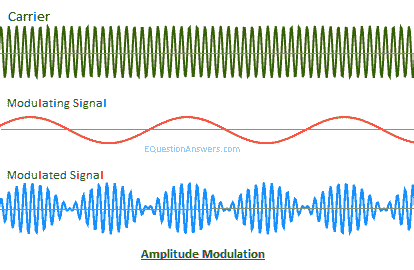

# 移动计算中的调制

> 原文：<https://www.javatpoint.com/modulation-in-mobile-computing>

调制是将信号与正弦波混合以产生新形式信号的过程。新产生的信号比未调制的信号有某些好处。低频信号与高频载波信号的混合称为调制。

换句话说，你可以说“调制是将一种形式的信号转换成另一种形式的信号的**过程**例如，模拟信号到数字信号或数字信号到模拟信号。

调制也叫**信号调制**。

**例:**我们通过一个简单的例子来理解信号调制的概念。假设有一种模拟传输介质可以传输信号，但是您有一个数字信号需要通过这种模拟介质传输。所以，要完成这个任务，你必须把数字信号转换成模拟信号。信号从一种形式转换成另一种形式的过程称为调制。

## 需要调制/为什么使用调制？

基带或低频信号不是可用于直接传输的强而兼容的信号。为了使这些信号传播更远的距离，我们必须通过用高频载波调制它们来增加它们的强度。这个过程不影响调制信号的参数。

调制是用来使携带信号的信息强到可以远距离传输，建立可靠的通信。高频信号可以传播更远的距离，而不会受到外部干扰的影响。在调制中，这些高频信号被用作载波信号来传输消息信号。这个过程叫做调制。在调制中，载波信号的参数根据调制信号的瞬时值而变化。

调制信号的另一个原因是允许较小的天线，因为我们知道低频信号需要巨大的天线。天线需要大约是信号波长的 1/10 才能有效。调制将低频信号转换成高得多的频率信号，该信号具有小得多的波长并允许较小的天线。

## 调制的优点

下面列出了在通信系统中实现调制的一些优点:

*   通过实施调制，天线尺寸变小。在调制技术出现之前，用于传输的天线必须非常大。通信的范围变得有限，因为如果不进行调制，电波就无法传播到一定的距离。
*   交流的范围扩大了。
*   接收质量大大提高。
*   允许接收器根据带宽进行调整。
*   信号发生多路复用。
*   没有信号混合发生。

## 调制类型

调制主要可分为两种类型:

*   数字调制
*   模拟调制

### 数字调制

数字调制是一种将数字信号/数据转换成模拟信号的技术。例如，基带信号。

数字调制可以进一步分为四种类型:

*   振幅移位键调制
*   最小移位键(MSK)调制
*   频移键控调制
*   相移键控(PSK)调制

**振幅移位键(ASK)调制**

*   顾名思义，在幅度移位键或 ASKS 调制中，幅度用“1”表示，如果幅度不存在，则用“0”表示。
*   使用幅度移位键控调制非常简单，并且需要非常低的带宽。
*   振幅移位键控调制容易被推断或演绎。

**最小换档键(MSK)调制**

*   最小移位键或 MSK 调制是最有效的调制技术，几乎可以应用于每一个比特流。它比幅移键、频移键和相移键简单有效。
*   MSK 主要用于处理二进制位的“一(1)”和“零(0)”转换的能力和灵活性。

**频移键控调制**

*   在频移键控或频移键控调制中，不同的频率使用不同的符号 f1 和 f2。
*   这里，f1 用于表示位“1”，f2 表示位“0”。
*   它也是一种简单的调制技术，但对不同的位使用不同的频率；带宽要求变高。

**相移键控(PSK)调制**

*   在相移键控或 PSK 调制中，相位差用于区分“1”和“0”位。
*   如果该位为“1”，则画一个简单的波，如果该位变为“0”，则波的相位偏移“180°或π”。
*   PSK 调制比 ASK 和 FSK 调制复杂，但也很稳健。

## 移动计算中的模拟调制

模拟调制是通过较高频率载波信号(如射频频带)传输模拟低频基带信号(如**音频或电视信号)的过程。基带信号总是模拟这种调制。**

换句话说，你可以说“模拟调制是一种用于将模拟数据信号传输成数字信号的技术。”

模拟调制的一个例子是宽带信号。

模拟调制中载波信号有三种特性，即振幅、频率和相位。因此，模拟调制可以进一步分类为:

*   调幅
*   调频
*   相位调制

## 数字调制和模拟调制的区别

数字调制和模拟调制都用于改变信号或将信号从一种形式转换为另一种形式，但不同之处在于模拟调制信号被解调为模拟基带波形。另一方面，在数字调制中，数字调制信号包含被称为符号的离散调制单元，它们被解释为数字数据。

### 调幅

调幅是一种用于电子通信的调制技术。它最常用于通过无线电载波传输信息。它根据消息信号的瞬时幅度来改变载波信号的瞬时幅度。

如果我们将消息信号表示为 **m(t)** 和 **c(t)= Acosw c t，**则**调幅信号 F(t)** 将被写成:

f(t)= Acoswct+m(t)coswct

F(t)=[A+m(t)] cosw c t

**调幅历史**

调幅是无线电广播中最早用于传输音频的调制技术。它是在 20 世纪的前 25 年发展起来的，是基于罗伯特·兰戴尔·德·莫拉和 T2·雷金纳德·费森登在 1900 年提出的无线电话实验。

**调幅的优点**

*   调幅易于实现。这是最简单的调制方式。
*   调幅，我们可以用很少的元件和一个电路很容易地做解调。
*   发射机和接收机的硬件设计都非常简单，这就是为什么它具有成本效益。
*   用于调幅的接收器非常便宜。

**调幅的缺点**

*   调幅不是一种非常节能的技术。
*   调幅需要非常高的带宽，相当于最高音频的带宽。
*   调幅很容易受到噪声的影响。你很容易注意到噪音。

**调幅的使用**

调幅用于调幅无线电通信。调幅广播是调幅的一个例子。

### 调频

调频是通过改变载波的瞬时频率来编码载波信息的过程。它根据消息信号的瞬时幅度来改变载波信号的瞬时频率。

如果我们将消息信号表示为 **m(t)** 和 **c(t)= Acosw c t，**则**调频信号 F(t)** 将被写成:

F(t)= Acos(wc t+kf ∫m(α)dα)

**调频优势**

*   调频广泛用于调频广播。
*   它还用于遥测、声音合成、地震勘探、雷达，以及通过脑电图、双向无线电系统、磁带记录系统和一些视频传输系统监测新生儿癫痫发作。
*   在无线电传输中使用频率调制的主要优点是它具有较大的信噪比。这就是为什么它能比等功率调幅信号更好地抑制射频干扰。这是大多数音乐广播频道更喜欢通过调频广播的主要原因。
*   在调频中，调制和解调不接收任何信道噪声。

**调频的缺点**

*   调频由比调幅更复杂的调制和解调电路组成。

**调频的使用**

调频的主要例子是调频广播。

### 相位调制

相位调制是根据信息信号的瞬时幅度改变载波信号瞬时相位的技术。当载波信号的瞬时相位发生变化时，它对消息信号进行编码。

如果我们将消息信号表示为 **m(t)** 和 **c(t)= Acosw c t，**则**相位调制信号 F(t)** 将被写成:

F(t)= Acos(wct+kpm(t))

**相位调制的优点**

*   相位调制主要用于传输无线电波。它还用于许多数字传输编码方案和技术，如无线网络、全球移动通信系统和卫星电视。
*   在 PM 中，调制和解调不接收任何信道噪声。

**相位调制的缺点**

*   永磁调制解调由比调幅和调频更复杂的电路组成。

**相位调制的使用**

相位调制主要用于 [Wi-Fi](https://www.javatpoint.com/wifi-full-form) 、 [GSM](https://www.javatpoint.com/gsm-full-form) 和卫星电视。

* * *