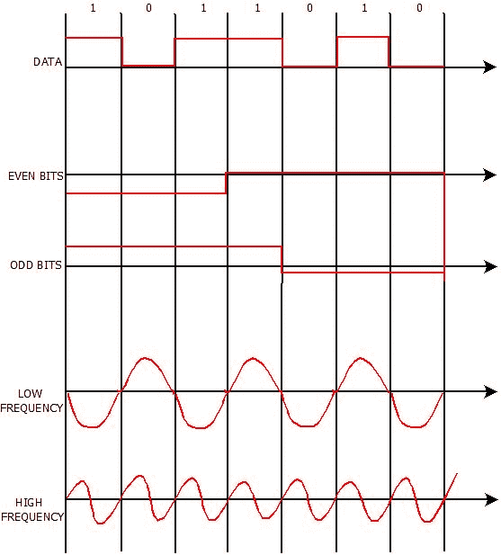

# 最小移位键控调制/最小移位键控(MSK)

> 原文：<https://www.javatpoint.com/minimum-shift-key-modulation-in-mobile-computing>

最小移位键控调制是用于将数字信号转换成模拟信号的另一种数字调制技术。它也被称为**最小频移键控(MSK)或高级频移键控**，因为它是一种连续相位频移键控。

## 最小移位键控调制或最小移位键控(MSK)的主要特征

*   最小频移键控或 MSK 最早是由科林斯电台的雇员梅尔文·多埃尔兹和 T2 在 20 世纪 50 年代末开发的。
*   它由正交分量之间交替的比特编码，Q 分量延迟符号周期的一半。
*   最小频移键控是最有效的数字调制技术。与数字调制技术的相移键控、频移键控和幅度移位键控相比，它几乎可以容易地实现每一个比特流。
*   最小移位键控的概念基于给定比特流的比特定位，例如偶数比特和奇数比特，以及比特定位频率生成表。
*   MSK 是使用最广泛的数字调制技术，因为它能够灵活地处理二进制位的“一(1)”和“零(0)”转换。

## 最小移位键控工作(MSK)

*   在最小移位键控中，比特被分成偶数和奇数比特，每个比特的持续时间加倍。
*   此后，频率被分成两种类型的频率 f1 和 f2。这里，f1 确定/表示低频，f2 表示高频。
*   如果信号是偶数或奇数，则根据比特值从频率生成表中选择原始或反转信号。
*   较高频率的曲线从 0 到π取一个完整的波，较低频率的曲线在相同的时间间隔内取一个 0 到π/2 的波。

让我们举一个例子来演示最小移位键控的工作原理，并为给定的比特流绘制一条曲线。让我们考虑比特流 1011010。这里，我们必须找到这个比特流的 MSK 曲线。

**MSK 曲线绘制规则**

**第一步:**首先根据振幅的位值绘制曲线。如果该位为零，则它会有振幅，而如果该位为零，则它没有振幅。

**第二步:**现在，从奇数位开始。如果该位的值为 1，则在 x 轴上方绘制两倍于原始长度的曲线。如果该位的值为零，则在 x 轴下方绘制两倍于原始大小的曲线。

**第三步:**现在，画出高低频曲线，如下图所示。任何问题都是一样的。

**第四步:**这是最后一步。现在，根据频率生成表绘制最终曲线。在下图中，蓝色曲线代表最终获得的 MSK 曲线。

## 高斯最小频移键控(GMSK)

高斯最小频移键控或 GMSK 非常类似于标准最小频移键控(MSK)，但数字数据流在应用于频率调制器之前，首先用高斯滤波器整形。

GMSK 调制形式基于没有相位不连续的频移键控。它可以有效利用频谱，并支持高效的无线电功率放大器。

它具有比大多数 MSK 调制系统窄得多的相移角。

### 高斯最小频移键控(GMSK)的使用

GMSK 主要用于以下技术:

*   全球移动通信系统
*   蓝牙
*   卫星通信
*   用于航海的自动识别系统。

### 高斯最小频移键控(GMSK)的优势

*   使用 GMSK 的最大优点是它降低了边带功率，减少了相邻频道中信号载波之间的带外干扰。
*   GMSK 提供高光谱效率。

### 高斯最小频移键控(GMSK)的缺点

*   它增加了系统中导致符号内干扰的调制存储器，使得区分不同传输数据值变得更加困难。
*   它需要更复杂的信道均衡算法，例如接收机端的自适应均衡器。
*   它的功耗很高。

* * *