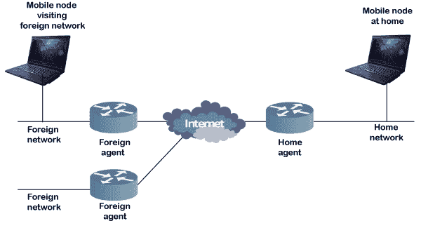

# 什么是移动 IP？

> 原文：<https://www.javatpoint.com/what-is-mobile-ip>

移动 IP 或 MIP 是互联网工程任务组(IETF) RFC 2002，事实上的标准通信协议。它是通过扩展互联网协议创建的。

移动 IP 允许移动设备用户从一个网络移动到另一个网络，同时保持相同的永久 IP 地址。

移动 IP 的概念和作用在移动计算技术领域非常重要。

[移动 IP](https://www.javatpoint.com/mobile-ip) 使通信完美无缺，并确保通信不会在用户会话或连接中断的情况下进行。

移动 IP 基于 [IP](https://www.javatpoint.com/ip) ，所以对于[互联网](https://www.javatpoint.com/internet)是可扩展的。任何支持 IP 的媒体也可以支持移动 IP。

## 移动 IP 技术简介

在 IP 网络中，当设备在其归属网络中时，路由是基于静态 IP 地址的。网络中的设备通过网络上分配的 IP 地址通过正常的 IP 路由进行连接。这和邮寄信件被投递到信封上的固定地址是一样的。当设备离开其家庭网络，并且使用正常的 IP 路由无法再到达时，就会出现问题。在这种情况下，设备的活动会话将被终止。移动 IP 的思想被引入来解决这个问题。它便于用户在前往不同网络或不同无线运营商时保持相同的 IP 地址，而不会中断通信或中断会话或连接。

移动 IP 的移动功能是在网络层而不是物理层执行的。

## 移动 IP 技术的体系结构

下图中指定了移动 IP 的组件及其之间的关系:

这就是移动 IP 技术的架构。它由以下组件组成:

*   移动节点
*   本地代理人
*   外国代理人
*   家庭网络(HN)
*   国外网络
*   对应节点
*   转交地址

**移动节点**

移动节点是一种设备或用户或路由器，可以频繁地更改其网络位置，而无需更改其原始 IP 地址。移动节点的例子有手机、个人数字助理(PDA)、笔记本电脑等。其软件支持网络漫游功能。

**家乡代理**

归属代理是归属网络上的路由器。它充当与移动节点通信的锚点。

**外国代理人**

外地代理是一种路由器，每当移动节点访问外地网络时，它都会提供多种服务，例如隧道数据传输。它负责将数据包从归属代理传送到移动节点。

**家庭网络**

家庭网络是移动节点最初所属的基站网络。

**外网**

除了本地网络或移动节点注册了 IP 的网络之外的任何网络都称为外地网络。

**对应节点**

用于与移动节点通信的伙伴节点称为对应节点。

**转交地址**

转交地址或转交地址用于定义移动节点的当前位置或用户。它用于通过隧道过程传递数据包。

## 移动知识产权的运作

移动 IP 的工作可以分为三个阶段:

**代理发现**

在代理发现阶段，移动节点发现它们的外地代理和本地代理。本地代理和外地代理使用 ICMP 路由器发现协议(IRDP)在网络上通告它们的服务。

**注册**

注册阶段负责通知本地代理和外地代理的当前位置，以便正确转发数据包。

**掘进**

此阶段用于建立虚拟连接，作为在隧道入口和隧道端点之间移动数据包的管道。

## 移动 IP 的应用

移动 IP 技术用于网络连接和 IP 地址的突然变化可能导致问题的许多应用中。它旨在支持无缝和连续的互联网连接。

它用于许多有线和无线环境，在这些环境中，用户必须跨多个局域网子网携带他们的移动设备。

虽然在诸如 3G 的蜂窝系统中不需要移动 IP，但是它经常被用于 3G 系统中，以在不同的分组数据服务节点(PDSN)域之间提供无缝的 IP 移动性。

* * *