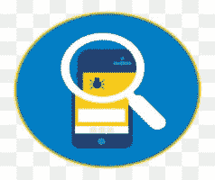

# 移动应用测试教程

> 原文：<https://www.javatpoint.com/mobile-application-testing>

当今时代，手机正从简单的通讯工具扩展到无所不能的小玩意。手机是用来订餐的，用来通知出租车让我们知道方向。所有这些设施只有通过使用移动应用程序才能实现。

### 介绍

每一个开发出来的移动应用都要经过移动测试的过程。这个过程保证我们在应用程序发布到市场(应用商店/游戏商店)之前保持其质量水平。移动应用的开发生命周期比其他应用短，因此移动应用的成功仅取决于移动应用的测试。应用程序基于可用性、安全性和功能性进行测试。这提高了应用程序的总体效率，也提高了用户的可靠性。

### 对移动应用的需求

我们的日常工作需要一个移动应用程序。在今天忙碌和忙乱的生活方式中，我们希望在日常事务中做有意义的工作。

以下是日常工作的几个例子:

比如:

1.  我们想付电费。
2.  需要与经理沟通并提交报告。
3.  想找附近的商店吗
4.  想知道驾驶室状态吗

所有这些工作都有一个解决方案:我们需要下面的东西在一秒钟内完成我们的日常工作。

*   智能手机的需求
*   互联网连接
*   一个移动应用程序来完成这项工作

我们可以通过使用智能手机智能地完成日常工作

为了使用手机，我们需要经过适当测试的移动应用程序，以便越来越多的用户喜欢该应用程序。正是用户体验使移动应用程序成功。

## 先决条件

对软件测试感兴趣的人应该对软件测试的概念有基本的了解。那些打算从事软件测试的人应该知道测试规划的概念，黑盒测试的技巧等等。像 [JavaScript](https://www.javatpoint.com/javascript-tutorial) 这样的脚本语言的高级知识给从事[软件测试](https://www.javatpoint.com/software-testing-tutorial)带来了额外的好处。

## 观众

我们的移动应用教程是为初学者和专业人士设计的。

## 问题

我们向您保证，您不会发现移动应用程序测试教程有任何问题。但是如果有任何错误，请在联系表格中发布问题。

* * *