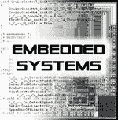
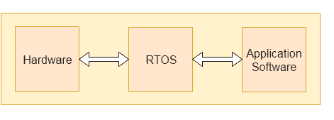

# 嵌入式系统教程

> 原文：<https://www.javatpoint.com/what-is-embedded-system>

嵌入式系统教程提供了嵌入式系统的基本和高级概念。我们的嵌入式系统教程是为初学者和专业人士设计的。

嵌入式系统是由硬件、应用软件和实时操作系统组成的系统。它可以是小型独立系统，也可以是大型组合系统。

我们的嵌入式系统教程包括嵌入式系统的所有主题，如特性、设计、处理器、微控制器、工具、寻址模式、汇编语言、中断、嵌入式 c 编程、led 闪烁、串行通信、lcd 编程、键盘编程、项目实施等。

* * *

## 什么是系统

**系统**是按照一套固定的规则、程序或计划来工作、组织或执行一项或多项任务的方式。

这是一种安排，在这种安排中，所有的单元通过在实时计算中遵循一定的规则组合在一起执行一项工作。它也可以被定义为一种按照固定计划工作、组织或完成一项或多项任务的方式。

* * *

## 什么是嵌入式系统

一个**嵌入式系统**是一个将软件嵌入到计算机硬件中的系统，它使一个系统专用于各种应用程序或应用程序或产品的特定部分或更大系统的一部分。

嵌入式系统可以是小型独立系统，也可以是大型组合系统。它是一个基于微控制器的控制系统，用于执行特定的操作任务。

嵌入式系统由三个主要组件组成:

*   **硬件:**硬件是与嵌入式系统物理连接的物理使用组件。它由基于微控制器的集成电路、电源、液晶显示器等组成。
*   **应用软件:**应用软件允许用户通过改变安装在嵌入式系统中的代码来执行要在嵌入式系统上运行的各种应用。
*   **实时操作系统(RTOS):** RTOS 监督嵌入式系统的工作方式。它充当硬件和应用软件之间的接口，监督应用软件，并提供机制让处理器在调度的基础上运行，以控制延迟的影响。

* * *

## 嵌入式系统索引

* * *

**嵌入式系统教程**

*   [ES 简介](embedded-system-tutorial)
*   [什么是 ES](what-is-embedded-system)
*   [ES 的特性](characteristics-of-embedded-system)
*   [专家系统的设计](designing-of-an-embedded-system)
*   [专家系统处理器](embedded-system-processors)
*   [微处理器](microprocessor)
*   [微控制器](microcontroller)
*   [MP vs MC](microprocessor-vs-microcontroller)
*   [微控制器的类型](types-of-microcontroller)
*   [专家系统工具和外设](embedded-system-tools-and-peripherals)

**8051 微控制器**

*   [8051 微控制器](embedded-system-8051-microcontroller)
*   [8051 MC 架构](embedded-system-8051-microcontroller-architecture)
*   [8051 MC 引脚数字图](embedded-system-8051-microcontroller-pin-diagram)
*   [专家系统输入输出编程](embedded-system-input-output-programming)
*   [寻址模式](embedded-system-addressing-modes)

*   [8051 指令集](embedded-system-8051-instruction-set)
*   [汇编语言](embedded-system-assembly-language)
*   [8051 中断](embedded-system-interrupts-in-8051-microcontroller)
*   [嵌入式 C](embedded-system-c-programming)
*   [发光二极管闪烁](embedded-system-led-blinking)
*   [7 段显示](embedded-system-7-segment-display)
*   [计数器/计时器](embedded-system-counter-timer)
*   [串行通信](embedded-system-serial-communication)
*   [键盘编程](embedded-system-keypad-programming)
*   [液晶编程](embedded-system-lcd-programmming)

**AVR 微控制器**

*   [AVR 微控制器](what-is-avr-microcontroller)
*   [ATmega32 微控制器](atmega32-avr-microcontroller)
*   [ATmega32 引脚图](atmega32-pin-diagram)
*   [ATmega32 记忆](atmega32-memories)
*   [ATmega8 微控制器](atmega8-avr-microcontroller)
*   [ATmega8 引脚图](atmega8-pin-diagram)
*   [输入输出端口编程](avr-input-output-port-programming)
*   [自动电压调节器寄存器](avr-registers)
*   [使用 Studio 编程](programming-avr-studio)
*   [液晶接口](lcd-interfacing-avr)
*   [AVR 中的 SPI](spi-in-avr-microcontroller)
*   [键盘接口](keyboard-interfacing-with-avr)
*   [模数转换器接口](adc-interfacing-avr)
*   [串行通信](avr-uart-serial-communication)
*   [脉宽调制微控制器](pwm-avr-microcontroller)
*   [中断微控制器](interrupts-avr-microcontroller)

**ES 项目**

*   [ES 项目](embedded-system-projects)
*   [火灾探测项目](embedded-system-project-fire-detection-and-control-system)
*   [射频识别考勤系统](embedded-system-project-rfid-based-attendance-system)

**机器人**

*   [机器人教程](robotics-tutorial)

* * *

## 先决条件

在学习嵌入式系统之前，你必须具备计算机体系结构和电路的基础知识。

## 观众

我们的嵌入式系统教程旨在帮助初学者和专业人士。

## 问题

我们保证您在本嵌入式系统教程中不会发现任何问题。但是如果有任何错误，请在联系表格中发布问题。