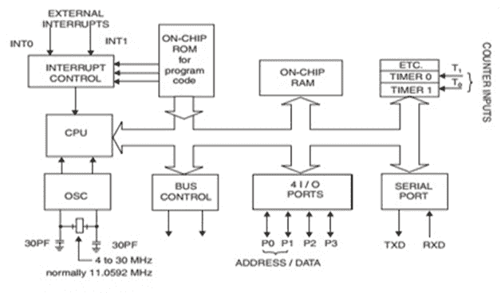
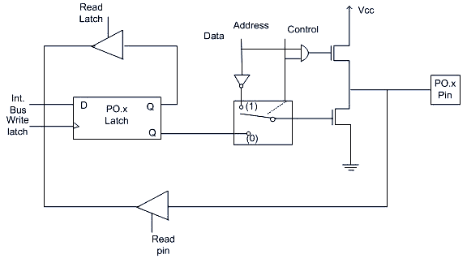
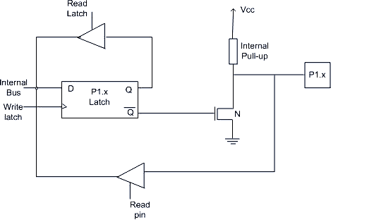
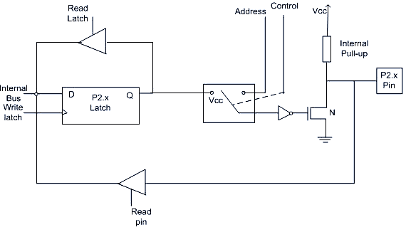
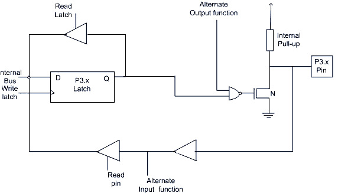

# 微控制器

> 原文：<https://www.javatpoint.com/microcontroller>

## 概观

在单个半导体芯片上制造的微型计算机称为单片微型计算机。因为单片机一般用于控制应用，所以也被称为**微控制器**。

微控制器包含微型计算机的所有基本部件，如中央处理器、随机存取存储器、只读存储器/可编程只读存储器、输入/输出线等。一些单芯片微控制器包含执行特定功能的设备，如直接存储器存取通道、模数转换器、串行端口、脉宽调制等。

### 微处理器和微控制器的区别

| 微处理器 | 微控制器 |
| 它用于大型应用。 | 它用于在应用程序中执行单个任务。 |
| 微处理器是计算机系统的核心。 | 它是嵌入式系统的核心。 |
| 它只是一个处理器。内存和输入/输出组件必须从外部连接。 | 微控制器包含外部处理器以及内部存储器和输入/输出组件。 |
| 由于 I/O 和内存外接，电路变大。 | 由于内部有输入输出和内存，电路很小。 |
| 不能用于紧凑系统，因此效率低下。 | 可用于小型系统和微控制器是一种有效的技术。 |
| 整个系统的成本增加。 | 整个系统成本低。 |
| 功耗高。 | 功耗低。 |
| 大多数微处理器没有省电模式。 | 大多数微控制器都有省电模式。 |
| 难以替代。 | 易于更换。 |
| 主要用于个人电脑。 | 主要用于洗衣机、MP3 播放器。 |

## 8051 架构

1980 年，英特尔推出了功能强大的 8051 系列 8 位微控制器。它们是第二代 8 位微控制器。8051 微控制器用于各种应用，包括有限的计算和一些控制策略。它们用于工业和商业控制应用、电器控制、仪器仪表等。

8051 包含布尔处理器、全双工串行端口和节能电路，以及基本组件，如 8 位中央处理器、随机存取存储器、只读存储器/可编程只读存储器/OTPROM、定时器/计数器和并行输入/输出线。

下图显示了英特尔 8051 微控制器的框图或架构。

## 8051 引脚描述

8051 微控制器的引脚图由 40 个引脚组成，如下所示:

**引脚 1-8(端口 1):** 这些是带有内部上拉电阻的 8 位双向输入/输出端口。它不执行任何任务；它只是一个输入输出端口

**引脚 9 (RST):** 这是一个复位输入引脚，用于将微控制器复位到其初始位置。

**引脚 10 至 17(端口 3):** 它也是一个带有内部上拉电阻的 8 位双向输入/输出端口。此外，它还执行一些特殊功能:

| 端口 3 引脚 | 功能 | 描述 |
| P3.0 | 接收数据 | 串行输入 |
| P3.1 | 数据发送 | 串行输出 |
| P3.2 | INT0 | 外部中断 0 |
| P3.3 | INT1 | 外部中断 1 |
| P3.4 | T0 | 计时器 0 |
| P3.5 | 一种网络的名称(传输率可达 1.54mbps) | 定时器 1 |
| P3.6 | wr | 外部存储器写入 |
| P3.7 | RD | 外部存储器读取 |

**引脚 18 和 19:** 分别是 XTAL1 和 XTAL1 引脚。这些引脚用于连接外部晶振以获取系统时钟。

**引脚 20 (GND):** 是接地引脚。它为电路提供电源。

**引脚 21 至 28(端口 2):** 这些引脚是双向输入/输出端口。高阶地址总线信号与这个双向端口多路复用。

**引脚 29 ( PSEN ):** 是程序使能引脚。使用此 PSEN 引脚可以读取外部程序存储器。

**引脚 30 (ALE/ PROG ):** 该引脚为地址锁存使能引脚。使用此引脚，可以将外部地址与数据分开。

**引脚 31 ( EA /VPP):** 命名为外部访问使能引脚(EA)。它用于启用或禁用外部存储器接口。

**引脚 32 - 39(端口 0):** 这些也是双向输入/输出引脚，但没有任何内部上拉。因此，它需要外部引脚来使用端口 0 引脚作为输入/输出端口。低位数据和地址总线信号与该端口复用。

**引脚 40 (VCC):** 该引脚用于为电路供电。

## 8051 个输入输出端口

8051 微控制器有 4 个 8 位输入/输出端口，可配置为输入或输出。因此，总共 32 个输入/输出引脚允许微控制器与外围设备连接。

#### 注意:引脚可以配置为 0 表示输出，1 表示输入。

## 1) PORT 0

P0 可以用作双向输入/输出端口，也可以用于为访问外部存储器而连接的地址/数据。当控制为 1 时，端口用于地址或数据接口。当控制为 0 时，该端口可用作双向输入/输出端口。

**图:端口 0 引脚结构**

**端口 0 作为输入端口**

如果控制为 0，则该端口用作输入端口，1 写入锁存器。在这种情况下，两个输出 MOSFETs 都关断。因此，由于输出引脚具有浮动，因此写入引脚的任何数据都直接由 read 引脚读取。

**端口 0 作为输出端口**

如果我们想在 P0 的引脚上写 1，写至锁存器的“1”会“关闭”下部场效应晶体管，同时由于“0”控制信号，上部场效应晶体管也会关闭。

假设我们想在端口 0 的引脚上写“0”，当“0”被写入锁存器时，引脚被下部场效应晶体管下拉。因此输出变为零。

## 2) PORT 1

端口 1 仅专用于输入/输出接口。当用作输出端口时，不需要像端口 0 那样连接额外的上拉电阻。

要将端口 1 用作输入端口，必须将“1”写入锁存器。在这种模式下，外部器件将 1 写入引脚，然后读取。

**图:端口 1 引脚结构**

## 3) PORT 2

端口 2 用于较高的外部地址字节或正常的输入/输出端口。这里，输入/输出操作类似于端口 1。当端口 2 引脚用于外部存储器访问时，端口 2 的锁存保持稳定。

**图:端口 2 引脚结构**

## 4) PORT 3

以下是端口 3 的替代功能:

| 端口 3 引脚 | 功能 | 描述 |
| P3.0 | 接收数据 | 串行输入 |
| P3.1 | 数据发送 | 串行输出 |
| P3.2 | INT0 | 外部中断 0 |
| P3.3 | INT1 | 外部中断 1 |
| P3.4 | T0 | 计时器 0 |
| P3.5 | 一种网络的名称(传输率可达 1.54mbps) | 定时器 1 |
| P3.6 | wr | 外部存储器写入 |
| P3.7 | RD | 外部存储器读取 |

它像端口 2 一样作为输入/输出端口工作。端口 3 的交替功能使其体系结构不同于其他端口。

**图:端口 3 引脚结构**

## 8051 中断

**中断**是创建一个临时暂停主程序的过程，将控制传递给外部源并执行它们的任务，然后将控制传递给主程序，在那里它保持关闭。

8051 有 5 个中断信号，即

*   INT0，
*   TFO，
*   INT1，
*   TF1，
*   国际扶轮/国际扶轮。

中断源的数量因版本而异。从 5 到 15 不等。

重要的中断源有:一个来自串行端口，两个来自定时器，两个来自外部中断 INT0 和 INT1。

通过设置/清除特殊功能寄存器 **IE(中断使能)**中的一个位，可以单独使能/禁用每个中断。IE 寄存器还包含一个全局禁用位，禁用所有中断。

通过设置/清除特殊功能寄存器 **IP(中断优先级寄存器)**中的位，也可以将每个中断编程为优先级方案之一。

低优先级中断可以被高优先级中断中断，但不能被另一个低优先级中断中断。高优先级中断可以？不要被低优先级中断中断。