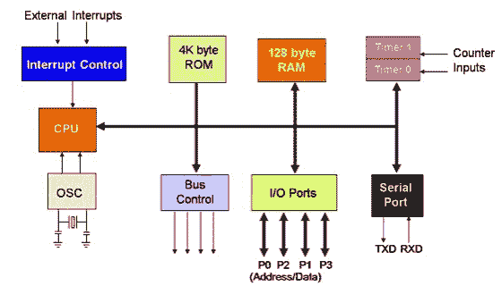

# 8051 微控制器架构

> 原文：<https://www.javatpoint.com/embedded-system-8051-microcontroller-architecture>

让我们看看 8051 微控制器的内部架构，以框图的形式表示如下:

8051 微控制器架构内部的基本组件包括:

**CPU(中央处理器)** : CPU 充当任何处理机器的头脑。它同步和管理微控制器中执行的所有进程。用户没有权力控制中央处理器的功能。它解释存储在只读存储器中的程序，并从存储器中执行，然后执行它计划的任务。中央处理器管理 8051 微控制器中可用的不同类型的寄存器。

**中断**:中断是微控制器给出的一个子程序调用，当其他一些高优先级程序请求获取系统总线时，n 个中断出现在当前运行的程序中。

中断提供了一种方法来推迟或延迟当前进程，执行子程序任务，然后再次重新启动标准程序。

**8051 微控制器中的中断类型:**

让我们看看 8051 微控制器中中断的五个来源:

*   定时器 0 溢出中断- TF0
*   定时器 1 溢出中断- TF1
*   外部硬件中断- INT0
*   外部硬件中断- INT1
*   串行通信中断- RI/TI

**内存**:操作时微控制器需要一个程序。该程序指导微控制器执行特定任务。安装在微控制器中的这个程序需要一些片上存储器来存储程序。

微控制器还需要内存来短期存储数据和操作数。在微控制器 8051 中，有 4 KB 的代码或程序存储器，即它有 4 KB 的只读存储器，它还包括 128 字节的数据存储器。

**总线**:总线是一组用作通信通道或作为数据传输手段的导线。不同的总线配置包括 8、16 或更多电缆。因此，一条总线可以承载 8 位，总共 16 位。

**8051 微控制器中的总线类型:**

让我们看看 8051 微控制器中使用的两种总线:

*   **地址总线** : 8051 单片机由 16 位地址总线组成。它通常用于将数据从中央处理器传输到存储器。
*   **数据总线** : 8051 单片机由 8 位数据总线组成。它通常用于将数据从一个外设位置传输到其他外设。

**振荡器**:由于微控制器是数字电路，因此需要定时器来操作。要在微控制器内部执行定时器操作，需要外部连接或片内振荡器。微控制器在嵌入式系统中用于管理设备的功能。因此，8051 使用两个 16 位计数器和定时器。为了定时器和计数器的操作，振荡器在微控制器内部使用。