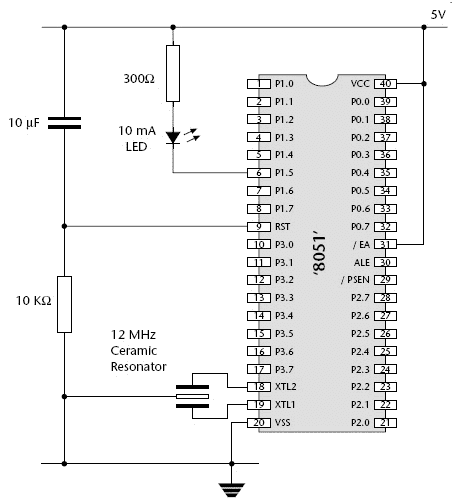

# 8051 微控制器引脚图

> 原文：<https://www.javatpoint.com/embedded-system-8051-microcontroller-pin-diagram>

让我们看看 40 引脚双列直插式封装(DIP)的微控制器集成电路，外部连接电源和振荡器。

考虑微控制器内部引脚配置的简要描述是:

**引脚 1-8** :这些引脚属于微控制器的端口 1。端口 1 用作国内上拉、准双向输入/输出端口。

**引脚 9** :复位引脚，用于将微控制器 8051 设置为初始值。在应用程序开始时，重置引脚将被设置为提升两次机器旋转。

**引脚 10-17** :这些引脚属于微控制器的端口 3。端口 3 可用于多种功能，如定时器输入、中断、发送(TxD)和接收(RxD)的串行通信指示器。它也被称为内置准双向端口的国内上拉端口。

**引脚 18 和 19** :这些引脚一般用于外部晶振与给定系统时钟的接口。

**针 20** :此针名为 V ss 。它象征地电压或 0 伏连接到微控制器的这个引脚。

**引脚 21-28** :这些引脚属于微控制器的端口 2。端口 2 可用作输入/输出端口，高级地址总线与该准双向端口复用。

**引脚 29** :该引脚属于程序存储使能或 PSEN。它用于解释来自外部程序存储器的符号。

**引脚 30** :该引脚属于外部访问或 EA 输入，用于允许或禁止外部存储器接口。如果不需要外部存储器，该引脚通过与电源电压相连而设置为高电平。

**引脚 31** :该引脚属于地址锁存使能或 ALE，用于解复用外部存储器接口端口 0 的地址数据指示。

**引脚 32-39** :这些引脚属于微控制器的端口 0。端口 0 可用作输入/输出端口，低位地址和数据总线信号与该端口复用。此引脚充当双向输入/输出端口，外部连接的上拉电阻是将这些端口用作输入/输出所必需的。

**引脚 40** :该引脚用于为电路提供电源。