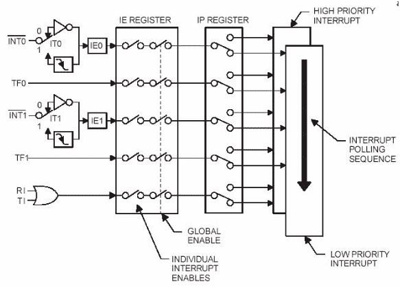

# 8051 微控制器中的中断

> 原文：<https://www.javatpoint.com/embedded-system-interrupts-in-8051-microcontroller>

这是一个子程序调用，由微控制器给出，当其他一些具有高优先级的程序被请求获取系统总线时，而不是在当前运行的程序中发生中断时。

中断提供了一种方法来推迟或延迟当前进程，执行子程序任务，然后再次重新启动标准程序。

* * *

## 8051 微控制器中的中断类型

让我们看看 8051 微控制器中中断的五个来源:

*   定时器 0 溢出中断- TF0
*   外部硬件中断- INT0
*   定时器 1 溢出中断- TF1
*   外部硬件中断- INT1
*   串行通信中断- RI/TI

定时器和串行中断由微控制器内部产生，而外部中断由外部连接到微控制器的附加接口设备或开关产生。这些外部中断可以是电平触发或边沿触发。

当中断发生时，微控制器执行中断服务程序。因此，对应于中断的存储单元使能它。考虑中断对应的存储位置如下中断向量表所示。


* * *

## 8051 单片机的中断结构

“复位”后，所有中断都被禁用，因此，所有中断都由软件启用。从所有五个中断中，如果任何一个或所有中断被激活，这将设置相应的中断标志，如图所示，对应于 8051 微控制器的中断结构:-



所有的中断都可以通过一些特殊的功能寄存器(也称为中断使能寄存器)来设置或清除，这完全取决于优先级，优先级是通过使用中断优先级寄存器来执行的。

## 中断使能寄存器

IE 寄存器用于启用和禁用中断。这是一个位可寻址寄存器，其中 EA 值必须设置为 1 才能启用中断。该寄存器中的各个位使能特定的中断，如定时器、串行和外部输入。在下面的 IE 寄存器中，位 1 对应于激活中断，位 0 对应于禁用中断。


## 中断优先级寄存器

使用 IP 寄存器，可以通过清除或设置中断优先级(IP)寄存器中的单个位来改变中断的优先级，如图所示。它允许低优先级中断可以中断高优先级中断，但通过使用另一个低优先级中断来禁止中断。如果中断的优先级没有被编程，那么微控制器以预定义的方式执行指令，其顺序是 INT0、TF0、INT1、TF1 和 SI。


* * *

## 8051 中的中断编程

1.  **Timer Interrupt Programming**: In microcontroller Timer 1 and Timer 0 interrupts are generated by time register bits TF0 AND TF1\. This timer interrupts programming by C code involves:
    *   选择 TMOD 寄存器的配置及其工作模式。
    *   启用工业工程寄存器及其相应的定时器位。
    *   使用适当的操作模式选择并加载 TLx 和 THx 的初始值。
    *   设置定时器运行位以启动定时器。
    *   为定时器编写子程序，并在子程序结束时清除 TRx 的值。

    **我们来看看定时器中断编程使用定时器 0 模型为闪烁的 LED 使用中断方法:**

    ```
     #include< reg51 .h> 
    sbit Blink Led = P2^0;	// LED is connected to port 2 Zeroth pin
    void timer0_ISR (void) interrupt 1	//interrupt no. 1 for Timer0
     {
    Blink Led=~Blink Led;	// Blink LED on interrupt 
    TH0=0xFC;	// loading initial values to timer 
    TL0=0x66;
    } 
    void main() 
    {
    TMOD=0x0l;		// mode 1 of Timer0
    TH0 = 0xFC:    // initial value is loaded to timer
    TL0 = 0x66: 		
    ET0 =1; 		// enable timer 0 interrupt
    TR0 = 1; 		// start timer
    while (1);		// do nothing
     }

    ```

2.  **外部硬件中断编程**

微控制器 8051 由两个外部硬件中断组成:如上所述的 INT0 和 INT1。这些中断在引脚 3.2 和引脚 3.3 上使能。它可以是电平触发或边沿触发。在电平触发中，引脚 3.2 的低电平信号使能中断，而引脚 3.2 的高电平至低电平转换使能边沿触发中断。

让我们看看 8051 微控制器的可编程特性是:

*   使能中断使能(IE)寄存器中外部中断的等效位。
*   如果是电平触发，则编写适合该中断的子程序，或者使能 TCON 寄存器中对应边沿触发中断的位。

**考虑边沿触发的外部硬件中断编程是:-**

```

void main()
{
IT0 = 1;	// Configure interrupt 0 for falling edge on INT0
EXO = 1;	// Enabling the EX0 interrupt
EA =1;		// Enabling the global interrupt flag
}
void ISR_ex0(void) interrupt 0
{

} 

```

*   **串行通信中断编程**当需要发送或接收数据时使用。由于一个中断位用于传输中断和接收中断标志，中断服务程序必须检查这些标志以了解实际的中断。通过 RI 和 TI 标志的逻辑或运算导致中断，并且仅由软件清除。考虑串行通信中断编程中涉及的步骤如下
    *   配置中断使能寄存器以使能串行中断。
    *   配置 SCON 寄存器以执行传输和接收操作。
    *   用适当的函数为给定的中断编写一个子程序。

**来看看使用串口中断通过 9600 波特率的串口发送‘E’的程序:**

```
void main() 
{
TMOD = 0x20: 
TH1= 0xFD;		// baud rate for 9600 bps 
SCON = 0x50; 
TR1=1; 
EA=l; 
whlle(l); 
}
void ISR_Serial(void) interrupt 4 
{
if(TI==l) 
{ 
SBUF= ?E?; 
TI=0; 
} 
else 
RI =0; 
}

```