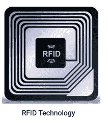
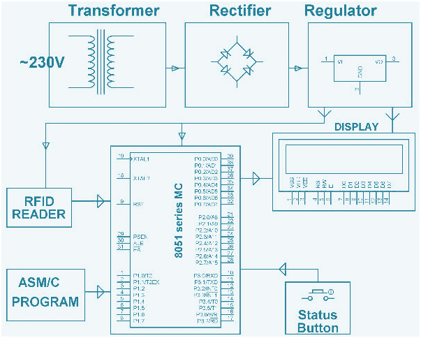
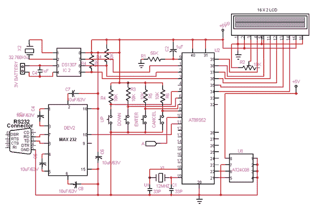

# 嵌入式系统项目:基于射频识别的考勤系统

> 原文：<https://www.javatpoint.com/embedded-system-project-rfid-based-attendance-system>

* * *

## 基于 8051 单片机的射频识别考勤系统

如今，学校和大学的出勤率是以纸面数据为基础的。有时这个过程会导致错误，需要更多的时间。

这个项目使用射频识别技术来记录每个进入教室的学生，并计算每个班级的时间。

在这个系统中，每个学生都被分配了一个射频识别标签。出勤可以通过将卡放在射频识别阅读器附近来完成。

## 什么是射频识别？

射频识别是一种包括小型天线和芯片的电子设备。该设备用于利用射频电磁场在阅读器和射频识别标签之间传输信息。

这些器件的工作频率范围包括低、中和高。低频范围从 30 千赫到 500 千赫，中频范围从 500 千赫到 900 千赫，高频范围从 2.4 兆赫到 2.5 兆赫



## 基于射频识别的考勤系统框图

大多数学校和学院的考勤系统大多是基于文件的。针对自动考勤系统，提出了一种基于无线技术的射频识别系统。每个学生都有一个射频识别标签，它使用内置的集成电路来存储和处理信息。

该系统的框图包括预置电路、微控制器、振荡器电路、液晶显示器和射频识别阅读器。



*   **微控制器**-用于基于 RFID 的考勤系统的微控制器是来自 8051 家族的 AT89C52。它包括 4 个输入/输出端口和 40 针。
*   **振荡器电路**-振荡器电路连接在微控制器的 18 和 19 引脚之间。该电路由振荡器和两个 33 pF 电容组成，工作频率为 11.0592 MHz。
*   **预置电路**-单片机 AT89C52 第 9 针为复位针。预置的电路由电容、电阻和开关组成。当按下开关时，复位引脚与相连，微控制器复位。
*   **液晶显示器**-液晶显示器由 16 个引脚组成，其中 3 个引脚与微控制器的端口-2 相连，其余所有引脚均与微控制器的端口-2 相连。
*   **射频识别阅读器**-射频识别阅读器用于读取存储在射频识别标签中的信息。它结合了任何类型的硬件设计。

## 考勤系统电路的工作

连接好考勤系统的所有部件后，给电源接通电路。然后液晶屏会显示，请刷卡。包含在射频识别标签中的信息被描述为学生的身份和出勤。当有人将卡放在射频识别阅读器前时，它会读取信息，并开始与存储在 AT89S52 微控制器中的信息进行匹配。操作前，微控制器用嵌入式 C 语言预编程。



如果卡的数据与射频识别阅读器匹配，那么信息将显示在液晶显示器上。通过使用该系统，可以节省操作时间，因为所有信息都直接存储在数据库中。

**源代码:**

**将操作微控制器系统所需的嵌入式系统程序视为基于 RFID 的考勤系统是:-**

```
#include #include <string.h>//0000 to 7FFF

sbit RS = P0^7;
sbit EN = P0^6;

sbit SDA = P1^0;
sbit SCL = P1^1;
sbit RELAY = P1^2;

code unsigned char RFID_1[] = "34006C9C04C0"; //34006C9C04+NULL
code unsigned char RFID_2[] = "34006C549C90";
code unsigned char RFID_3[] = "1300F8FAC1D0";
code unsigned char RFID_4[] = "34006CD5AD20";
code unsigned char RFID_5[] = "420061231E1E";

code unsigned char name_1[] = "SANJAY JAIN";
code unsigned char name_2[] = "SHEKHAT HARSH";
code unsigned char name_3[] = "DHOLARIYA RAKSHIT";
code unsigned char name_4[] = "DIVYANG SINGH ";
code unsigned char name_5[] = "NAKUL JAIN";

unsigned char rs[15];

unsigned int no_of_records;

void delay()
{
	int j;
	for(j=0;j<500;j++);
}

void long_delay()
{
	unsigned int j;
	for(j=0;j<65000;j++);
}

void idelay()
{
	unsigned int j;
	for(j=0;j<10000;j++);
}

void lcd_command(char lc)
{
	P2 = lc;
	RS = 0;
	EN = 1;
	delay();
	EN = 0;
}

void lcd_data(char ld)
{
	P2 = ld;
	RS = 1;
	EN = 1;
	delay();
	EN = 0;
}

void lcd_init()
{
	lcd_command(0x38);
	lcd_command(0x0E);
	lcd_command(0x01);
}

void serial_init()
{
	 TMOD = 0x20;
	SCON = 0x50;
	TH1 = 0xFD;
	TR1 = 1;
}

void transmit(unsigned char tx)
{
	SBUF = tx;
	while(TI==0);
	TI = 0;
}

void send_string(unsigned char *str)
{
	int j;
	for(j=0;str[j]!='\0';j++)
		transmit(str[j]);	
}

unsigned char receive()
{
	char rx;
	while(RI==0);
	RI = 0;
	rx = SBUF;
	return(rx);
}

void lcd_string(char add,char *str)
{
	int j;
	lcd_command(add);
	for(j=0;str[j]!='\0';j++)
		lcd_data(str[j]);	
}

void start()
{
	SDA = 1;
	SCL = 1;
	SDA = 0;
}

void stop()
{
	SDA = 0;
	SCL = 1;
	SDA = 1;
}

void write(unsigned char w)
{
	int j;
	SCL = 0;
	for(j=0;j<8;j++)
	{
		if((w & 0x80)==0)
			SDA = 0;
		else
			SDA = 1;
		SCL = 1;
		SCL = 0;
		w = w << 1;
	}
	SCL = 1;
	SCL = 0;
}

unsigned char read()
{
	int j;
	unsigned char r = 0x00;
	SDA = 1;

	for(j=0;j<8;j++)
	{
		SCL = 1;
		r = r << 1;
		if(SDA == 1)
			r = r | 0x01;
		SCL = 0;
	}
	return(r);
}

void ack()
{
	SDA = 0;
	SCL = 1;
	SCL = 0;
}

void nack()
{
	SDA = 1;
	SCL = 1;
	SCL = 0;
}

void rtc_read()
{
		unsigned char ss,mm,hh,day,mn,date,yr;
		start();
		write(0xD0);
		write(0x00);		
		stop();
		start();
		write(0xD1);
		ss = read();
		ack();
		mm = read();
		ack();
		hh = read();
		ack();
		day = read();
		ack();
		date = read();
		ack();
		mn = read();
		ack();
		yr = read();
		nack();
		stop();

		rs[0] = hh/0x10 + 48;
		rs[1] = hh%0x10 + 48;
		rs[2] = ':';
		rs[3] = mm/0x10 + 48;
		rs[4] = mm%0x10 + 48;
		rs[5] = ',';
		rs[6] = date/0x10 + 48;
		rs[7] = date%0x10 + 48;
		rs[8] = '/';
		rs[9] = mn/0x10 + 48;
		rs[10] = mn%0x10 + 48;
		rs[11] = '/';
		rs[12] = yr/0x10 + 48;
		rs[13] = yr%0x10 + 48;
		rs[14] = '\0';
}

void rtc_init()
{
	start();
	write(0xD0);
	write(0x00);
	write(0x00);
	write(0x00);
	write(0x13);
	write(0x05);
	write(0x12);
	write(0x04);
	write(0x12);
	stop();

}

void write_records(unsigned char *str);
void read_records();

void main()
{
	unsigned char rec_data[13],i,t;

	RELAY = 0;

	lcd_init();
	serial_init();
	rtc_init();
	idelay();
	start();
	write(0xA0);
	write(0x7F);
	write(0xFF);
	stop();
	start();
	write(0xA1);
	no_of_records = read();
	nack();
	stop();

//	no_of_records = 0;

	while(1)
	{
	start:
		lcd_command(0x01);
		lcd_string(0x80,"RFID ATTENDANCE");
		lcd_string(0xC5,"SYSTEM");

		j = 0;
		while(1)
		{
			if(RI==1)
			{
				RI = 0;
				t = receive();
				if(t == '+')
				{
					read_records();
					goto start;
				}
				else
				{
					rec_data[j] = t;
					for(j=1;j<12;j++)
						rec_data[j] = receive();
					rec_data[j] = '\0';	
					break;
				}
			}
		}

		j = strcmp(RFID_1,rec_data);	//match => j = 0

		lcd_command(0x01);

		if(j==0)
		{
			RELAY = 1;
			lcd_string(0x80,name_1);
			rtc_read();
			lcd_string(0xC0,rs);
			long_delay();
			write_records(name_1);
			RELAY = 0;
			goto start;		
		}

//
		j = strcmp(RFID_2,rec_data);	//match => j = 0

		if(j==0)
		{
			RELAY = 1;
			lcd_string(0x80,name_2);
			rtc_read();
			lcd_string(0xC0,rs);
			long_delay();
			write_records(name_2);
			RELAY = 0;
			goto start;		
		}

//
		j = strcmp(RFID_3,rec_data);	//match => j = 0

		if(j==0)
		{
			RELAY = 1;
			lcd_string(0x80,name_3);
			rtc_read();
			lcd_string(0xC0,rs);
			long_delay();
			write_records(name_3);
			RELAY = 0;
			goto start;		
		}

		j = strcmp(RFID_4,rec_data);	//match => j = 0

		if(j==0)
		{
			RELAY = 1;
			lcd_string(0x80,name_4);
			rtc_read();
			lcd_string(0xC0,rs);
			long_delay();
			write_records(name_4);
			RELAY = 0;
			goto start;		
		}

		j = strcmp(RFID_5,rec_data);	//match => j = 0

		if(j==0)
		{
			RELAY = 1;
			lcd_string(0x80,name_5);
			no_of_records = 0;
			start();
			write(0xA0);
			write(0x7F);
			write(0xFF);
			write(0x00);
			stop();
			lcd_string(0xC0,"MEMORY CLEARED");
			long_delay();
			RELAY = 0;
			goto start;		
		}
		lcd_string(0x80,"ERROR");
		lcd_string(0xC0,rec_data);
		long_delay();
	}
}</string.h> 
```